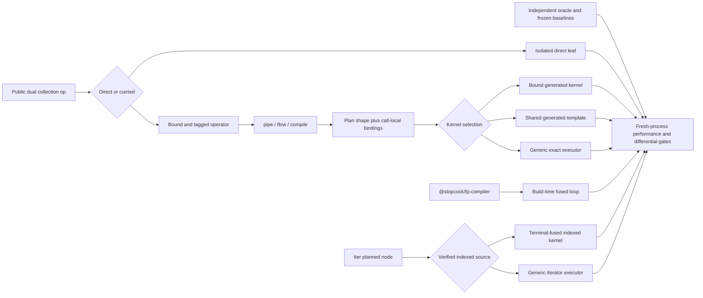

# Stopcock FP performance-frontier implementation plan

> **Status:** proposed, blocked on Phase -1 semantic-contract and performance-
> environment gates. No production optimization starts until those gates pass.
>
> **Baseline:** the live FP 2.0 checkout on 2026-07-24. This checkout already
> contains a portable Plan IR, generated portable templates, an optional
> build-time compiler, indexed `Iter` fast paths, writable-target APIs, and
> extensive performance gates. This plan extends and consolidates those
> systems. It does not recreate them.
>
> **Relationship to older plans:** the 2026-07-21 universal, tiered-execution,
> and absolute-performance plans remain superseded design history. In
> particular, do not restore runtime `eval`/`new Function`, automatic JIT
> promotion, the removed `Stream` API, or root namespace bundles.

## Outcome

Make `@stopcock/fp` consistently fast across the ways real applications call
it, not merely fast in a warm, isolated benchmark:

- Direct collection operations do not fall onto a slow V8 tier after mixed
  sizes or mixed direct/curried use.
- Curried operators are cheap to construct and stable to invoke without
  sacrificing fusion metadata or retaining arbitrary user values.
- Common portable pipelines use callback-bound, generated kernels instead of
  accumulating generic dispatch overhead.
- `@stopcock/fp-compiler` remains the hand-written-loop ceiling and improves
  expression-position and reusable-runner output without changing program
  semantics.
- `Iter` fuses terminals into its existing indexed source lane and recognizes
  safe typed-array sources, while generic iterables remain fully correct.
- Typed-array operations select evidence-backed strategies once per qualified
  runtime/engine version profile, constructor family, and size band rather than
  applying one heuristic to all V8 or JSC releases.
- Allocation, retained memory, cold import, first call, steady-state
  throughput, package size, and tree-shaken size are all measured separately.
- Faster contracts are explicit. Exact `Object`, `Map`, iterator, callback,
  sparse-array, and mutation semantics are never silently weakened.
- Eager `Array.flatMap` and lazy `Iter.flatMap` retain distinct, explicit
  contracts: eager Array pipelines flatten callback-returned Arrays with the
  existing indexed semantics, while only `Iter.flatMap` accepts arbitrary
  iterables and owns `IteratorClose` behavior.
- Every public performance statement is reproducible from raw samples,
  source/runtime identity, equivalent semantics, and a named denominator.

This is a performance plan, not an Effect competitor. It deliberately excludes
managed resources, fibers, schedulers, structured concurrency, and effect
runtimes.

## Definition of “blazing fast”

There is no single “fastest library” number. A release is fast only when all of
these dimensions are healthy:

| Dimension | Required evidence |
|---|---|
| Direct operation | Fresh process and steady-state, data-first and data-last, multiple sizes and call histories |
| Pipeline | Inline and hoisted operators, allocating and terminal pipelines, early exit and full pass |
| Runtime portability | Node 22/V8, Node 24/V8, and current supported Bun/JSC |
| Input family | Dense arrays, sparse arrays, canonical typed arrays, safe fallback objects, generic iterables |
| Allocation | Throughput measured without memory instrumentation; retained heap, GC, and RSS measured separately |
| Startup | Cold import, first construction, first execution, and warm execution |
| Distribution | Shipped `dist`, subpath gzip, packed tarball, and tree-shaken consumer fixture |
| Correctness | Output, callback count/order/index, exceptions, mutation, iterator closing, and observable construction order |
| Comparison | Frozen Stopcock baseline for gating; pinned peers only for characterization |

“Fast everywhere” means a broad performance floor plus deliberately chosen
ceilings. It does not mean optimizing a geomean while allowing a few severe
regressions.

## Scope

### In scope

- `packages/fp/codegen/**`
- `packages/fp/src/**`
- `packages/fp/scripts/**`
- `packages/fp/README.md`, `CHANGELOG.md`, and `MIGRATION.md`
- `packages/fp-compiler/src/**`
- `packages/fp-compiler/scripts/**`
- `packages/fp-compiler/README.md`
- `benchmarks/src/reference/**`
- Focused exploratory benchmark files under `benchmarks/src/**`
- FP-specific consumer fixtures under `benchmarks/fixtures/**`
- `benchmarks/package.json` and `benchmarks/PERF_PROFILE.md`
- FP-specific jobs in `.github/workflows/ci.yml` and
  `.github/workflows/publish.yml`
- Changesets for any public API addition

### Explicitly out of scope

- Runtime dynamic code generation or parsing/stringifying callback source.
- Native addons, WASM, SIMD, workers, or parallel execution in this program.
- Reintroducing `Stream`; the supported lazy abstraction is `Iter`.
- Effect runtime, cancellation, scheduling, resource scopes, or concurrency.
- Weakening default exact semantics for speed.
- Exposing engine switches or tuning thresholds as public API.
- Adding specialist namespaces to the root entrypoint.
- Changing `@stopcock/synth` or bringing it into FP release automation.
- Gating a release on “beating” a third-party version. Peer results inform
  product positioning; frozen Stopcock baselines protect releases.

## Non-negotiable invariants

1. **Generated files are not edited by hand.**
   - Edit `packages/fp/codegen/defs/array.ts` and generators.
   - Regenerate `packages/fp/src/array.ts` and
     `packages/fp/src/portable-templates.ts`.
   - Make `codegen:check` prove reproducibility.
2. **A frozen public contract precedes oracle selection.**
   - Eager Array operations, including Array pipeline `flatMap`, retain the
     current direct API domain and behavior.
   - Arbitrary callback-returned iterable flattening and `IteratorClose` belong
     to `Iter.flatMap`, not eager Array `flatMap`.
   - The interpreter becomes the eager-pipeline semantic oracle only after it,
     portable templates, direct execution, and the build compiler agree with the
     independently expressed contract fixtures.
   - Candidate runtime and compiler kernels are checked against independently
     expressed expected behavior.
   - Benchmark reference emitters must not import or reuse candidate codegen.
3. **Call-count dispatch remains call-count dispatch.**
   - Do not replace `arguments.length` with value, type, or truthiness checks.
   - `undefined` is a valid operand and initial accumulator.
4. **Dense array semantics remain dense.**
   - Holes are observed as `undefined`; callbacks are still invoked.
   - Source length snapshots, mutation visibility, callback arity/index, and
     exception order stay compatible with the current contract.
5. **Iterator protocol behavior remains exact where the API accepts iterables.**
   - `Iter`, generic iterable fallbacks, custom `Symbol.iterator`, `return()`,
     nested lazy `flatMap`, early termination, and thrown callback behavior
     preserve `IteratorClose`.
   - Eager Array `flatMap` must not silently acquire arbitrary iterable
     flattening semantics through an interpreter or compiler fast path.
6. **No unbounded caches.**
   - Function-key caches use `WeakMap`.
   - Primitive caches have a documented hard capacity and eviction rule.
   - Arbitrary object operands are not strongly retained.
7. **No per-element engine checks.**
   - Runtime and kernel policy is selected once and captured outside hot loops.
8. **No impure two-pass algorithms.**
   - `filter`, `filterMap`, and predicate-based terminals call user callbacks
     exactly once per semantically visited element.
9. **Exact APIs stay exact.**
   - `Obj` keeps prototype, symbol, descriptor, path-safety, and own-property
     behavior.
   - `Map.get` keeps present-`undefined` versus missing-key semantics.
10. **Evidence is fail-closed.**
    - Missing cases, missing raw samples, wrong runtime, duplicate IDs,
      substituted source, invalid orientations, or mismatched derived
      statistics fail the gate.
11. **Cached pipe paths observe the canonical runner.**
    - The current `ShapeEntry.run` replacement behavior is covered by tests.
    - A faster identity/front cache must not close over a stale concrete runner
      or leak bound values between structurally identical plans.
12. **Tagged operator layout is deliberate.**
    - If operator closures remain mutable, their public identity, public tag
      layout, and trusted-provenance behavior are frozen by tests before caching
      changes.
    - `_op`, `_fn`, `_a1`, and `_a2` are created in a consistent order so hot
      tagged closures do not acquire avoidably different hidden-class layouts.
13. **Public tag-shaped properties are never an authority boundary.**
    - The currently exported `_op`, `_fn`, `_a1`, and `_a2` structural fields
      are forgeable and mutable.
    - Optimized planning trusts only internal provenance, not the presence or
      apparent validity of public properties.
    - Unknown or forged functions fall back. Deleting or mutating public fields
      on a trusted operator cannot change its semantics or bindings.
14. **Plain-data APIs enforce their boundary at runtime.**
    - TypeScript structural types and documentation cannot distinguish class
      instances, accessors, subclasses, or exotic prototypes.
    - Every traversed node and admitted replacement value is validated before a
      plain-data cloning shortcut can observe or invoke an accessor.
15. **Runtime-tuned policy is version-safe.**
    - Engine-family selection alone is insufficient when supported Node or Bun
      versions disagree.
    - Unknown or unqualified engine versions use the conservative generic
      policy; no future Node `>=22` release silently inherits stale V8 tuning.

## Live architecture and real optimization seams

| Area | Current state | Work in this plan |
|---|---|---|
| Direct `Array.map` | Minimal preallocated loop, but a zero-formal public wrapper also owns arity dispatch, a one-entry curried cache, tagging, and cache mutation | Isolate the direct leaf from operator construction and prove tier stability |
| Other generated duals | Explicit formals are already generated, but direct and curried work still share one public callable | Generalize the split only to measured hot operations |
| One-op `pipe` | Directly invokes the unary operator; it is not a fused plan | Measure and preserve this distinct path |
| Portable pipelines | Plan IR, shape cache, generic interpreter, and generated portable templates already exist; fresh inline operators can still allocate fresh binding structures | Replace scattered special cases with one generated kernel registry, bound factories, and fixed-arity binding entry points |
| `compile()` | Binds callbacks, but also contains hard-coded critical shape loops | Move shape policy out of `compile.ts` into generated descriptors |
| Build compiler | Already transforms `pipe`, `flow`, `compile`, and `compilePure` across the supported operation corpus | Tighten expression-position codegen, reusable runners, and common tails |
| `Iter` | Persistent planned nodes, native-array inspection, array fast paths, and several hard-coded terminal paths already exist | Consolidate into terminal-fused indexed kernels and add canonical typed-array access |
| Typed arrays | Canonical view validation, exact allocation, native intrinsic fast paths, and size-based filter strategies already exist | Characterize constructor/runtime/selectivity space and select immutable runtime policies |
| Allocation | `*Into`, collectors, transducers, `Iter.toArrayInto`, and typed-array targets already exist | Add internal size bounds, optimize only where honest, and measure memory independently |
| Objects and maps | `Obj` is deliberately exact; `Record` is the narrower null-prototype contract; `Map.getOrUndefined` already exists | Add compiled repeated paths only if useful, document fast contracts, and do not duplicate APIs |
| Benchmarks | Raw paired samples and symmetric orientation primitives already exist; many gates are fresh-process | Add dispatch history, allocation, and per-engine strategy evidence; separate release gates from peer reports |

At the audited baseline, the existing package-size gate reports 16,286 of
18,000 permitted gzip bytes for the shared compile chunk and 124,118 of
150,000 permitted bytes for the packed tarball. The plan therefore has
headroom, but not enough to tolerate indiscriminate kernel duplication.

## Target architecture



The registry may share operation metadata with runtime and compiler generation.
It must not make the benchmark oracle circular: reference behavior and
hand-written denominators remain independently implemented.

---

## Phase -1 — Clear semantic and evidence blockers

This phase is a hard prerequisite, not parallel preparation. It resolves the
contracts and infrastructure that Phase 0 needs in order to produce admissible
evidence.

### -1.1 Freeze eager and lazy `flatMap` contracts

- [ ] Add an independently authored semantic fixture for the existing direct
  `Array.flatMap` API:
  - the callback contract returns an Array;
  - flattening observes that returned Array through the current length/index
    behavior;
  - callback count, index, mutation, getters, holes, exceptions, and result
    ordering are explicit.
- [ ] Specify that eager Array pipelines use exactly that contract. They do not
  consume arbitrary callback-returned iterables and do not claim
  `IteratorClose` for the callback result.
- [ ] Specify arbitrary iterable flattening, nested iterator closing, and
  `return()` behavior under `Iter.flatMap` only.
- [ ] Add cross-surface fixtures covering direct execution, generated
  `array.ts`, the runtime interpreter, portable templates, runtime `compile()`,
  and `@stopcock/fp-compiler`.
- [ ] Change the public contract only through an explicit API proposal,
  migration note, and semver/changeset decision. A performance implementation
  may not make that decision implicitly.

### -1.2 Establish an unforgeable operator-provenance design

- [ ] Record that exported tag-shaped structural fields are currently public
  and cannot authenticate an operator.
- [ ] Approve an internal provenance design before changing operator caching or
  fast-path selection. The default design is a private
  `WeakMap<Function, TrustedOperatorMetadata>` populated only by generated
  operator factories.
- [ ] Make planning consult trusted provenance first. Public `_op`, `_fn`,
  `_a1`, and `_a2` fields may remain compatibility/diagnostic data but must not
  authorize a kernel or provide trusted bindings.
- [ ] Define fallback behavior for untrusted functions and for trusted
  functions whose public fields are deleted, forged, or mutated.
- [ ] If public tag fields or exported tagged types are removed or narrowed,
  include type-test updates, migration documentation, and the appropriate
  changeset.

### -1.3 Qualify the performance environment

- [ ] Provision or label stable `perf-linux-x64` and `perf-macos-arm64` runners
  before baseline calibration.
- [ ] Disable parallel benchmark jobs and power-saving/turbo variability as far
  as each platform permits.
- [ ] Record CPU identity, governor/power mode, OS image, architecture, runtime
  installations, thermal policy, and runner image/version in a checked-in
  profile.
- [ ] Reject an unknown or drifted profile before starting a timed worker.
- [ ] Run a repeated noise/variance qualification and write numeric acceptance
  limits into `benchmarks/PERF_PROFILE.md`.
- [ ] Keep GitHub-hosted results as bounded PR canaries only. They are not
  admissible for frozen baselines, release thresholds, or public claims.

### Phase -1 exit gate

- Eager Array and lazy Iter `flatMap` contracts are approved and represented by
  independent fixtures.
- The trusted-operator provenance and compatibility design is approved.
- Both dedicated runner profiles pass repeatability and environment-validation
  checks.
- `benchmarks/PERF_PROFILE.md` no longer describes the intended release profile
  as unavailable or provisional.
- No production hot-path optimization has started.

---

## Phase 0 — Establish benchmark truth before changing hot code

### 0.1 Freeze the implementation baseline

- [ ] Record the exact baseline commit and dirty-tree fingerprint used for
  performance work.
- [ ] Build `@stopcock/fp` and hash:
  - `packages/fp/codegen/defs/array.ts`
  - `packages/fp/codegen/dual-inline.ts`
  - `packages/fp/codegen/portable-templates.ts`
  - `packages/fp/src/array.ts`
  - `packages/fp/src/portable-templates.ts`
  - `packages/fp/dist/array.js`
  - the shared compile chunk measured by the package-size gate.
- [ ] Copy only the minimal equivalent baseline kernels into frozen benchmark
  modules. Do not import the live candidate from a “before” module.
- [ ] Give every baseline a schema version, source hash, semantic description,
  and retirement rule.
- [ ] Pin peer versions already used by the benchmark package:
  `@mobily/ts-belt@3.13.1`, `remeda@2.34.1`, `ramda@0.32.0`, and
  `lodash-es@4.18.1`.
- [ ] Record the resolved peer entry file and hash in comparison reports.
- [ ] Mark peer comparisons as characterization, never release denominators.

### 0.2 Add the direct-dispatch contract

Add:

- `benchmarks/src/reference/array-dispatch-baseline.ts`
- `benchmarks/src/reference/array-dispatch-perf-contract.ts`
- `benchmarks/src/reference/array-dispatch-perf-worker.ts`
- `benchmarks/src/reference/array-dispatch-perf.ts`
- `benchmarks/src/reference/array-dispatch-perf-gate.ts`
- `benchmarks/src/reference/array-dispatch-perf-gate.test.ts`

Tasks:

- [ ] Reuse `runInterleavedPaired` and
  `combineSymmetricPairedSamples` from
  `benchmarks/src/reference/perf-runner.ts`.
- [ ] Run candidate-at-A/reference-at-B and reference-at-A/candidate-at-B in
  separate fresh processes.
- [ ] Keep all raw A and B timing arrays for both orientations.
- [ ] Recompute ratios, confidence intervals, relative margin of error, sign
  result, and checksums in the gate rather than trusting worker summaries.
- [ ] Measure both source and built output; only the shipped `dist` lane is a
  release gate.
- [ ] Cover operations:
  `map`, `filter`, `flatMap`, `reduce`, `find`, `some`, `every`, and `take`.
- [ ] Cover forms:
  direct data-first, prebuilt curried, fresh inline curried, and one-op `pipe`.
- [ ] Cover sizes:
  0, 1, 8, 100, 1,000, 10,000, and 100,000.
- [ ] Cover histories:
  large-only, ascending, descending, alternating 100/100,000,
  direct-then-curried, curried-then-direct, stable callback, and fresh callback.
- [ ] Treat those axes as required coverage dimensions, not an implicit
  Cartesian product.
- [ ] Check in an authoritative case manifest with stable IDs and explicitly
  classify each row as:
  - a bounded PR sentinel;
  - a release-gating case;
  - characterization only.
- [ ] Record the exact expected worker count, shard count, retry limit, and
  numeric wall-clock budget for quick and release suites in
  `benchmarks/PERF_PROFILE.md`.
- [ ] Make every shard report its manifest hash and planned/observed case IDs;
  merge must reject omissions, duplicates, or a different manifest.
- [ ] Require an explicit reviewed manifest change when adding an axis or case.
  A loop change must not accidentally multiply fresh-process work.
- [ ] Add a dedicated tier-transition canary that applies an exact prelude and
  times the first bounded target call. Normal warmup must not erase the failure
  the canary exists to catch.
- [ ] Test semantic equivalence and callback counts before every timed case.
- [ ] Give lexical A and B genuinely distinct call sites.
- [ ] Run `node --no-maglev` as an artifact-only diagnostic on runtimes that
  support it. Normal Node remains the real gate.
- [ ] Record Node version, V8 version, Bun/JSC version, OS, architecture, CPU
  identity, case hash, source hashes, worker PID, orientation, warmup, sample
  count, batch size, and output checksum.

### 0.3 Add shared report validation

- [ ] Extract common provenance and raw-sample validation only where doing so
  does not destabilize existing gates.
- [ ] Add unit tests for:
  - missing and duplicate case IDs;
  - missing or reused worker identities;
  - absent orientation;
  - swapped or identical lexical roles;
  - non-finite, empty, or truncated raw arrays;
  - a summary that does not reproduce from raw samples;
  - wrong source/runtime hash;
  - incorrect result or callback checksum;
  - excessive relative margin of error.
- [ ] Preserve every existing gate while the shared validation is introduced.
  Migrate one gate at a time and compare old/new decisions on checked-in
  fixtures.

### 0.4 Separate regression evidence from market evidence

- [ ] Add a report-only peer suite for semantically equivalent direct
  collection operations and pipelines.
- [ ] Label every row with exact semantics. Do not compare:
  - hole-skipping against dense-hole behavior;
  - mutation-observing against snapshotted behavior;
  - `Map.getOrUndefined` against Option-returning lookup;
  - lazy iteration against eager materialization.
- [ ] Report absolute throughput plus normalized ratios. Never publish only
  “times faster”.
- [ ] Include Stopcock source and `dist` as separate series until their parity
  is proven.
- [ ] Retain the existing Vitest benchmark charts as exploratory developer
  tools; do not source release claims from their shared worker history.

### 0.5 Calibrate gates

- [ ] After Phase -1 runner qualification, run three clean baseline sessions per
  engine/platform on the exact dedicated performance profiles.
- [ ] Reject hosted, drifted, thermally invalid, incomplete, or over-budget
  sessions rather than using them to calibrate a threshold.
- [ ] Set noise-aware case floors from those distributions.
- [ ] Apply these cross-cutting minimums unless an existing gate is stricter:
  - every changed hot case point estimate is at least `0.97x` its frozen
    Stopcock baseline;
  - no lower confidence bound may fall below `0.90x`;
  - the changed-family geometric mean is at least `1.00x`;
  - result and callback checksums must match exactly;
  - RME is at most 5% on Node and 6% on Bun, otherwise rerun and then fail.
- [ ] Keep improvement targets separate from regression floors. Failure to
  reach an aspirational native-loop target does not justify weakening a
  baseline floor.

### Phase 0 exit gate

- The direct map mixed-history plateau can be reproduced or conclusively
  classified on Node 22 and Node 24.
- The same case can distinguish source, `dist`, fresh-only, steady-state, and
  mixed-history behavior.
- Every report contains raw samples and identity metadata.
- Quick and release manifests have bounded worker counts, wall-clock budgets,
  complete shard coverage, and stable hashes.
- The gate tests fail closed for intentionally corrupted fixtures.
- No production implementation has changed yet.

---

## Phase 1 — Split direct execution from curried operator construction

### 1.1 Prototype on `Array.map`

Source of truth:

- `packages/fp/codegen/defs/array.ts`

Generated output:

- `packages/fp/src/array.ts`

Implement three explicit responsibilities:

```ts
runMap(source, callback)       // minimal indexed kernel
getMapOperator(callback)       // cache, closure, and fusion metadata
map(_arg0?, _arg1?)            // call-count dispatcher only
```

Tasks:

- [ ] Give the public `map` implementation explicit formals.
- [ ] Keep `arguments.length` solely in the tiny public dispatcher.
- [ ] Ensure the direct path reaches a leaf that:
  - reads no operator cache;
  - allocates or tags no closure;
  - touches no `_op`, `_fn`, `_a1`, or `_a2` metadata;
  - performs no type-based dispatch;
  - snapshots source length exactly as the current implementation does.
- [ ] Keep the existing same-callback one-entry identity behavior inside
  `getMapOperator`.
- [ ] Keep tagged metadata byte-for-byte equivalent for pipeline recognition.
- [ ] Benchmark these candidate layouts rather than assuming an extra function
  boundary is free:
  1. explicit public wrapper directly invoking `runMap`;
  2. public wrapper → `mapDirect` → `runMap`;
  3. separate direct and curried leaf functions sharing one loop helper.
- [ ] Choose the layout from Node 22, Node 24, and Bun evidence across tiny,
  large, and mixed-history cases.
- [ ] Reject any layout that fixes V8 but materially regresses JSC or small
  arrays.

### 1.2 Lock the semantics

Extend focused tests in:

- `packages/fp/src/__tests__/array.test.ts`
- `packages/fp/src/__tests__/semantics-fixtures.test.ts`
- `packages/fp/src/__tests__/collection-dual.test.ts`
- `packages/fp/src/__tests__/collection-dual-types.test-d.ts`

Cover:

- [ ] Direct and curried calls return the same dense result.
- [ ] Same callback still returns the same cached operator identity.
- [ ] Different callbacks do not alias.
- [ ] Tagged metadata remains present and correct.
- [ ] `undefined` arguments are distinguished by call count.
- [ ] Sparse slots invoke callbacks as `undefined`.
- [ ] Length mutation, value mutation, reentrancy, thrown callbacks, `NaN`,
  `-0`, getters, proxies, and frozen inputs preserve current behavior.
- [ ] Callback argument count and index sequence remain unchanged.
- [ ] A one-op `pipe(source, A.map(fn))` remains the direct unary-operator path,
  not a silently fused plan.

### 1.3 Make dual code generation structurally testable

Refactor:

- `packages/fp/codegen/dual-inline.ts`

Add a focused codegen test module under:

- `packages/fp/codegen/__tests__/`

Tasks:

- [ ] Extract pure parse/model/render functions from the CLI/file-writing shell.
- [ ] Add structural snapshots for tagged and untagged arities 2–4.
- [ ] Assert direct leaves do not reference metadata or cache symbols.
- [ ] Assert curried constructors retain all required metadata.
- [ ] Assert public wrappers use call-count arity dispatch.
- [ ] Assert generated overloads and type guards are unchanged.
- [ ] Run codegen twice in the test and prove byte-identical output.

### 1.4 Generalize through a measured allowlist

Only after `map` passes the Phase 1 gate:

- [ ] Add a generator policy describing whether an operation receives a split
  direct leaf.
- [ ] Initially allowlist:
  `map`, `filter`, `flatMap`, `reduce`, `find`, `some`, `every`, and `take`.
- [ ] Measure each operation before and after enabling it.
- [ ] Keep the current combined wrapper for operations where the split loses on
  either engine, tiny inputs, curried calls, or package size.
- [ ] Do not rewrite all generated dual operations as one mechanical change.
- [ ] Document the allowlist rationale beside the generator policy.

### Phase 1 acceptance

- No 100,000-element map history is more than 10% slower than its large-only
  history on the same runtime/profile.
- The known mixed-size/mixed-form map case no longer exhibits an approximately
  2× slow plateau.
- Every changed dispatch row satisfies the Phase 0 baseline floors.
- Curried identity and tagging tests pass.
- `codegen:check`, source types, type tests, portable-boundary checks, package
  contract, and package-size gate pass.

---

## Phase 2 — Make operator construction cheap without creating a memory problem

### 2.0 Freeze the operator identity and tag contract

- [ ] Document which data-last operator identities are intentionally stable.
  `Array.map` already promises same-callback identity through tests; do not
  accidentally generalize that promise to every operation.
- [ ] Preserve the current exported tagged types and tag-shaped fields unless a
  separately reviewed public API change removes or narrows them. Do not describe
  currently exported structural fields as private.
- [ ] Standardize `_op`, `_fn`, `_a1`, and `_a2` creation order in generated
  tagged closures.
- [ ] Implement the Phase -1 trusted-provenance design. Kernel selection and
  binding extraction must use the private provenance record, never public
  property shape or an in-range `_op` value.
- [ ] Add forged tags for every valid opcode, deleted fields, reordered fields,
  mutated opcodes, mismatched callbacks/bindings, and copied tag objects.
- [ ] Require untrusted functions to take the generic callable path. Mutating
  public properties on a trusted operator must not change its selected
  semantics or bindings.
- [ ] Prove that same-shape calls cannot reuse another call's callback, seed, or
  scalar operand.

### 2.1 Measure construction separately from execution

- [ ] Add cases for:
  - construct only;
  - construct then call once;
  - prebuild then call repeatedly;
  - inline construction inside a hot outer loop;
  - stable callback identity;
  - rotating callback identity;
  - fresh closure every call;
  - primitive and object configuration operands.
- [ ] Report nanoseconds per construction separately from elements per second.
- [ ] Include one-op `pipe` because it pays operator construction but no fused
  plan.
- [ ] Include reusable `flow`/`compile` because their construction amortization
  is intentionally different.

### 2.2 Define an internal cache policy

Add an internal cache helper only if the measurements justify it:

- Proposed file: `packages/fp/src/operator-cache.ts`
- It must remain unexported.

Policy:

- [ ] Function identity keys use `WeakMap<Function, Operator>`.
- [ ] A bounded primitive tuple cache may use a small ring/LRU with a fixed
  capacity documented in code.
- [ ] Object-valued arguments use nested weak keys only when that can be
  expressed safely; otherwise they are not cached or strongly retained.
- [ ] Composite caches state ownership and lifetime.
- [ ] Caches tolerate reentrancy and never expose partially constructed
  operators.
- [ ] `NaN`, `0`, `-0`, symbols, bigint, and `undefined` have explicit,
  tested key semantics.
- [ ] Cache lookup must not enter the direct data-first leaf.
- [ ] Do not add a cache to an operation unless its construction benchmark
  improves by at least 5% and execution/package-size regressions stay within
  the cross-cutting floor.

### 2.3 Apply narrowly

- [ ] Start with callback-only operators used in pipelines.
- [ ] Keep `Array.map`’s proven identity contract.
- [ ] Treat multi-argument operators such as reducers with initial values,
  comparators, and keyed transforms as separate experiments.
- [ ] Evaluate small primitive MRUs for `take`, `drop`, and similar scalar-only
  operators independently from callback caches.
- [ ] Reject caching where callback identities are almost always fresh.
- [ ] Reject caching that increases retained heap materially under churn.
- [ ] Add churn tests with `WeakRef`/`FinalizationRegistry` only as diagnostic
  aids; do not make nondeterministic collection timing a correctness gate.

### Phase 2 acceptance

- Selected operator construction improves at least 5% in its target workload.
- No direct operation or prebuilt operator falls below its frozen floor.
- Only private provenance can authorize a specialized kernel or supply trusted
  bindings; every valid-opcode forgery remains generic.
- Deleting, copying, or mutating public tag-shaped fields cannot change a
  trusted operator's execution.
- Bounded primitive caches never exceed their stated capacity.
- Function/object keys are collectable and no correctness test depends on GC
  timing.
- Packed and subpath gzip limits still pass.

---

## Phase 3 — Consolidate portable shape kernels

### 3.1 Replace scattered specialization policy with one descriptor model

Current policy is split between:

- `packages/fp/codegen/portable-templates.ts`
- generated `packages/fp/src/portable-templates.ts`
- `packages/fp/src/lower.ts`
- hard-coded `bindCriticalRunner` branches in
  `packages/fp/src/compile.ts`

Introduce a single internal descriptor model in the generator source, for
example:

```ts
interface KernelDescriptor {
  readonly id: string
  readonly codes: readonly number[]
  readonly terminal: 'collect' | 'reduce' | 'find' | 'some' | 'every' | 'count' | null
  readonly source: 'array'
  readonly mode: 'exact'
  readonly shared: boolean
  readonly bound: boolean
}
```

The exact naming is implementation detail; the ownership is not.

- [ ] Make the generator the source of truth for eligible common shapes.
- [ ] Generate:
  - an unbound shared runner taking call-local `StepBinding[]`;
  - fixed-arity entry points taking `_fn`, `_a1`, and `_a2` values directly for
    measured short plans;
  - a callback-bound factory for reusable `compile()`/`flow()` runners where
    evidence supports it;
  - immutable lookup metadata;
  - stable kernel IDs for diagnostics and benchmarks.
- [ ] Keep the generic exact executor as the fallback for every valid shape.
- [ ] Make fixed-arity `pipe()` use direct binding fields where profiling proves
  that this avoids temporary `StepBinding[]` allocation. Keep long and unknown
  shapes on the generic binding-array entry point.
- [ ] Keep `pipe()` binding-local and reentrant. Do not cache a transient
  `StepBinding[]` or mutable binding scratch globally.
- [ ] Let `compile()` bind stable callbacks once.
- [ ] Delete the corresponding hard-coded branch from `bindCriticalRunner`
  only after its generated replacement passes differential and performance
  gates.
- [ ] End with no duplicated shape policy between `compile.ts` and generated
  templates.

### 3.2 Start with evidence-backed common shapes

First promotion set:

- [ ] `map → filter`
- [ ] `map → filter → reduce`
- [ ] `map → filter → find`
- [ ] `map → filter → some`
- [ ] `map → filter → every`
- [ ] `filter → map → take`
- [ ] `filterMap → take`
- [ ] `map → flatMap → filter → filterMap → reduce`
- [ ] Characterize `flatMap → uniq → count` as a segmented boundary case.
  Do not stream-fuse `uniq` unless it is deliberately reclassified with proven
  stable-order and `SameValueZero` semantics; until then, optimize only the
  stream segments around its materialization boundary.

For each descriptor:

- [ ] Define exact callback index lanes.
- [ ] Define allocation/cardinality behavior.
- [ ] Define early-exit and consumed-element behavior.
- [ ] Define Array versus generic fallback eligibility.
- [ ] Add source-size threshold only if both engines prove it necessary.
- [ ] Keep any engine threshold outside the generated inner loop.
- [ ] Include inline, prebuilt, and compiled bindings in the performance case
  matrix.

### 3.3 Prevent combinatorial template growth

- [ ] Add a checked-in kernel manifest generated from descriptors.
- [ ] Record per-kernel unminified, minified, and gzip byte cost.
- [ ] Require corpus frequency or a named sentinel regression before adding a
  shape.
- [ ] Prefer grammar-based generator reuse over copying large loop bodies.
- [ ] Enforce existing package budgets:
  - shared compile chunk gzip at most 18,000 bytes;
  - packed package at most 150,000 bytes.
- [ ] Add a per-kernel marginal size report so one valuable shape is not hidden
  by aggregate compression.

### 3.4 Make selection observable

Extend internal/existing explanation data without bloating the public root:

- [ ] Report execution kind:
  `direct`, `bound-template`, `shared-template`, or `generic`.
- [ ] Report stable kernel ID, exact/pure mode, boundary count, and fallback
  reason.
- [ ] Emit a machine-readable corpus coverage artifact listing generated
  kernel, bound kernel, generic stage machine, materialization boundary, and
  compiler transformed/skipped status with reason.
- [ ] Keep explanation deterministic and side-effect free.
- [ ] Add tests proving the explanation matches the runner actually selected.
- [ ] Use the selection report in benchmark output to prevent accidentally
  timing a fallback.

### 3.5 Differential and metamorphic tests

Extend:

- `packages/fp/src/__tests__/portable-templates.test.ts`
- `packages/fp/src/__tests__/compile.test.ts`
- `packages/fp/src/__tests__/pipe-fusion.test.ts`
- `packages/fp/src/__tests__/optimizer-regressions.test.ts`
- `benchmarks/src/reference/fuzz-correctness.test.ts`

Cover:

- [ ] Empty, singleton, sparse, huge, frozen, getter-backed, proxy, and mutated
  arrays.
- [ ] Throwing and reentrant callbacks.
- [ ] Stable and fresh callback identities.
- [ ] Early exit at first, middle, last, and no match.
- [ ] `filterMap` null/undefined and Option representation semantics as
  currently defined.
- [ ] Eager Array `flatMap` callback results under the Phase -1 length/index
  contract, including returned sparse/getter-backed/mutated Arrays.
- [ ] Assert that a non-Array iterable callback result does not silently acquire
  lazy `Iter.flatMap` flattening semantics.
- [ ] Test arbitrary iterable callback results, nested iterators, and
  `IteratorClose` separately through `Iter.flatMap`.
- [ ] Require direct Array execution, the runtime interpreter, generated
  portable templates, runtime `compile()`, build-compiler output, and the
  independent reference fixture to agree.
- [ ] Exact result equality, callback trace equality, and thrown error identity.
- [ ] Shared versus bound versus generic runner differential checks.

### Phase 3 acceptance

- Existing portable and callback-churn gates do not regress.
- Every selected kernel satisfies frozen-baseline floors on Node 22, Node 24
  canary, and Bun.
- For the common full-pass `map → filter → reduce` sentinel, the portable
  reusable runner reaches at least 75% of the equivalent hand-written loop on
  both engines, or the implementation records a measured stop decision and
  leaves the generic path unchanged.
- Early-exit common shapes target at least 90% of the equivalent hand-written
  loop without relaxing frozen floors.
- No generated-kernel selection lies in diagnostics.
- Package budgets pass.

---

## Phase 4 — Push the build-time compiler to the hand-loop ceiling

The compiler already recognizes and lowers `pipe`, `flow`, `compile`, and
`compilePure`. This phase improves generated code; it does not add baseline
support that already exists.

Primary files:

- `packages/fp-compiler/src/transform.ts`
- `packages/fp-compiler/src/inline.ts`
- `packages/fp-compiler/src/codegen.ts`
- `packages/fp-compiler/src/ops.ts`
- generated `packages/fp-compiler/src/ops-table.ts`
- `packages/fp-compiler/scripts/gen-ops-table.ts`

### 4.0 Canonicalize compiler planning

- [ ] Generate opcode, domain, cardinality, binding schema, boundary,
  early-termination, constructor, and exact/pure eligibility facts into the
  compiler snapshot.
- [ ] Add a compiler-side `StaticPlan`/IR with the same code and segment
  concepts as runtime `PlanShape`, while retaining AST expressions as its
  bindings.
- [ ] Move compiler segmentation from string-name switches to the generated
  operation facts.
- [ ] Add a corpus test that builds equivalent runtime and static plans and
  compares opcode sequence, segment boundaries, terminal classification, and
  fallback reason.
- [ ] Use the runtime interpreter as a semantic oracle only after the Phase -1
  eager/lazy contract fixtures pass on every surface.
- [ ] Keep the independently authored reference emitter as the non-circular
  oracle; shared plan metadata must not become shared candidate loop code.

### 4.1 Expand the compiler corpus by evaluation context

Extend the compiler operation corpus with:

- [ ] expression statement;
- [ ] variable initializer;
- [ ] return expression;
- [ ] concise arrow body;
- [ ] conditional branch;
- [ ] logical/nullish expression;
- [ ] call argument;
- [ ] array/object literal member;
- [ ] `await` expression;
- [ ] loop body;
- [ ] `try`/`catch`/`finally`;
- [ ] class/object method using `this`;
- [ ] function using `arguments`;
- [ ] nested scopes with shadowed imports, `Array`, and `undefined`.

For each context, test inline and hoisted operator construction.

### 4.2 Remove avoidable expression-position frames

- [ ] Classify contexts where a fused statement sequence can be hoisted
  hygienically without changing evaluation order.
- [ ] Generate collision-free temporaries through the host AST facilities.
- [ ] Preserve left-to-right evaluation of source, callbacks, operator
  arguments, sibling call arguments, getters, and computed keys.
- [ ] Preserve TDZ, `this`, `arguments`, `super`, `await`, `yield`,
  labels/breaks, and `try/finally`.
- [ ] Use direct statements where proven safe.
- [ ] Retain the existing IIFE or skip transformation where safety cannot be
  proven.
- [ ] Fail closed with a stable diagnostic; never silently emit a risky
  transform.

### 4.3 Tighten callback binding and direct tails

- [ ] Capture operator expressions exactly once at the original semantic
  point.
- [ ] For reusable `flow`/`compile`, bind stable callback locals outside the
  returned hot loop.
- [ ] Extend direct terminal tails for common reduce/find/some/every/count
  shapes.
- [ ] Avoid materializing an intermediate result when the terminal consumes it
  immediately.
- [ ] Keep separate callback index counters where stage semantics require them.
- [ ] Specialize Array input only when the transform’s contract proves it; keep
  the correct fallback otherwise.
- [ ] Compare emitted source size and parse cost as well as throughput.
- [ ] For `compilePure` only, investigate already-eligible materialization
  rewrites such as stable top-k for `sort → take` and eliminating a pure
  cardinality-preserving map before `length`.
- [ ] Keep exact and pure corpora, caches, diagnostics, and baselines separate.
- [ ] Preserve single-step `flow` identity.

### 4.4 Share metadata, not the oracle

- [ ] Generate runtime and compiler opcode facts from the canonical registry
  where possible.
- [ ] Add a check that the compiler operation table and runtime registry agree
  on opcode, bindings, cardinality, early exit, and boundary status.
- [ ] Do not import generated runtime loop bodies into compiler reference
  emitters.
- [ ] Keep benchmark reference loops independently authored.
- [ ] Add a source-level snapshot for every compiler operation and sentinel
  shape.

### 4.5 Host and packaging validation

- [ ] Retain Babel/unplugin plus Vite, Rollup, esbuild, and Webpack tests.
- [ ] Test source maps and diagnostic locations after statement hoisting.
- [ ] Pack `@stopcock/fp-compiler` and run fixtures against the packed artifact.
- [ ] Confirm applications without the compiler keep the fully portable
  runtime and no dynamic-code dependency.

### Phase 4 acceptance

- The existing compiler operation corpus remains complete and semantic.
- Existing compiler gates remain at least:
  - `0.90x` geometric mean against hand-written reference;
  - no Bun case below `0.80x`;
  - no Node case below `0.70x`;
  or stricter values already encoded in the live gate.
- Common `map → filter → reduce`, early-exit, and filter/take compiled sentinels
  target at least `0.90x` hand-written speed on both engines.
- Changed expression-position cases improve by at least 10% or are not landed.
- No unsafe context is transformed merely to satisfy a benchmark.

---

## Phase 5 — Generalize `Iter` into terminal-fused indexed execution

`packages/fp/src/iter.ts` already has:

- persistent planned nodes;
- native-array validation;
- `ArrayPlanIterator`;
- `executeArrayFastPlan`;
- `executeIterableFastPlan`;
- `collectFastPlan`;
- several duplicated `map → filter` terminal loops.

The next step is consolidation and terminal fusion, not introducing a first
array lane.

### 5.1 Define safe indexed source access

Refactor `inspectPlanSource` around an internal discriminated source:

```ts
type PlanSourceAccess =
  | { kind: 'array'; source: readonly unknown[] }
  | { kind: 'typed-array'; source: CanonicalTypedArray }
  | { kind: 'iterable'; source: Iterable<unknown>; replacesSource: boolean }
```

- [ ] Keep the current native Array iterator/prototype checks.
- [ ] Do not claim or depend on generic proxy-identity detection; JavaScript
  exposes no such test.
- [ ] Base indexed-lane eligibility only on observable facts such as
  `Array.isArray`, accepted prototypes, the observed iterator method, and the
  exact behavior required by the indexed loop.
- [ ] Use the generic iterable path for detectably custom `Symbol.iterator`
  behavior, subclasses, rejected prototypes, or any source whose indexed
  behavior has not been proven equivalent.
- [ ] Treat transparent proxies as indistinguishable from their observable
  target shape. For every source admitted by the observable checks, require the
  indexed executor to preserve iterator-equivalent length/index/trap order even
  when that source is proxy-wrapped.
- [ ] If proxy fixtures expose a semantic difference, tighten eligibility using
  an observable condition. If no such condition distinguishes the case, do not
  ship that indexed optimization; proxy identity itself cannot be the fallback
  switch.
- [ ] Add canonical typed-array validation using the same principles as
  `typed-array.ts`.
- [ ] Require the current-realm built-in typed-array iterator for the indexed
  lane; own/prototype iterator overrides must fall back.
- [ ] Handle detached buffers, SharedArrayBuffer-backed views, subclasses,
  resizable-buffer changes during callbacks, cross-realm values, and optional
  Float16 conservatively.
- [ ] Differentially test direct indexing against
  `%TypedArrayIterator%.next()` under buffer detachment and resize. If exact
  behavior cannot be reproduced cheaply, keep that source/case on the generic
  iterator lane.
- [ ] Fall back whenever indexed access is not observably equivalent.
- [ ] Do not expose `PlanSourceAccess` publicly.

### 5.2 Introduce an Iter kernel descriptor/generator

Proposed files:

- `packages/fp/codegen/iter-kernels.ts`
- generated `packages/fp/src/iter-kernels.ts`

Tasks:

- [ ] Model step shape, terminal, source family, early exit, and state slots.
- [ ] Generate bounded indexed kernels for selected shapes.
- [ ] Reuse small semantic helpers, but keep hot terminal logic in the loop.
- [ ] Replace duplicated shape predicates and terminal loops in `iter.ts`
  incrementally.
- [ ] Keep `executePlan` as the generic oracle/fallback.
- [ ] Make generated output reproducible through `codegen` and
  `codegen:check`.

### 5.3 Fuse terminal behavior

Support this terminal matrix for safe indexed sources:

- [ ] `toArray`
- [ ] `toArrayInto`
- [ ] `reduce`
- [ ] `find` / `findOrUndefined`
- [ ] `some`
- [ ] `every`
- [ ] `count`
- [ ] `forEach`
- [ ] `first` / `firstOrUndefined`
- [ ] `last` / `lastOrUndefined`
- [ ] `nth` / `nthOrUndefined`

Start with these step shapes:

- [ ] one operation: map, filter, filterMap, take, drop, takeWhile, dropWhile,
  scan;
- [ ] `map → filter`;
- [ ] `map → filter → take`;
- [ ] `filter → map → take`;
- [ ] `filterMap → take`;
- [ ] `scan → filterMap`;
- [ ] `flatMap → map → filter`, with exact nested iterator closing.

Terminal kernels must:

- [ ] Inline the terminal action rather than invoking an `emit` callback for
  every produced value.
- [ ] Maintain independent callback index counters per stage and output index
  for the terminal.
- [ ] Stop source reads at the exact semantic point.
- [ ] Close nested iterators when an early terminal exits.
- [ ] Preserve holes-as-`undefined` for Array.
- [ ] Preserve typed-array numeric/bigint values and buffer semantics.

### 5.4 Keep public iteration honest

- [ ] Retain `ArrayPlanIterator` for callers that ask for an iterator.
- [ ] Do not claim an allocation-free `.next()` API; JavaScript exposes
  `IteratorResult` objects.
- [ ] Optimize materializing/terminal consumers separately from public
  iteration.
- [ ] Test partial iteration, repeated `.next()` after completion, thrown
  callbacks, and consumer `return()`.

### 5.5 Extend Iter performance evidence

Extend:

- `benchmarks/src/reference/iter-broad-perf-gate.ts`
- `benchmarks/src/reference/iter-broad-perf-gate.test.ts`
- the isolated Iter worker/corpus used by that gate.

Add:

- [ ] Array and representative typed-array sources.
- [ ] Every terminal in the matrix.
- [ ] Full pass and early exit at first/middle/last/no match.
- [ ] Tiny, medium, and large inputs.
- [ ] Stable and fresh callbacks.
- [ ] Generic Set/generator/custom iterator fallbacks.
- [ ] A hand-written indexed loop denominator and frozen Stopcock baseline as
  separate references.
- [ ] Per-case floors; do not allow the aggregate to hide a terminal
  regression.

### Phase 5 acceptance

- Existing broad Iter frozen-baseline geomean remains at least `1.00x` and no
  existing row falls below its current `0.90x` floor.
- Selected Array terminal kernels target a geometric mean of at least `0.85x`
  equivalent hand-written indexed loops, with no common terminal below
  `0.80x`; the release target is `0.90x`.
- Typed-array terminal kernels initially target at least `0.85x` equivalent
  native typed loops, with no case below `0.75x`.
- Generic iterable cases do not regress beyond the cross-cutting floor.
- IteratorClose, callback trace, sparse-array, mutation, and detached-buffer
  fixtures pass.
- Generated Iter kernels remain within package budgets.

---

## Phase 6 — Select typed-array algorithms by evidence, not folklore

Primary implementation:

- `packages/fp/src/typed-array.ts`

Existing gate:

- `benchmarks/src/reference/typed-array-perf-gate.ts`
- `benchmarks/src/reference/typed-array-perf-gate.test.ts`

The audited current evidence already shows why one global choice is wrong:
Bun/JSC's material weakness is BigInt filtering (about `0.70–0.71x` native in
the measured rows), while Node/V8's weakest rows are tiny clone/reverse/slice
operations (about `0.88–0.93x` native). Preserve the raw current gate as the
regression baseline; do not average these weaknesses together.

### 6.1 Expand characterization before changing policy

Add:

- `benchmarks/src/reference/typed-array-before.ts`
- `benchmarks/src/reference/typed-array-kernel-lab.ts`
- `benchmarks/src/reference/typed-array-perf-contract.ts`

- [ ] Move frozen typed-array implementations out of the live gate file and
  pin their SHA-256/source identity.
- [ ] Hash the case projection as well as the candidate/baseline sources so a
  silently removed hard row fails closed.

Cover constructor families:

- [ ] `Int8Array`
- [ ] `Uint8Array`
- [ ] `Uint8ClampedArray`
- [ ] `Int32Array`
- [ ] `Float32Array`
- [ ] `Float64Array`
- [ ] `BigInt64Array`
- [ ] `BigUint64Array`
- [ ] `Float16Array` when present

Cover:

- [ ] sizes 0, 1, 16, 64, 127, 128, 1,024, 4,096, and 65,536;
- [ ] filter selectivity 0%, 1%, 25%, 50%, and 100%;
- [ ] predictable and irregular predicates;
- [ ] canonical, subclassed, SharedArrayBuffer-backed, and fallback views;
- [ ] present/missing and early/late cases for search operations;
- [ ] clone, map, mapInto, filter, filterInto, copyInto, concat, slice,
  reverse, includes, and sort;
- [ ] Node 22, Node 24, and Bun.

### 6.2 Benchmark candidate filter kernels

Keep candidates in the benchmark lab until selected:

- [ ] native `%TypedArray%.prototype.filter`;
- [ ] full typed scratch buffer followed by exact trim/copy;
- [ ] small JavaScript array staging followed by exact typed allocation;
- [ ] chunked typed scratch for low-selectivity large inputs;
- [ ] the current implementation as frozen baseline.

Rules:

- [ ] No two-pass predicate evaluation.
- [ ] Treat native `%TypedArray%.prototype.filter` as a comparison, not an
  automatically eligible replacement. The current contract deliberately
  preserves the concrete source constructor rather than `Symbol.species`,
  constructs the public result after callback effects, observes supported
  length-tracking resizable-buffer growth, rebinds SharedArrayBuffer-backed
  output to ArrayBuffer, and does not trust monkeypatched instance/prototype
  methods.
- [ ] No globally reused scratch buffer that can alias, retain user data,
  break reentrancy, or survive exceptions observably.
- [ ] A temporary pool is rejected unless ownership, zeroing/retention,
  reentrancy, and exception safety are proven and its memory benefit is
  measured.
- [ ] Preserve callback order/count/index, output constructor, value coercion,
  and all canonical/fallback semantics.
- [ ] If a native-semantics alternative is still valuable, design it only as a
  separately named API with explicit snapshot/species semantics; it may not
  masquerade as `filter`.

### 6.3 Add immutable runtime policy selection

Proposed internal file:

- `packages/fp/src/runtime-profile.ts`

Tasks:

- [ ] Detect only stable supported runtime families:
  `v8`, `jsc`, and `generic`.
- [ ] Record the exact Node/Bun version and V8/JSC identity used to qualify each
  policy.
- [ ] Select an immutable typed-array kernel policy at module initialization.
- [ ] Use one family-wide strategy only when it satisfies every supported
  runtime version in that family.
- [ ] Where supported versions disagree, key an explicit, bounded policy table
  by qualified runtime/engine version band, numeric/bigint constructor family,
  and coarse size band only where evidence requires it.
- [ ] Send unknown versions, versions outside a qualified band, and future
  untested Node `>=22` releases to the conservative generic policy.
- [ ] Keep selectivity-independent choices unless selectivity can be known
  without extra callback passes.
- [ ] Keep engine and size branching outside element loops.
- [ ] Use conservative exact behavior for unknown runtimes.
- [ ] Keep thresholds internal and cover every branch in tests.
- [ ] Add an internal diagnostics hook for benchmark tests without exporting
  tuning controls.

### 6.4 Promote strategies conservatively

A candidate strategy may enter production only if:

- [ ] semantic differential tests pass for all supported constructors and
  fallback cases;
- [ ] it wins across every supported runtime version covered by a family-wide
  rule, or is restricted to an explicitly qualified version band;
- [ ] it improves its target engine/family band;
- [ ] a Bun BigInt filter candidate improves its target rows by at least 10%
  with the confidence interval wholly above parity before it replaces the
  current kernel;
- [ ] no non-target engine row regresses by more than 3%;
- [ ] worst-case retained memory is acceptable;
- [ ] package-size floors pass;
- [ ] the gate has a per-row threshold for the affected family.

Do not average Node’s strengths with Bun’s weaknesses. A fast Node bigint row
must not hide a slow Bun bigint row.

### Phase 6 acceptance

- Existing frozen-baseline floors stay unchanged or become stricter.
- Every constructor/runtime-version/size case is present exactly once.
- The selected strategy table is reproduced by checked-in evidence.
- Every family-wide policy is proven across all supported versions receiving it;
  every narrower policy has a bounded version allowlist and generic fallback.
- Target native-relative goal:
  - at least `0.90x` native for intrinsic-like operations;
  - at least `0.85x` native for filter families after specialization;
  - no production strategy lands merely by improving an aggregate.
- Bun bigint and floating-point filters have explicit per-row outcomes rather
  than being hidden in a geomean.

---

## Phase 7 — Reduce allocations and make memory a first-class benchmark

### 7.1 Derive internal output bounds

The registry already contains `OpCardinality`; do not add a competing
cardinality taxonomy.

- [ ] Add an internal derivation from source knowledge plus registry/Iter steps:
  - exact length;
  - upper bound;
  - unknown.
- [ ] Propagate:
  - map/scan preserve an exact bound;
  - take caps exact or upper bounds;
  - drop reduces exact Array/typed-array lengths;
  - filter/filterMap retain only an upper bound;
  - flatMap becomes unknown;
  - materialization boundaries recompute from the realized segment.
- [ ] Keep the hint advisory and unobservable.
- [ ] Never create a JavaScript Array with reserved `length` and exposed holes
  merely to imitate capacity reservation.

### 7.2 Apply only honest allocation strategies

- [ ] Include the existing writable-target implementations in
  `packages/fp/src/array-extra.ts`, `collector.ts`, `transducer.ts`, `iter.ts`,
  and `typed-array.ts`; do not add parallel APIs.
- [ ] Use exact preallocation plus indexed writes for exact-cardinality Array
  outputs when it wins on both engines.
- [ ] Compare `push`, exact preallocate/write, and chunked collection for
  upper-bound/unknown outputs.
- [ ] Also characterize dense `Array.from({ length })` seeding and
  preallocate-to-upper-bound/truncate, because V8/JSC elements-kind behavior
  can make theoretically similar strategies diverge.
- [ ] Exercise SMI, double, object, string, mixed, and sparse inputs plus
  alternating small/large histories.
- [ ] Do not preallocate a filter result to full source length if trimming or
  hole handling costs more than `push`.
- [ ] Keep `*Into` APIs as the explicit user-owned reuse path:
  - `Collector.arrayInto`;
  - `Transducer.intoArrayInto`;
  - `Iter.toArrayInto`;
  - typed-array `mapInto`, `filterInto`, and `copyInto`;
  - existing Map/Set/Record writable targets.
- [ ] Add examples and performance guidance instead of inventing a misleading
  public `reserve()` API.
- [ ] Ensure writable-target APIs preserve fixed-capacity/type contracts and
  throw/fail exactly as current tests require.
- [ ] Measure turning stateless `Collector.array()` into a generic singleton;
  today each call can allocate the collector object, closures, and registration
  state. Land only if identity is not public and all collector tests pass.
- [ ] For a verified native Array source and the built-in array collector,
  measure exact indexed copying. Keep `Collector.arrayInto(target)` append-only;
  never clear a caller-owned target.

### 7.3 Add an isolated allocation report

Add:

- `benchmarks/src/reference/allocation-perf-contract.ts`
- `benchmarks/src/reference/allocation-perf-worker.ts`
- `benchmarks/src/reference/allocation-perf.ts`
- `benchmarks/src/reference/allocation-perf-gate.ts`
- `benchmarks/src/reference/allocation-perf-gate.test.ts`

Node lane:

- [ ] Spawn with `--expose-gc`.
- [ ] Force GC outside the measured operation where supported.
- [ ] Record retained heap delta over repeated batches.
- [ ] Record peak RSS from the child process.
- [ ] Record GC count and pause duration through `PerformanceObserver` only
  after validating runtime support.
- [ ] Keep throughput timing in a separate process without memory observers.

Bun lane:

- [ ] Use `Bun.gc(true)` only behind a runtime capability check.
- [ ] Report only metrics with equivalent meaning.
- [ ] Mark unsupported metrics explicitly; do not compare unlike counters.
- [ ] Keep throughput and memory runs separate.

General:

- [ ] Check in a metric-capability matrix keyed by supported engine/version.
  Mark each metric `required` or `optional` and define the equivalent unit and
  collection method.
- [ ] Fail a run when a required capability is missing.
- [ ] Represent an unavailable optional metric as an explicit `unsupported`
  value with a reason; never synthesize zero, omit the field, or compare it with
  a different counter.
- [ ] Run enough independent processes to report median and dispersion.
- [ ] Record source/runtime/case identity and output checksum.
- [ ] Measure cold import, first construction, first execution, and steady
  execution as separate cases.
- [ ] Cover direct Array ops, portable pipelines, compiled pipelines, Iter
  terminals, typed arrays, and `*Into`.
- [ ] Include allocation-heavy and early-exit workloads.

### 7.4 Memory gates

- [ ] Start memory results as characterization until three stable sessions
  establish noise.
- [ ] Then fail release candidates on:
  - more than 10% retained-heap regression in a changed family;
  - more than 10% peak-RSS regression attributable to the package;
  - materially increased GC count/pause without a compensating documented
    throughput gain;
  - unbounded growth under callback/operator churn.
- [ ] Never use exact bytes/op as a portable cross-engine claim unless both
  runtimes expose equivalent counters.

### Phase 7 acceptance

- Exact-length paths use evidence-backed allocation.
- Filtering/expanding paths do not gain unsafe callback passes or observable
  holes.
- Reusable target APIs have documented examples and measured benefits.
- Throughput is not contaminated by GC instrumentation.
- Memory reports fail closed on a missing required capability, an undeclared
  capability change, a silently absent value, or a mislabeled metric.
- Declared unsupported optional metrics remain explicit and do not fail the run
  merely because the engine does not expose them.

---

## Phase 8 — Add explicit fast contracts for repeated object/path work

### 8.1 Keep `Obj` exact by default

Do not change:

- enumerable own string and symbol handling;
- prototype preservation;
- property descriptor preservation where currently promised;
- own-only traversal;
- unsafe write-key protection for `__proto__`, `constructor`, and
  `prototype`;
- Array length/prototype behavior during path cloning.

Benchmark exact operations against semantically equivalent reference
implementations. A plain spread/object-literal row may be shown as a different
contract, not treated as a fair regression denominator.

### 8.2 Design a compiled repeated-path API

Provisional API; finalize through a type/API checkpoint before implementation:

```ts
const path = Obj.compilePath(['user', 'profile', 'name'] as const)

path.getOrUndefined(value)
path.has(value)
path.set(value, 'Tom')
path.modify(value, String.toUpperCase)
path.remove(value)
```

If one object cannot express sound read/write types, split it into
`compilePathReader` and `compilePathUpdater`.

Tasks:

- [ ] Write type examples before runtime code.
- [ ] Preserve tuple-path inference and path-value inference.
- [ ] Copy and freeze the supplied path so later caller mutation cannot change
  behavior.
- [ ] Normalize property keys once.
- [ ] Validate unsafe write segments once for writer operations.
- [ ] Do not reject a read of `"constructor"` merely because writes are
  protected.
- [ ] Implement static depth 0–4 branches without runtime code generation.
- [ ] Use the existing exact generic path loop beyond the bounded depths.
- [ ] Preserve descriptors, prototypes, arrays, own-only traversal, and
  structural sharing exactly.
- [ ] Expose `remove` only where the path type is removable, if the current type
  machinery can express that without degrading inference.
- [ ] Add direct-versus-compiled repeated-depth benchmarks at depths
  1, 2, 4, 8, and 16.
- [ ] Land only if repeated use improves at least 15% at common depths without
  materially increasing the object subpath.

Likely files:

- `packages/fp/src/object.ts`
- `packages/fp/src/__tests__/object.test.ts`
- `packages/fp/src/__tests__/types.test-d.ts` or a focused object-path type test
- `benchmarks/src/reference/structural-perf.ts`
- `benchmarks/src/reference/structural-perf-contract.ts`
- `benchmarks/src/reference/structural-perf-gate.ts`

### 8.3 Position `Record` as the narrow fast object contract

- [ ] Document that `Record` is for homogeneous, enumerable,
  null-prototype/record-like data rather than arbitrary class instances.
- [ ] Benchmark `Record` operations against an equivalent null-prototype
  native baseline.
- [ ] Measure whether path helpers belong in `Record`.
- [ ] Add `Record` path APIs only if users gain a materially simpler/faster
  contract than compiled `Obj` paths.
- [ ] Do not duplicate the whole `Obj` surface under another name.

### 8.4 Add an explicitly narrow plain-data write tier

This is the opt-in place for spread/slice-style speed. Keep it in
`@stopcock/fp/object` unless measured subpath size justifies a new specialist
entry. Provisional names:

- `Obj.assocPlain`
- `Obj.setPathPlain`
- `Obj.modifyPathPlain`

Contract:

- [ ] Accept only ordinary Arrays and ordinary/null-prototype objects.
- [ ] Operate on own enumerable data properties only.
- [ ] Exclude class instances, exotic prototypes, accessors, Array subclasses,
  and descriptor preservation.
- [ ] Keep prototype-pollution keys rejected.
- [ ] Return ordinary mutable plain data.
- [ ] Make the narrower semantics explicit in names, types, documentation, and
  tests; never silently route exact `Obj` calls through this tier.

Implementation/validation:

- [ ] Define a recursive internal `PlainData` validator using prototypes and own
  property descriptors; TypeScript types and documentation are not enforcement.
- [ ] Validate every traversed/cloned input node before invoking a user modifier
  callback or using spread, `Object.assign`, or slicing.
- [ ] Validate a modifier callback's result and every other replacement value
  before admitting it into the returned plain-data structure.
- [ ] Reject accessors without reading them, plus classes, exotic prototypes,
  Array subclasses, unsafe keys, and other excluded values, with a documented
  `TypeError` before partial cloning or mutation.
- [ ] Define and test cycle handling; reject cyclic values unless the public
  plain-data contract deliberately includes graph-preserving cloning.
- [ ] Use spread, `Object.assign`, Array slicing, or shallow branch cloning only
  after the runtime validator has admitted the relevant branch.
- [ ] Benchmark exact and plain variants plus equivalent native/manual code at
  depths 1, 4, and 8 and object widths 8, 32, and 128.
- [ ] Require at least `1.25x` improvement on representative repeated writes
  before shipping.
- [ ] Add focused pollution, accessor, prototype, symbol, and misuse tests.
- [ ] Keep these exports off the root entrypoint.

### 8.5 Clarify and complete Map lookup contracts

The package already has `Map.getOrUndefined`; do not add a duplicate.

- [ ] Benchmark separately:
  - present key with defined value;
  - present key with `undefined`;
  - missing key.
- [ ] Document:
  - use Option-returning `get` when missing versus present-`undefined` matters;
  - use `getOrUndefined` when the ambiguity is acceptable;
  - use `has` when only membership matters.
- [ ] Add lazy `getOrElse(source, key, fallback)` in direct and data-last forms.
  It must call `get` first, call `has` only when the value is `undefined`, and
  invoke the fallback exactly once only for an absent key.
- [ ] Add runtime and type tests for defined, present-`undefined`, and absent
  values plus a throwing/reentrant fallback.
- [ ] Preserve `get`’s semantically necessary `get` then conditional `has`
  behavior.
- [ ] Keep `getOrUndefined` within 10% of equivalent native `Map.get` in the
  dedicated row.

### Phase 8 acceptance

- No default `Obj` or `Map` semantic contract is weakened.
- Compiled paths, if shipped, improve their named repeated-use workload by at
  least 15% and pass full descriptor/prototype/path-safety differential tests.
- Plain-data write APIs, if shipped, are at least `1.25x` exact equivalents on
  their named workloads and reject every unsafe key, accessor, class instance,
  subclass, exotic prototype, invalid replacement, and unsupported cycle
  without invoking excluded getters.
- The public API has type tests, README documentation, generated API coverage,
  package-contract coverage, and a changeset.
- Users can intentionally choose exact `Obj`, narrow `Record`, or ambiguous
  one-lookup `Map.getOrUndefined` behavior.

---

## Phase 9 — Protect startup, tree shaking, and package size

### 9.1 Extend the size gate

Extend:

- `benchmarks/src/reference/fp-package-size-gate.ts`
- `benchmarks/src/reference/fp-package-size-gate.test.ts`

Keep:

- shared compile chunk gzip ≤ 18,000 bytes;
- packed `@stopcock/fp` tarball ≤ 150,000 bytes.

Add:

- [ ] gzip and brotli size per public subpath;
- [ ] marginal bytes for generated portable and Iter kernels;
- [ ] root entry size;
- [ ] `array`, `iter`, `typed-array`, `object`, and `compile` subpath sizes;
- [ ] packed file allowlist verification;
- [ ] a minimal consumer bundle importing one function;
- [ ] a pipeline consumer bundle;
- [ ] proof that unused specialist subpaths are absent.
- [ ] root export-key snapshot remains unchanged; new object/map functionality
  stays on its existing specialist subpath.
- [ ] if a new subpath is ever justified, add it through
  `packages/fp/module-manifest.ts`, regenerate exports, and run clean-room
  NodeNext, bundler, and runtime imports.

### 9.2 Add deterministic consumer bundle fixtures

Proposed:

- `benchmarks/fixtures/fp-tree-shaking/minimal/`
- `benchmarks/fixtures/fp-tree-shaking/pipeline/`
- `benchmarks/fixtures/fp-tree-shaking/iter/`

- [ ] Pin bundler configuration and mode.
- [ ] Hash fixture source and bundler version.
- [ ] Fail if generated kernel registries become eager root imports.
- [ ] Fail if `@stopcock/fp-compiler` enters runtime bundles.
- [ ] Retain `sideEffects: false` contract checks.

### 9.3 Split startup measurements

Keep `benchmarks/src/package/cold-import.bench.ts` exploratory and add a
release-facing fresh-process gate:

- `benchmarks/src/reference/cold-start-perf-contract.ts`
- `benchmarks/src/reference/cold-start-perf-worker.ts`
- `benchmarks/src/reference/cold-start-perf-gate.ts`
- `benchmarks/src/reference/cold-start-perf-gate.test.ts`

- [ ] process startup only control;
- [ ] cold root import;
- [ ] cold specialist subpath import;
- [ ] first direct call;
- [ ] first operator construction;
- [ ] first portable pipeline construction;
- [ ] first portable execution;
- [ ] first Iter plan and terminal;
- [ ] warm steady state.

- [ ] Subtract/process-normalize only where the statistical model is valid.
- [ ] Preserve raw wall-clock samples.
- [ ] Run source and packed package separately.
- [ ] Pair empty-process startup and import startup in both AB and BA orders.
- [ ] Record parent wall time, child-observed import duration, and first-call
  duration separately.

### Phase 9 acceptance

- Existing package-size budgets pass.
- No changed specialist subpath grows more than 5% gzip without a recorded
  exception tied to a measured win.
- Minimal consumer bundles do not pull in compiler, Iter, typed-array, object,
  or unused kernel code.
- Cold import does not regress more than 10% or 1 ms, whichever allowance is
  larger, and first-call latency does not regress more than 10% against the
  frozen baseline.

---

## Phase 10 — CI wiring, documentation, and release policy

### 10.1 Separate quick, full, and characterization lanes

Update:

- `benchmarks/package.json`
- `.github/workflows/ci.yml`
- `.github/workflows/publish.yml`
- `benchmarks/PERF_PROFILE.md`

Add scripts:

- [ ] `perf:array-dispatch:bun`
- [ ] `perf:array-dispatch:node`
- [ ] `perf:array-dispatch:node24`
- [ ] `perf:allocation:bun`
- [ ] `perf:allocation:node`
- [ ] any extracted typed-array/Iter full-corpus scripts
- [ ] a bounded `perf:fp:quick` aggregate for PR diagnosis
- [ ] a complete `perf:fp:release` aggregate for dedicated runners

Lane policy:

- [ ] PR canary:
  correctness, gate evaluator tests, package size, bounded sentinel performance.
- [ ] Full regression:
  all frozen-baseline gates, raw artifacts, Node 22 and Bun on Linux x64 and
  macOS arm64.
- [ ] Node 24 tier canary:
  direct dispatch histories and selected pipeline/compiler cases.
- [ ] Market characterization:
  pinned peers, report-only, manually or nightly triggered.
- [ ] Memory characterization:
  isolated and non-parallel.

### 10.2 Enforce release claims on Phase -1 qualified hardware

- [ ] Consume only the qualified `perf-linux-x64` and `perf-macos-arm64` runner
  labels and validated environment profiles established in Phase -1.
- [ ] Re-run profile validation before every release suite and reject runner or
  runtime drift.
- [ ] Keep GitHub-hosted results as regression canaries; never promote them to
  frozen-baseline or release evidence.
- [ ] Do not call any unqualified or profile-drifted macOS-arm64 result release
  evidence.
- [ ] Upload JSON, text summary, source hashes, packed artifact identity, and
  environment manifest for every run.

### 10.3 Preserve gate order and fail closed

For each implementation slice:

1. [ ] Codegen structural tests, if applicable.
2. [ ] Focused semantic unit tests.
3. [ ] Type tests.
4. [ ] `codegen:check`.
5. [ ] Source/type/portable/package contract checks.
6. [ ] Quick source performance diagnostic.
7. [ ] Build and pack `@stopcock/fp`.
8. [ ] Shipped-`dist` performance gate.
9. [ ] Package-size/tree-shaking/startup gates.
10. [ ] Existing adjacent performance gates.
11. [ ] Full cross-engine dedicated run before release.

Never update a frozen baseline in the same change that fails against it.
Baseline replacement requires a separate reviewed evidence change explaining
why the old implementation is no longer the correct denominator.

### 10.4 Document how users get the fastest path

Update:

- `packages/fp/README.md`
- `packages/fp-compiler/README.md`
- `packages/fp/CHANGELOG.md`
- `packages/fp/MIGRATION.md` if an API changes
- generated/public API documentation as required by package checks

Document:

- [ ] direct data-first versus reusable curried use;
- [ ] when to hoist an operator;
- [ ] when `pipe` is enough and when `compile`/`flow` amortizes construction;
- [ ] how the optional build compiler reaches the highest ceiling;
- [ ] `Iter` versus eager Array usage;
- [ ] writable-target APIs for allocation-sensitive loops;
- [ ] typed-array subpath and runtime-specific internal selection;
- [ ] exact `Obj` versus narrow `Record`;
- [ ] Option `Map.get` versus `getOrUndefined`;
- [ ] benchmark methodology and current supported runtime matrix;
- [ ] honest caveats for tiny collections and first-call latency.

### 10.5 Release artifacts

- [ ] Add a changeset for public APIs or documented observable behavior.
- [ ] Do not add a changeset for internal benchmark-only experiments.
- [ ] Attach full performance JSON to the release candidate.
- [ ] Generate a before/after table with confidence intervals and exact
  denominators.
- [ ] Include worst regressions, not just top wins.
- [ ] Confirm package provenance and packed contents.

### 10.6 Command matrix

Run large performance gates sequentially, never concurrently on the same
machine.

Current correctness/package gates:

```sh
bun run --cwd packages/fp codegen:check
bun run --cwd packages/fp check:release
bun run --cwd packages/fp-compiler check:release
bun run test:types
```

Current adjacent performance gates to retain:

```sh
bun run --cwd benchmarks perf:portable:bun
bun run --cwd benchmarks perf:portable:node
bun run --cwd benchmarks perf:callback-churn:bun
bun run --cwd benchmarks perf:callback-churn:node
bun run --cwd benchmarks perf:pipe-dispatch:bun
bun run --cwd benchmarks perf:pipe-dispatch:node
bun run --cwd benchmarks perf:iter-broad:bun
bun run --cwd benchmarks perf:iter-broad:node
bun run --cwd benchmarks perf:typed-array:bun
bun run --cwd benchmarks perf:typed-array:node
bun run --cwd benchmarks perf:compiler:bun
bun run --cwd benchmarks perf:compiler:node
bun run --cwd benchmarks perf:package-size
```

New scripts this plan must make real:

```sh
bun run --cwd benchmarks perf:array-dispatch:bun
bun run --cwd benchmarks perf:array-dispatch:node
bun run --cwd benchmarks perf:array-dispatch:node24
bun run --cwd benchmarks perf:allocation:bun
bun run --cwd benchmarks perf:allocation:node
bun run --cwd benchmarks perf:cold-start:bun
bun run --cwd benchmarks perf:cold-start:node
bun run --cwd benchmarks perf:fp:quick
bun run --cwd benchmarks perf:fp:release
```

Every command that produces performance evidence must write machine-readable
artifacts under `PERF_ARTIFACT_DIR` and exit non-zero on a failed or incomplete
gate.

---

## Implementation sequence and dependency graph

### Sequential critical path

1. Phase -1 semantic contracts, trusted-tag design, and qualified runners.
2. Phase 0 benchmark truth and frozen baselines on those runners.
3. Phase 1 `map` prototype and dispatch split.
4. Phase 1 allowlisted dual generation.
5. Phase 2 trusted operator provenance and bounded caching.
6. Phase 3 portable kernel descriptor consolidation.
7. Phase 4 compiler alignment and residual codegen optimization.
8. Phase 5 Iter indexed terminal kernels.
9. Phase 6 version-safe typed-array runtime policy.
10. Phase 7 allocation propagation and memory gates.
11. Phase 8 explicit path/object contracts.
12. Phase 9 package/startup protection.
13. Phase 10 release CI wiring and documentation.

### Work that can run in parallel after Phase 0

- Dispatch split experiments.
- Compiler context/corpus expansion.
- Typed-array kernel characterization.
- Allocation-report infrastructure.
- Object/path API type design.
- Tree-shaking consumer fixtures.

### Dependencies that must not be inverted

- Do not freeze baselines, calibrate thresholds, or begin production
  optimization before Phase -1 runner qualification passes.
- Do not use the interpreter as the eager-pipeline oracle until direct,
  interpreter, portable-template, runtime-compile, and build-compiler
  `flatMap` contracts agree.
- Do not trust public tag-shaped fields for kernel selection or binding
  extraction.
- Do not optimize before the relevant fresh-process gate exists.
- Do not generalize dual splitting before `map` proves portable.
- Do not delete `bindCriticalRunner` cases before generated equivalents exist.
- Do not add typed-array engine policy before constructor/selectivity evidence.
- Do not use allocation hints before their semantics and measurement are
  validated.
- Do not publish compiled paths before type design and exact semantic tests.
- Do not tighten public performance claims before dedicated-runner evidence.

## Suggested commit slices

Each slice should be independently reviewable and revertible:

1. `test(fp): freeze eager and lazy flatMap contracts`
2. `infra(perf): qualify dedicated FP performance runners`
3. `bench(fp): add direct-dispatch raw-sample contract`
4. `perf(fp): isolate Array.map direct execution`
5. `codegen(fp): make split dual generation testable`
6. `perf(fp): split measured hot array duals`
7. `perf(fp): authenticate generated operator metadata`
8. `bench(fp): measure operator construction and churn`
9. `perf(fp): consolidate generated portable kernel descriptors`
10. `perf(fp-compiler): tighten safe expression-position lowering`
11. `perf(fp): generate Iter terminal kernels`
12. `perf(fp): add canonical typed-array Iter sources`
13. `bench(fp): expand typed-array strategy corpus`
14. `perf(fp): select version-safe typed-array runtime policies`
15. `bench(fp): add isolated allocation and retained-memory reports`
16. `perf(fp): propagate exact and upper output bounds`
17. `feat(fp): add compiled exact object paths` if the design gate passes
18. `feat(fp): add guarded plain-data writes and Map.getOrElse`
19. `docs(fp): document explicit fastest-path contracts`
20. `ci(fp): add quick, full, Node 24, and dedicated performance lanes`

Do not combine baseline creation, implementation, and baseline replacement in
one commit.

## Cross-cutting validation matrix

| Surface | Correctness | Performance | Size/startup |
|---|---|---|---|
| Direct dual ops | array, dual, semantic fixtures, type tests | dispatch history gate, pipe dispatch | array subpath, first call |
| Portable kernels | interpreter differential, fuzz, optimizer regressions | portable, callback churn, corpus | compile chunk |
| Build compiler | transform/host/source-map/packed fixtures | compiler stratified and operation gates | plugin pack and consumer bundle |
| Iter | collection/iterator/close/type tests | narrow and broad Iter gates | iter subpath, first terminal |
| Typed arrays | constructor/view/buffer semantic matrix | typed-array gate and kernel lab | typed-array subpath |
| Allocation | writable-target and capacity tests | throughput plus isolated memory | retained heap/RSS |
| Object/Record/Map | descriptors, prototype, path safety, present-undefined | structural/data gates | object/record/map subpaths |

## Stop/go checkpoints

### Checkpoint 0 — before baseline calibration or hot-path work

Proceed only if:

- eager Array and lazy Iter `flatMap` fixtures express distinct, approved
  contracts and all existing execution surfaces have an explicit alignment task;
- the trusted-operator provenance design no longer relies on public tag shape;
- both dedicated performance profiles pass environment and repeatability checks;
- the quick and release benchmark manifests have fixed case IDs, worker counts,
  shard rules, retry limits, and wall-clock budgets.

Otherwise the plan remains blocked. Do not calibrate release floors on hosted
machines and do not begin a production optimization.

### Checkpoint A — after the `map` prototype

Proceed only if:

- the mixed-history failure disappears on normal Node;
- Bun and tiny arrays stay inside floors;
- source and shipped `dist` agree;
- curried metadata and identity remain correct.

Otherwise retain the current implementation and keep the new benchmark as a
regression canary.

### Checkpoint B — after portable kernel consolidation

Proceed only if:

- generated replacements cover every deleted hard-coded branch;
- bound/shared/generic differential tests agree;
- package size remains inside budget;
- common shapes improve on both engines.

Otherwise keep only descriptor cleanup that is performance-neutral and revert
losing kernels.

### Checkpoint C — after Iter generation

Proceed only if:

- terminal fusion beats the existing emit-callback route;
- generic iterator behavior and closing remain exact;
- typed-array inspection is conservative and fully tested.

Otherwise retain the existing array fast paths and ship no new source class.

### Checkpoint D — after typed-array characterization

Proceed only if:

- a strategy wins within a clear runtime-version/family/size region;
- that region covers every supported version receiving the rule, or has an
  explicit bounded version allowlist;
- unknown runtime/engine versions select the generic policy;
- non-target rows remain inside floors;
- memory and reentrancy remain safe.

Otherwise keep the current portable strategy and retain the characterization
report.

### Checkpoint E — before public performance claims

Proceed only if:

- dedicated Linux x64 and macOS arm64 evidence exists;
- Node 22, Node 24 canary, and Bun reports are complete;
- the packed artifact is the measured artifact;
- peer semantics and versions are explicit;
- worst-case rows and confidence intervals are published.

## Risk register

| Risk | Mitigation | Rollback boundary |
|---|---|---|
| Eager `flatMap` silently acquires lazy iterable semantics | Independent direct/interpreter/compiler fixtures and separate Iter closing corpus | Reject the candidate surface and retain the existing eager contract |
| Forged in-range tags authorize the wrong kernel or bindings | Private WeakMap provenance; public fields are non-authoritative; valid-opcode forgery tests | Disable tagged fast-path selection and use the generic callable path |
| Extra leaf call helps V8 but hurts JSC | Per-engine, tiny/large, source/dist gate before allowlisting | Revert one generator policy entry |
| Shared direct/curried helper recreates optimizer pollution | Mixed-form history cases and alternative leaf layouts | Keep only `map` or restore combined wrapper |
| Operator cache retains user values | Weak function keys, bounded primitives, no strong object keys, memory churn report | Remove internal cache without API change |
| Kernel descriptor growth explodes bundle | Evidence allowlist and marginal byte report | Remove individual descriptor |
| Runtime/compiler metadata drift | Generated consistency check; independent semantic oracle | Revert shared metadata generation |
| Compiler hoist changes evaluation order | Context corpus, source snapshots, fail-closed transform | Fall back to IIFE/skip |
| Iter indexed path bypasses custom protocol | Conservative source inspection and custom iterator fixtures | Fall back to generic executor |
| Typed scratch increases peak memory | Separate memory report; no global pool | Restore previous family policy |
| Engine or version detection becomes brittle | Qualified version bands with unknown-version generic fallback | Force generic policy internally |
| Plain-data shortcut invokes an accessor or admits a class instance | Prototype/descriptor validation before callbacks/cloning and validation of returned replacements | Do not ship the plain-data tier |
| Exact Object path specialization changes descriptors | Differential trace and structural sharing tests | Do not ship compiled writer |
| Aggregate hides a severe row | Required per-case floors and complete case set | Gate rejects report |
| Corpus axes multiply into an unusable release job | Checked-in manifest, fixed worker budget, sharding, and completeness hash | Keep the bounded sentinel set and treat the rest as characterization |
| Hosted CI noise causes false claims | Dedicated release runners; hosted results are canaries | Rerun dedicated profile |
| Generated files conflict with dirty baseline | Edit generator sources only and verify direct file contents | Revert the isolated generated slice |

## Final definition of done

The program is complete only when:

- [ ] Phase -1 semantic, provenance-design, runner-profile, and corpus-budget
  gates passed before the first production optimization.
- [ ] Eager Array `flatMap` agrees across direct, interpreter, generated
  portable, runtime-compiled, and build-compiled execution, while arbitrary
  iterable flattening and `IteratorClose` remain covered under `Iter.flatMap`.
- [ ] The direct-dispatch history suite proves `Array.map` and the allowlisted
  hot operations are stable on Node 22, Node 24, and Bun.
- [ ] Direct leaves are mechanically separated from curried cache/tagging work
  where evidence supports the split.
- [ ] Operator caching is bounded, memory-safe, limited to measured wins, and
  authenticates metadata through private provenance rather than public fields.
- [ ] Portable common kernels come from one generated descriptor source, with
  no equivalent hard-coded `compile.ts` branches.
- [ ] The build compiler safely improves its residual weak contexts and retains
  complete operation/host coverage.
- [ ] `Iter` terminals use generated indexed kernels for verified Array and
  typed-array sources and preserve generic iterator semantics.
- [ ] Typed-array strategy selection is evidence-backed per supported runtime
  version and constructor family, with unknown versions forced to generic.
- [ ] Allocation and memory reports are isolated, reproducible, and
  release-visible, and their required/optional capability matrix is enforced.
- [ ] Any compiled path API passes its type, semantic, performance, size, docs,
  and changeset gates—or is explicitly not shipped.
- [ ] Any plain-data write API validates prototypes, descriptors, traversed
  nodes, and replacement values at runtime—or is explicitly not shipped.
- [ ] Package size, tree shaking, cold import, and first-call latency remain
  inside budget.
- [ ] Frozen Stopcock regression gates and pinned peer characterization are
  clearly separated.
- [ ] Dedicated-runner artifacts contain raw samples, source/runtime identity,
  checksums, confidence intervals, manifest/shard completeness, and validated
  environment identity.
- [ ] Documentation tells users which contract and call form is fastest without
  pretending all semantics are interchangeable.

At that point Stopcock can credibly claim a performance strategy broader than
“wins a fused benchmark”: strong direct operations, predictable pipelines,
near-hand-loop build output, fast lazy terminals, engine-aware typed arrays,
controlled allocation, and honest package/startup costs.
