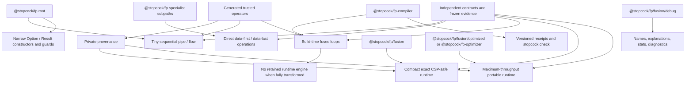
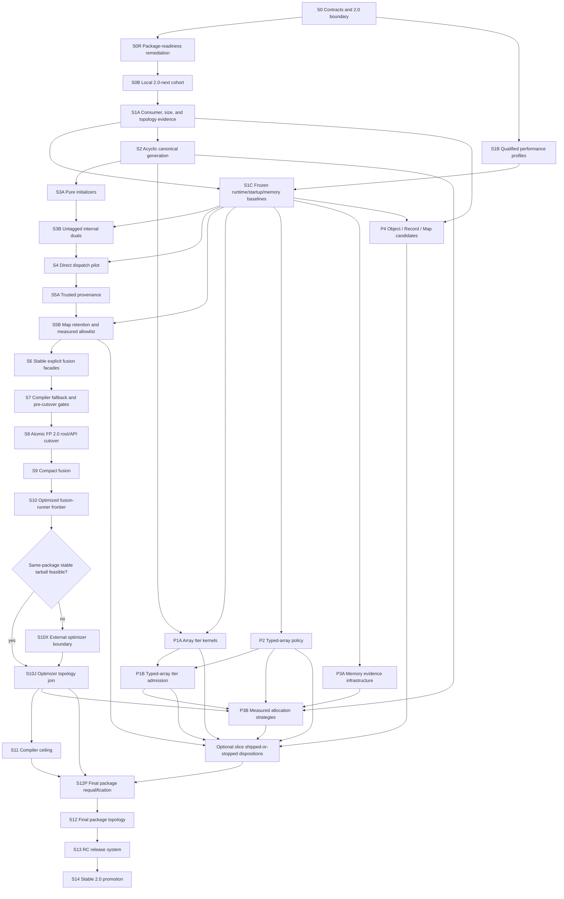

# Stopcock 2.0 performance-density superplan

> **Status:** proposed canonical execution plan.
>
> **Target release:** every Stopcock library workspace under `packages/*` is
> version-aligned to `2.0.0`; the 20-package base public inventory ships as one
> coordinated 2.0 cohort and the private `@stopcock/synth` workspace is aligned
> and compatibility-tested but is not published. If S10X proves and creates
> `@stopcock/fp-optimizer`, that new package becomes the twenty-first public
> member and is subject to every cohort gate. Private demo, documentation,
> benchmark, and application workspaces under `apps/*` and `benchmarks` are not
> part of the version cohort.
>
> **Delivery model:** independently reviewable, revertible slices. Every slice
> must leave a buildable, testable, packable working product. A later slice may
> improve or replace an earlier implementation, but no slice may depend on a
> temporarily broken root, missing export, incomplete generated file, or
> unverified fallback.
>
> **Current baseline:** the live checkout on 2026-07-24. Re-read and fingerprint
> the implementation worktree at the start of execution. At plan creation it was
> `main...origin/main [ahead 1]` with unrelated user-owned changes to
> `bun.lock`, `vite.config.ts`, and `apps/diff-demo/`.

## Canonical role and source plans

This document combines and orders these preserved source plans:

- `docs/superpowers/plans/2026-07-24-stopcock-fp-performance-frontier-implementation.md`
  - source SHA-256:
    `e5b6c1a8bc2f7b72b65e85d07a8c9289b56c496b54050cf7a6e5b6ee6d5fc10e`
- `docs/superpowers/plans/2026-07-24-fp-maximum-bundle-size-reduction.md`
  - source SHA-256:
    `dc7127ee67dab6ae2f32caffe55425c6ffaf4da8ee8c02c3705cbd674dc47fbf`

The source plans remain the detailed evidence and task catalogues. Do not
rewrite or delete them. This superplan owns:

- target architecture;
- dependency order;
- deliverable slice boundaries;
- cross-tier semantic contracts;
- shared size, performance, memory, and startup gates;
- Stopcock 2.0 version alignment;
- release-candidate and stable-release policy;
- rollback and stop/go decisions.

Where the source plans conflict, this document takes precedence on:

1. **Tier topology.** Root `pipe` and `flow` become tiny sequential 2.0
   primitives. Runtime fusion is explicit.
2. **Trust.** Public `_op`, `_fn`, `_a1`, and `_a2` properties remain
   compatibility/diagnostic data only. Private provenance is authoritative.
3. **Oracle policy.** Independently authored contract fixtures precede use of
   `interpret.ts` as a comparison oracle.
4. **Size policy.** Behavior-valid consumer closures and absolute tier budgets
   supersede the legacy shared-compile-chunk assumption.
5. **Template policy.** Compact and maximum-throughput runtimes receive
   different generated kernel allowlists from one canonical descriptor source.
6. **Version policy.** No Stopcock library workspace under `packages/*`
   remains at `0.x` or `1.x` in the stable release.
7. **Optimizer packaging.** The optimized runtime remains a same-package
   subpath for 2.0 unless a later slice proves a safe, versioned cross-package
   provenance and runner ABI.

The version-cohort scope is an explicit user decision made on 2026-07-24 and
supersedes the source plans' version ambiguity. It does **not** broaden FP
performance work into Synth: Synth remains private, excluded from FP
performance implementation and publication, and participates only in manifest
alignment plus a bounded compatibility check because it consumes Stopcock
packages.

## Outcome

Stopcock 2.0 should provide:

- direct utilities that tree-shake to hand-written-helper scale;
- tiny, always-correct sequential root composition;
- build-time fusion with effectively zero retained runtime engine;
- deterministic compiler receipts and a packed `stopcock check` renderer that
  separates static decisions, observed runs, and release evidence;
- an explicit compact CSP-safe fusion runtime;
- an explicit maximum-throughput portable fusion runtime;
- fast lazy terminals, typed arrays, and allocation-sensitive paths on their
  specialist subpaths;
- exact semantics across direct, sequential, compact, optimized, and compiled
  execution;
- a coordinated 2.0 package family with consistent versions, dependencies,
  peers, documentation, CI, and provenance.

The product claim is **performance density**, not one undifferentiated
“fastest” score. Each tier must state its byte cost, startup cost, steady-state
performance, semantic contract, and intended use.

The positioning is not “another ergonomic lazy utility library.” Familiar
data-first/data-last composition is the approachable entry surface; the
defensible difference is that ordinary typed pipelines carry enough internal
semantic information to be safely specialized, explained, and checked across
execution tiers. Any Remeda or other peer speed claim remains
artifact/corpus/runtime-specific characterization until the corresponding
qualified evidence exists—never a blanket slogan.

## Stopcock 2.0 package cohort

### Public 2.0 release cohort

All of these packages finish at stable version `2.0.0`:

- `@stopcock/async`
- `@stopcock/autodiff`
- `@stopcock/color`
- `@stopcock/date`
- `@stopcock/diff`
- `@stopcock/eslint-plugin-fp`
- `@stopcock/fp`
- `@stopcock/fp-codemod`
- `@stopcock/fp-compiler`
- `@stopcock/fp-interop`
- `@stopcock/fp-testing`
- `@stopcock/http`
- `@stopcock/img`
- `@stopcock/la`
- `@stopcock/parser`
- `@stopcock/pattern`
- `@stopcock/persistent`
- `@stopcock/signal`
- `@stopcock/state`
- `@stopcock/svg`

This is the 20-package base inventory. If and only if S10X is accepted, add
`@stopcock/fp-optimizer` as a required twenty-first public package at the same
`2.0.0-next.N`/`2.0.0` version. From that decision onward, “public cohort” and
“all public packages” mean the selected 20- or 21-package inventory. Cohort
tooling must enumerate `packages/*` and cannot preserve a stale handwritten
count.

### Private compatibility cohort

- `@stopcock/synth`
  - set its workspace manifest version to `2.0.0`;
  - update and validate its internal Stopcock dependency compatibility;
  - keep `"private": true`;
  - do not publish it;
  - do not bring Synth implementation or performance work into the FP
    performance slices;
  - add a bounded compatibility lane so a private dependent cannot silently
    remain incompatible with the 2.0 root/API changes.

### Versioning rules

- Add a deterministic version-cohort check. It must enumerate
  `packages/*/package.json` rather than maintain an incomplete handwritten
  subset.
- During the release-candidate train, all public packages use the same
  `2.0.0-next.N` version and exact compatible prerelease peer ranges.
- S0B’s `2.0.0-next.0` is a local development cohort, not an RC publication.
  S13 owns the first publishable unused `next.N`.
- Before any RC pack, pending changesets are consumed and the entire cohort is
  advanced together. After a published RC, any code, declaration, manifest,
  lockfile, or packed-artifact change requires a new changeset, a higher
  `next.N` for the whole cohort, and a complete repack.
- At stable promotion, every public package becomes exactly `2.0.0` and public
  peer ranges become `^2.0.0` unless a deliberately stricter range is required.
- Packed package manifests, not workspace manifests alone, are the release
  evidence.
- Internal dependency ranges must resolve to the same 2.0 cohort after packing.
- Do not permanently place all packages in a Changesets fixed group unless
  lockstep versioning after 2.0 is an explicit product decision. The coordinated
  2.0 version is a release operation, not an accidental permanent policy.
- The dynamic all-`packages/*` version-cohort check is likewise train-scoped
  from S0B through S14. S14 freezes the released inventory into its immutable
  evidence manifest and retires the default all-workspace lockstep invocation.
  Afterwards, ordinary package-contract checks permit independently versioned
  new packages; replaying the 2.0 cohort check requires the frozen manifest and
  may not absorb future `packages/*` workspaces.
- The release cannot promote while any package remains `0.x`/`1.x`, an FP peer
  still rejects the selected 2.0 candidate, or a packed internal dependency
  resolves outside the cohort.

## Target product architecture



### Public tier contract

| Tier | Public entry | Role | Target consumer cost |
|---|---|---|---:|
| Sequential root | `@stopcock/fp` | Small synchronous fallback and ordinary composition | `pipe`/`flow` each at most 0.5 KiB gzip |
| Direct specialist | `@stopcock/fp/*` | Direct and data-last operations without fusion-engine retention | selected direct op at most 0.5 KiB gzip |
| Compiler | `@stopcock/fp-compiler` | Automatic fused output plus versioned receipts and `stopcock check` | common compiled consumer at most 1 KiB gzip, runtime engine absent |
| Compact fusion | `@stopcock/fp/fusion` | Explicit CSP-safe runtime fusion with a small kernel set | 5.5 KiB interim, 5.0 KiB target |
| Optimized fusion | `@stopcock/fp/fusion/optimized`, or direct opt-in `@stopcock/fp-optimizer` only after accepted S10X extraction | Explicit maximum portable throughput | at most 12 KiB, expected 9.5–11 KiB |
| Fusion debug | `@stopcock/fp/fusion/debug` | Opt-in explanations and diagnostics | at most 3 KiB incremental gzip and absent by default |

### Pinned 2.0 base API and conditional S10X mapping

| Specifier | Required public surface | Fallback/compatibility meaning |
|---|---|---|
| `@stopcock/fp/fusion` | `pipeFused`, `flowFused`, `compile`, `compilePure` | compact explicit fusion after S9; before S9 it is clearly labelled a non-published compatibility alias to optimized fusion |
| `@stopcock/fp/fusion/optimized` | `pipeFused`, `flowFused`, `compile`, `compilePure` | maximum-throughput same-package implementation when S10X is skipped; removed before the first RC if S10X selects the direct opt-in package |
| `@stopcock/fp-optimizer` | conditional `pipeFused`, `flowFused`, `compile`, `compilePure` | direct opt-in maximum-throughput package only after S10X; never a dependency of `@stopcock/fp` |
| `@stopcock/fp/fusion/debug` | `explain`, `explainPure`, `explainRunner`, `getOptimizerStats`, `resetOptimizerStats`, plus their intentional public types | debug/diagnostic code, absent from production tier closures unless explicitly imported |
| `@stopcock/fp/compile` | current `compile`, `compilePure`, explanation/statistics compatibility surface during the documented window | deprecated compatibility facade to optimized fusion in the same-package topology; to compact fusion after S10X extraction, with a codemod to direct `@stopcock/fp-optimizer` for maximum throughput |
| `@stopcock/fp/dual` | public generic `dual` and its existing public types | callable compatibility API; caller-supplied tags never grant trusted provenance |

Compiler recognition, binding analysis, dead-import pruning, and fallback are
keyed by both source specifier and exported symbol. A facade may not silently
change its fallback tier merely because another facade is refactored.

Public functions created through `dual(..., { op })` remain callable and retain
their tag-shaped compatibility/diagnostic fields, but no caller-provided op
string or numeric value registers private provenance. They execute through the
generic callable path in 2.0. This performance/diagnostic change must be frozen
in S0 fixtures, documented, and tested across every valid public opcode.

### Why optimized fusion defaults to `@stopcock/fp` for 2.0

Generated templates currently depend on the main package runner and binding
ABI. Trusted operators must be authenticated through private provenance. A
separate `@stopcock/fp-optimizer` package cannot safely duplicate a private
`WeakMap`, trust public numeric tags, or import private filesystem paths.

For the base 2.0 topology:

- keep `@stopcock/fp/fusion/optimized` in the same package and module instance;
- make it unreachable from root, direct entries, and compact fusion;
- measure its tarball and consumer closure separately;
- permit extraction only after a slice proves:
  - a versioned runner/binding ABI;
  - a read-only trusted metadata/provenance protocol;
  - one-way package dependencies with no cycle;
  - single- and duplicate-version packed-install behavior;
  - no direct-bundle pollution;
  - synchronized compatible release ranges.

If that extraction is accepted, the final 2.0 API deliberately changes before
the first RC: users import `@stopcock/fp-optimizer` directly, compiler source
recognition and the codemod follow that specifier, and
`@stopcock/fp/fusion/optimized` is removed rather than becoming a facade with a
required hidden install cost.

### Internal semantic protocol boundary

Stopcock 2.0 standardizes an internal semantic protocol, not a public operator
SDK. It has three deliberately separate artifacts:

1. **`OperatorSemanticV1`:** immutable logical facts and observable semantics.
2. **`OperatorLoweringV1`:** one executor-specific capability and lowering for
   an exact semantic identity.
3. **`OperatorEvidenceV1`:** artifact-bound references to independently
   produced conformance, size, and performance evidence.

The protocol is static and generation-owned. It is composed from package-local
definition modules at build time; there is no process-global mutable registry,
runtime discovery, or import-time registration requirement. Direct-only
consumers retain none of the schema, lowering bank, evidence catalogue, debug
names, or benchmark data.

The authoring seam is one internal, definition-only `defineOperatorV1` helper.
It validates and deeply freezes plain semantic input, assigns no authority, and
emits no runtime registration side effect. Package namespaces make future
build-time contributors collision-safe, but FP is the only 2.0 contributor;
another package joins only through a reviewed slice with its own laws, corpus,
lowerings, and closure gates.

`OperatorSemanticV1` includes at least:

- protocol schema version, namespaced stable semantic ID, semantic revision,
  and semantic hash;
- logical input/output domains, accepted physical layouts, cardinality, and
  output-shape contract;
- binding layout and callback arity/index/count/order/evaluation-point rules;
- exact versus pure equivalence class, effect/determinism restrictions, source
  mutation visibility, and thrown-error identity/timing;
- early termination, stream termination, full materialization, and domain
  transition as four separate concepts;
- input/result ownership, permitted aliasing or detachment, allowed result and
  scratch storage classes, and the allocation scopes an executor may claim;
- the generic reference implementation ID and independently authored law and
  differential-corpus IDs; and
- explicit incremental semantics or `unsupported`. No delta, worker, SIMD, or
  Wasm capability is inferred from purity or a similarly broad flag.

The numeric opcode is only a generated compact encoding. It is never semantic
identity, provenance, compatibility, or authority. The semantic hash covers
normative behavior but excludes debug prose, source locations, benchmark
results, timestamps, and other non-semantic evidence.

The canonical encoder defines that hashed projection explicitly. Reference
implementation, law, corpus, and evidence IDs are link fields outside the
semantic hash; the lowering hash separately covers its implementation/runner
identity and ABI. Changing normative semantics creates a semantic revision and
hash. Changing only a runner invalidates the corresponding lowering identity;
changing retained evidence invalidates only the evidence identity. Neither
pretends the logical operator changed.

`OperatorLoweringV1` includes the target tier/backend, lowering ABI version,
accepted semantic mode and layouts, capability predicate with stable rejection
codes, runner/implementation ID, exact fallback, ownership/allocation contract,
and no evidence reference. A missing capability is `unsupported`; it never
defaults to eligible. `OperatorEvidenceV1` is the only join from semantic,
lowering, descriptor/bank, emitted-artifact, and corpus hashes to retained
evidence. Runtime lowerings and runner banks never contain the IDs or hashes of
evidence generated from themselves. A definition may generate wrappers,
metadata views, case manifests, and scaffolding, but it cannot generate a
passing law, differential, or benchmark result.

S2 owns one fail-closed refinement validator. A lowering's accepted layouts
must be a subset of the semantic layouts; its mode may not weaken effect,
evaluation, error, termination, or numeric guarantees; output shape,
cardinality, domain transition, ownership, and alias behavior must be equal or
a lossless projection; allocation permissions may only become stricter; and
fallback must name the same semantic ID/revision/hash. Every
`FusionRunnerDescriptorV1` is generated as a lossless projection of an accepted
lowering and cannot override those fields. Contradictions fail generation and
release validation rather than becoming runtime fallbacks.

Trust and evidence remain orthogonal:

- `trusted` means an operator was constructed by an authenticated internal
  factory and its call-local bindings match private provenance;
- `declared` means metadata makes a capability claim;
- `corpus-verified` means the named semantic/lowering/artifact hashes passed an
  independently authored corpus; and
- `release-qualified` means the exact packed artifact passed the applicable
  release lanes.

No evidence label grants provenance, and no trusted function is automatically
pure, exact, fast, worker-safe, SIMD-safe, Wasm-safe, or incrementally correct.

The boundary with the planned
`docs/superpowers/plans/2026-07-21-stopcock-compute-1.0-implementation.md` is
explicit:

- FP owns `OperatorSemanticV1`, array planning, fusion selection, compiler
  lowering, and compiler receipts.
- Compute owns `defineKernel`, `KernelProgram`, numeric/backend semantics,
  buffer ownership, scratch planning, worker transport, cancellation, crash
  recovery, and execution reports.
- A future optional adapter may lower a trusted, pure, closed FP semantic plan
  into a versioned Compute program. It may not serialize arbitrary callbacks or
  duplicate Compute's worker protocol.
- Such an adapter must forward Compute's structured `NumericPolicy`. FP
  defaults to `{ version: 1, mode: 'exact' }`; approximate execution is a
  capability miss unless the caller explicitly permits every required
  deviation class (`reassociation`, `fma-contraction`, or
  `transcendental-implementation`) with operation/dtype/domain tolerance
  evidence. Permission for one class never authorizes another.
- This FP 2.0 plan does not add Compute to the release cohort or create an FP
  runtime dependency on Compute.
- Because cohort tooling enumerates `packages/*` and permits only private Synth
  outside publication, creation of `packages/compute@0.0.0` is sequenced after
  S14 stable promotion **and** S14's committed transition from the dynamic
  train check to the frozen-manifest replay check. Starting Compute earlier
  requires an explicit revision to this plan's package inventory, version
  policy, and RC gates; it may not silently introduce a 1.x/private exception
  during the 2.0 train.

S10's generated execution objects are therefore called
`FusionRunnerDescriptorV1`, not `KernelProgram` or a generic “kernel protocol.”
That terminology reserves Compute's closed numeric program and worker-runtime
authority.

## Definition of a deliverable slice

A slice is complete only if all applicable statements are true:

1. **Working source:** affected source imports, runtime behavior, and types pass.
2. **Deterministic generation:** generated files are never hand-edited; the
   canonical generation command produces byte-identical output twice and no
   diff from a clean checkout.
3. **Working distribution:** every affected package builds and packs.
4. **Working public surface:** every affected public subpath imports, executes,
   and type-checks from the exact packed artifact.
5. **Working consumer:** final minified consumer fixtures execute and match
   behavior oracles.
6. **Tier isolation:** metafiles/topology checks prove forbidden modules are
   absent from each affected entry closure.
7. **Performance honesty:** the relevant frozen-baseline and per-row gates pass
   on admissible runners. A smaller bundle cannot offset a failed runtime row.
8. **Size honesty:** absolute per-bundler budgets pass. One smaller tier cannot
   offset an oversized tier.
9. **Evidence identity:** reports contain source, generated output, dist,
   tarball, fixture, tool, runtime, OS, architecture, and case-manifest
   identities as applicable.
10. **Release artifact:** observable API/behavior changes include a changeset,
    migration text, and documentation.
11. **Independent rollback:** reverting an ordinary slice restores the prior
    working product without requiring a later slice. A security/trust
    remediation instead rolls back to a conservative generic-safe path and
    must never re-enable a now-proven unsafe authority boundary merely to
    reproduce prior performance.
12. **Unrelated state preserved:** user-owned changes and unrelated baseline
    failures are not reformatted, reset, hidden, or folded into the slice.

A focused test pass is necessary but not sufficient. No slice may be marked
done while generated output is stale, an export points at a missing file, the
packed artifact differs materially from the measured one, or a fallback is
only expected to be repaired later.

## Global semantic and safety invariants

These apply to every slice.

### Dispatch and values

- Data-first/data-last selection remains based on `arguments.length`.
- `undefined`, `NaN`, `0`, `-0`, bigint, symbols, and explicit initial values
  remain valid operands.
- A direct leaf does not enter tag, cache, provenance, or fusion work.
- Existing stable data-last identity promises, including `Array.map`’s
  same-callback behavior, are preserved unless explicitly versioned.

### Array and iterator behavior

- Dense holes remain observed as `undefined` where current APIs promise that
  behavior.
- Source length snapshots, reads, callback count/order/index/arity, mutation
  visibility, reentrancy, thrown-error identity/timing, and result ownership
  remain exact.
- Eager Array `flatMap` flattens callback-returned Arrays according to its
  frozen indexed contract.
- Arbitrary returned iterables, nested iterator closing, and `IteratorClose`
  belong to `Iter.flatMap`.
- No optimized indexed lane bypasses observable custom iterator behavior.

### Option, Result, and types

- The canonical frozen `none` singleton remains reference-identical wherever
  current runtime behavior exposes that identity.
- Existing Option/Result tags and unchanged error branches retain their
  representation and identity.
- `flow(fn) === fn` remains true if frozen fixtures confirm it.
- Refinement, tuple, readonly, overload, and currying inference remain intact.
- Published declarations contain no accidental explicit `any` or private
  filesystem path.

### Tier equivalence and fallback

- Direct, root sequential, compact fusion, optimized fusion, compiler output,
  and the independent contract fixtures agree wherever they implement the same
  semantics.
- `interpret.ts` is a comparison oracle only after it agrees with the
  independent fixtures across the affected surfaces.
- `compilePure` never silently falls back to exact-mode semantics.
- Unsupported compiler sites preserve the tier selected by the original
  import:
  - root import → sequential fallback;
  - explicit fusion import → compact fusion fallback;
  - explicit optimized import → optimized fallback;
  - compatibility `./compile` import → its documented compatibility tier.
- Mixed transformed/untransformed files retain exactly the imports needed by
  their remaining fallback sites.

### Provenance and caches

- Public tag-shaped properties never authorize a kernel or provide trusted
  bindings.
- Only private trusted provenance may select a specialized runner.
- Forged, copied, deleted, reordered, or mutated public fields remain generic.
- Public-field mutation on a trusted operator cannot change its behavior.
- No newly introduced cache closes over a stale replaceable runner, leaks
  bindings between structurally identical calls, strongly retains arbitrary
  user objects, or grows without a documented bound.
- The frozen baseline’s generated `Array.map` one-entry strong callback cache
  is a known temporary exception required to preserve same-callback identity.
  S4 may isolate but not expand it; S5B must replace its retention mechanism
  with a collectable equivalent before S5B completes.
- Cache ownership, capacity, eviction, reentrancy, reset behavior, and memory
  cost are explicit.
- Provenance registration and pure-annotation rules are designed together:
  tree shaking may remove an unreachable operator and its self-owned
  registration, but must not retain fusion state in a direct-only consumer or
  erase registration for a reachable trusted operator.

### Portability

- Browser ESM, Node 22+, Node 24 canary, Bun/JSC, and strict CSP remain
  supported.
- No `eval`, `new Function`, callback source parsing/stringifying, disguised
  synchronous dynamic import, native addon, or hidden `Array.from` semantic
  fallback is introduced.
- Runtime/engine detection stays outside element loops and outside root/direct
  entry closures.
- Unknown or future engine versions use conservative generic policy.

## Evidence and gate policy

### Evidence lanes

Do not form a Cartesian mega-suite. Maintain separate bounded manifests:

- correctness and semantic differentials;
- consumer size by bundler and entry closure;
- direct/dispatch performance;
- sequential root performance;
- compact fusion performance;
- optimized fusion performance;
- compiler performance and coverage;
- Iter performance;
- typed-array performance;
- cold start and first call;
- allocation and retained memory;
- peer/market characterization.

PR jobs use bounded sentinels. Dedicated release jobs run the complete frozen
corpus sequentially on qualified hardware. Peer comparisons are informational,
never release denominators.

### Receipt and evidence taxonomy

Receipts record decisions and provide join keys for external evidence; they do
not create proof. Keep these versioned records separate:

- **`CompilerReceiptV1`:** deterministic static analysis and emitted-artifact
  facts for one discovered source site.
- **`PlanReceiptV1`:** deterministic runtime-planner facts for one semantic plan
  before execution.
- **`RuntimeProfileV1`:** optional instrumented observations from an actual run.
- **`ReleaseEvidenceRefV1`:** typed references to independently retained
  semantic, size, benchmark, package, or provenance artifacts.

Every static receipt records schema/site identity, repo-relative source span and
source hash, source specifier/export, compiler/config/semantic-manifest hashes,
ordered semantic identities and modes, segment and boundary decisions, applied
or rejected lowering, exact fallback tier, stable reason codes, and emitted
code/source-map hashes when applicable. Identical inputs produce byte-identical
static receipts; clocks, absolute machine paths, random IDs, and runtime
observations are forbidden.

Runtime profiles are separately keyed by receipt, plan, output artifact, and
runtime hashes. They may contain aggregate sizes, selectivity, consumed-item
counts, selected/executed runner, hotness, timings, and explicitly instrumented
allocations. They never contain input values, callback captures, result values,
or user data. Instrumented results are never silently substituted for
uninstrumented performance results.

Allocation claims use a closed scope rather than the ambiguous word “one”:
`compiler-emitted-result`, `fusion-runner-result`,
`fusion-runner-scratch`, `caller-provided`, or `backend-staging`. A static
receipt may record a contract or upper bound only. Observed count/bytes require
a hash-matched `RuntimeProfileV1` and name the exact scope; caller-provided
storage is never counted as executor allocation. S7 compiler receipts may make
static claims only about `compiler-emitted-result`; S9/S10 observed profiles
own fusion-runner result/scratch observations. `backend-staging` is reserved for
a future adapter and is unsupported by FP 2.0.

Use this closed evidence vocabulary:

- `declared-capability`: metadata only, never rendered as a pass;
- `static-decision`: what analysis selected, rejected, or emitted;
- `semantic-differential`: an artifact/hash-bound independent corpus result;
- `runtime-observation`: a hash-matched instrumented execution aggregate;
- `qualified-benchmark`: raw-sample evidence from an admissible profile; and
- `release-artifact`: packed-install, size, declaration, or provenance evidence.

Human renderers label claims `declared`, `statically selected`,
`corpus-verified`, `runtime-observed`, or `release-qualified`. In particular:

- a static receipt cannot claim an observed stop count, actual executor, total
  allocation count, callback purity, or end-to-end speed;
- a corpus pass is evidence for the named compiler, semantic descriptors, and
  emitted artifacts, not proof about an arbitrary user callback;
- “one allocation” is permitted only when its scope says
  `compiler-emitted-result` and the statement is a static contract, or a
  matching runtime profile observed the named allocation scope;
- a selected or eligible runner is not `executed` until the invocation branch
  records it; and
- any source, config, semantic, lowering, generated-output, package, runtime,
  or corpus hash mismatch makes the affected evidence `stale`/`unavailable`,
  never successful.

The first product surface is the durable JSON contracts plus their renderer.
S2 owns the definition-only receipt envelope/schema and generated validators;
S7 owns the compiler producer plus the explicit packed-CLI slice exposing
`stopcock check`. It aggregates these records rather than scraping console
prose or silently running tests, profilers, or benchmarks during an application
build.

### Cross-tier hard floors

| Surface | Release floor |
|---|---|
| Changed hot direct case | point estimate at least `0.97x`, lower confidence bound at least `0.90x`, changed-family geomean at least `1.00x` versus frozen Stopcock |
| Same-process direct canary | geomean at least `0.98x`; no common operation below `0.95x` |
| Sequential short pipe | geomean at least `0.98x`; every arity 1–5 at least `0.95x` |
| Sequential long pipe | geomean at least `0.97x`; no extra array allocation |
| Root bundle | `pipe` and `flow` each at most 512 gzip bytes in esbuild, Rollup, Rolldown, and Webpack |
| Sequential common pipeline | at most 1.5 KiB gzip |
| Direct `map` | at most 512 gzip bytes in every required bundler |
| Two unrelated helpers | at most 512 gzip bytes in every required bundler |
| Compiled common pipeline | at most 1 KiB in every supported host and no retained runtime engine |
| Compiler execution | existing corpus geomean at least `0.90x` hand loop; no Bun row below `0.80x`; no Node row below `0.70x` |
| Compact fusion | at most 5.5 KiB interim, 5.0 KiB target; size-first floor is geomean at least `0.75x` frozen current portable runtime and no common row below `0.60x`; claims remain limited to performance proven by the same artifact |
| Optimized fusion | explicit-only closure at most 12 KiB; existing portable policies retained; candidate geomean at least `1.00x` frozen current engine |
| Iter | old corpus geomean at least `1.00x`; no old row below `0.90x` |
| Typed arrays | at least `0.90x` native for intrinsic-like operations, at least `0.85x` for filters, no non-target regression worse than 3% |
| Cold import/first call | no regression greater than 10% or 1 ms, whichever allowance is larger |
| Specialist entry size | no gzip growth over 5% without a named measured win and reviewed exception |
| Retained heap/RSS | no attributable changed-family regression over 10% after calibration |
| Main FP tarball before S12 topology work | no regression beyond reviewed evidence and never above the legacy 150 KiB ceiling |
| Main FP tarball after S12 topology work | at most 105 KiB at the non-publishable S12 migration checkpoint; below 100 KiB for every published RC and stable 2.0 |

If compact fusion is advertised as equivalent to the old portable-performance
runtime, it must additionally retain the encoded portable policies:

- Bun/JSC global geomean at least `1.20x`, no row below `0.80x`, RME at most 6%;
- Node/V8 global geomean at least `1.15x`, no row below `0.85x`, RME at most 5%;
- all existing stratum floors.

If it cannot, compact fusion remains an honestly labelled size-first runtime.
Optimized fusion retains the maximum-throughput claim.

### Bundle gate rules

- Execute the final minified artifact.
- Gate esbuild, Rollup, Rolldown/Vite+, and Webpack independently.
- Gate gzip; record Brotli and add stable Brotli ceilings after evidence exists.
- Measure every entry’s transitive chunk closure in multi-entry applications.
- Record module attribution and largest positive deltas.
- Pin fixture, bundler, minifier, source, and package identities.
- Reject missing/duplicate fixtures and invalid or substituted artifacts.
- Do not let a smaller direct fixture compensate for an oversized fusion tier.

### Performance gate rules

- Frozen Stopcock is the release denominator.
- Pinned peers are characterization only.
- Preserve raw AB/BA paired samples and recompute all statistics in the gate.
- Reject wrong runtimes, unqualified runners, drifted profiles, missing shards,
  duplicate case IDs, mismatched checksums, or unsupported substitutions.
- Keep throughput processes free of GC/memory instrumentation.
- Never update a failing frozen baseline in the implementation change.

## Slice dependency graph



P1–P4 may execute in parallel once their stated entry gates pass. They are not
allowed to block the core tiny-root architecture merely because an optional
candidate fails its own performance gate. They must finish or record an
explicit stop decision before S12 freezes public declarations and package
topology.

---

## S0 — Freeze architecture, semantics, and the 2.0 release boundary

### Entry state

- `@stopcock/fp` is `1.0.0`.
- several public packages are `0.0.0`;
- compiler/interop/parser peers already refer to FP 2.x;
- root `pipe` and `flow` automatically enter the current fusion engine;
- root exports include `dual`, `compile`, `compilePure`, and `explain`;
- eager Array and lazy Iter `flatMap` are not frozen across every execution
  surface;
- public tag-shaped fields are currently forgeable authority.

### Deliverable

- Approved tier/export table from this plan.
- Approved public migration map:
  - root `pipe`/`flow` → sequential root;
  - root `compile`/`compilePure` → `@stopcock/fp/fusion`;
  - root `explain` → `@stopcock/fp/fusion/debug`;
  - root `dual` → `@stopcock/fp/dual`;
  - maximum runtime throughput → `@stopcock/fp/fusion/optimized`, or direct
    `@stopcock/fp-optimizer` only if S10X is accepted before the first RC.
- Independently authored eager Array and lazy Iter `flatMap` fixtures.
- Approved private-provenance design.
- Checked-in 2.0 package cohort inventory and version-range policy.
- Explicit prerelease policy: no stable 2.0 publication until S14.
- Tier-specific claim and fallback wording.

### Work

- Add architecture/contract documentation and semantic fixtures.
- Add an assertion that the current version, manifest, and peer state is
  intentionally inconsistent until the coordinated cutover slice.
- Add root export and migration-target snapshots.
- Add non-gating forged-tag characterization demonstrating the current
  authority problem without encoding the vulnerable current behavior as the
  desired assertion. Convert it into a passing security gate only in S5A.
- Record all public dependants that must be tested against the 2.0 FP surface.
- Add a package-cohort readiness matrix for every `packages/*/package.json`
  containing current version, public/private status, exports, build/type/test/
  pack commands, internal dependencies/peers, changelog/README/license state,
  and whether a `0.0.0` package is genuinely ready to become public at 2.0.

### Allowed changes

- `docs/superpowers/**`
- independently authored semantic and type fixtures under
  `packages/fp/src/__tests__/**` and `packages/fp-compiler/src/__tests__/**`
- additive package-cohort/readiness validation scripts and their tests
- no production runtime, generated output, public export, package version,
  lockfile, or publish-workflow change

### Validation

- Direct, interpreter, generated portable, runtime compile, and compiler fixture
  expectations are independently expressed.
- Eager Array fixtures reject arbitrary returned iterables as eager flattening.
- Iter fixtures prove nested closing and arbitrary iterable behavior.
- Every current root export has one intentional 2.0 destination.
- Every package workspace appears exactly once in the version cohort.
- Every public `0.0.0` package has an explicit `ready` or `blocked` disposition;
  a blocked package stops all-cohort promotion rather than being assigned 2.0
  by version-only fiat.

### Working-product invariant

The existing 1.x runtime, exports, distribution, and package versions remain
unchanged.

### Rollback

Remove the additive fixtures and contract documents. No runtime rollback is
required.

### Exit gate

No production optimization begins until the semantic, topology, trust, and
version decisions are approved.

---

## S0R — Remediate package-readiness blockers

S0R is a conditional gate. If S0 marks every base public package ready, it
completes as a validated no-op. A blocked public package cannot be silently
dropped because the user’s release target is the complete package family.

### Entry state

- S0 has enumerated every `packages/*` library and assigned `ready` or
  `blocked:<reason>`.
- Each blocker names the exact package-owned or shared/root release seam that
  prevents build, test, type-check, pack, import, licensing, or internal
  dependency compatibility.

### Deliverable

- One bounded, independently revertible remediation per blocked public package.
- A refreshed readiness inventory with no blocked public package.
- Private Synth may remain implementation-excluded, but its manifest and
  bounded compatibility prerequisites must be ready.

### Work

- Fix only the package-owned source/configuration or shared/root dependency
  directly responsible for the recorded readiness failure.
- Preserve public behavior unless a separately reviewed 2.0 breaking change,
  migration, and changeset are genuinely required.
- Re-run the exact failed package contract from a clean packed install.
- Keep each package remediation in its own commit; do not use one broad
  workspace cleanup to manufacture readiness.
- If a package cannot be made ready within the approved release scope, stop the
  whole superplan for a product decision. Do not version or publish a partial
  base cohort.

### Allowed changes

- the one blocked package named by each remediation record
- shared/root build, type, pack, license, or dependency tooling only where the
  record proves it directly blocks that package
- focused tests, migration text, and changeset required by that remediation
- no FP performance work, unrelated cleanup, package removal, readiness waiver,
  version alignment, lockfile rewrite, or Synth publication

### Validation

- Every base public package builds, passes its scoped correctness/type/package
  contract, packs, installs cleanly, imports every declared export, and carries
  required README/LICENSE/publication metadata.
- Internal dependency/peer requirements have a valid path to the coordinated
  2.0 cohort.
- The inventory is complete and contains no `blocked`, `waived`, `deferred`, or
  missing public package.
- A no-op S0R proves the same conditions without changing files.

### Working-product invariant

After each remediation, the affected package is a working current-version
product; no package is assigned 2.0 merely to hide a broken release surface.

### Rollback

Revert one package remediation and restore its explicit blocked status. S0B
then becomes blocked again; no other package or user-owned state is reverted.

### Exit gate

All 20 base public packages and private Synth’s bounded compatibility surface
are ready. S0B cannot start with a blocked or waived package.

---

## S0B — Normalize the local 2.0-next development cohort

### Entry state

- S0R has approved the complete package/readiness inventory with no blocked
  public package.
- live packed FP dependants are not peer-consistent because FP is `1.0.0`
  while compiler/interop/parser already require FP 2.x.
- the user-owned main worktree contains a modified `bun.lock`.

### Deliverable

- One isolated clean release worktree for all cohort/version/lockfile work.
- One idempotent version authority at `tooling/v2-cohort.mjs`.
- Base immutable cohort packer at `tooling/v2-pack-cohort.mjs` and private
  compatibility runner at `tooling/v2-synth-compat.mjs`.
- All ready `packages/*` library manifests aligned locally to
  `2.0.0-next.0`.
- Exact prerelease internal peer ranges that accept the same cohort.
- Private Synth aligned separately and still private.
- Peer-consistent clean packed installs for FP and all ready dependants.
- No registry publication.
- The clean worktree becomes the canonical implementation/release worktree for
  S1 onward, or its cohort-only commit is integrated before S1 starts. It is
  not a disposable side branch whose manifest and lockfile state later slices
  silently lack.

### Work

`tooling/v2-cohort.mjs` is the only authority allowed to coordinate versions.
Before any Changesets operation it must derive the selected public inventory
from S0/S10J and snapshot every excluded private workspace manifest/changelog.
It must assemble, filter, and apply release plans only for that selected public
inventory:

- never pass an unfiltered prerelease-exit plan to the normal version applier;
- consume only changesets whose package set is wholly inside the selected
  public cohort; reject a mixed public/private changeset for explicit splitting
  and leave private-only changesets untouched;
- ignore/suppress synthetic releases Changesets proposes for excluded private
  workspaces;
- keep every excluded private workspace byte-identical, except that Synth’s
  manifest/dependency alignment is performed manually in its dedicated private
  lane;
- preserve absent/null private app/docs/benchmark versions as absent/null;
- fail if Changesets, normalization, or lockfile work mutates an excluded
  private manifest/changelog.

This filter is required because the installed Changesets prerelease-exit
planner can synthesize patch releases for private workspaces missing
`preVersions` even when `.changeset/config.json` has
`"privatePackages": false`.

The tool must then provide deterministic operations:

- `plan --target 2.0.0-next.0`
  - enumerate all package workspaces;
  - read current Changesets state without modifying files;
  - show proposed versions, internal dependency/peer ranges, private-package
    handling, and blocked packages.
- `align-next --target 2.0.0-next.0`
  - require the canonical clean worktree and either no prerelease train or the
    exact already-aligned target train;
  - on first execution, run the equivalent of
    `vp exec changeset pre enter next` once;
  - snapshot the pending Changesets release plan and IDs;
  - assemble the equivalent `changeset version` release plan, filter it to
    wholly selected-public changesets, and apply only that plan so existing
    mixed patch/minor/major public changesets are consumed and their changelog
    text is preserved;
  - deliberately normalize every ready public package, including packages
    starting at `0.0.0`, to `2.0.0-next.0`; ordinary semver bump arithmetic is
    not allowed to choose a lower target;
  - normalize the generated full-cohort changelog headings and prerelease state
    to the same target without dropping consumed changeset IDs or text;
  - align all ready public packages to the target prerelease;
  - align private Synth outside Changesets publication;
  - use exact same-cohort prerelease peers where npm prerelease semantics would
    make `^2.0.0` reject the RC;
  - run `bun install --lockfile-only`;
  - finish with `check`, a clean re-run of the Changesets status/release-plan
    parser, and byte-stable second execution.
  - on an exact-target second execution with no new pending changeset, perform
    verification only and write no byte; reject a different active train or
    new pending changeset with an instruction to use `advance-next`.
- `advance-next --target 2.0.0-next.N`
  - require active `next` prerelease state and an unused monotonically
    increasing `N`;
  - assemble/filter/apply every wholly selected-public pending changeset before
    normalization; never consume an excluded-private or mixed changeset;
  - advance the entire public cohort, Synth manifest, internal prerelease
    ranges, changelogs/prerelease state, and lockfile to the one target;
  - never advance only packages touched by a later slice;
  - run before **any** RC pack when the chosen target differs or pending
    changesets exist, including the first published RC, and after every code,
    declaration, manifest, or artifact-affecting change made after a published
    RC.
- `join-current --package <new-package-name>`
  - require an active local `next` train and a package absent from S0’s base
    inventory;
  - align only that newly created package to the current local cohort version,
    update exact internal ranges and the lockfile, and leave its changeset
    pending;
  - support S10X development without inventing a second version writer;
  - never publish or replace the later all-cohort `advance-next` before an RC.
- `align-stable --target 2.0.0`
  - require the accepted RC evidence record;
  - mark the equivalent of `vp exec changeset pre exit`, assemble the resulting
    release plan, remove every release outside the selected public cohort, and
    apply the filtered plan without invoking the unfiltered CLI version pass;
  - normalize every selected public package to `2.0.0`;
  - align Synth’s manifest/dependencies manually to `2.0.0` outside Changesets;
  - normalize public internal ranges to `^2.0.0` or an approved stricter stable
    range, regenerate changelogs/prerelease state, and run
    `bun install --lockfile-only`;
  - assert every other private app/docs/benchmark manifest and changelog is
    byte-identical to its pre-operation snapshot.
- `check` and `check-packed`
  - verify workspace and exact packed manifests, respectively.

The tool must integrate with Changesets rather than silently discarding
existing changesets/changelogs. Tests must seed mixed current versions and
mixed patch/minor/major changesets, including a `0.0.0` package, and prove the
same full-cohort target and preserved text. They must also seed versioned
private apps, missing/null-version private docs/benchmarks, private Synth, and
`preVersions` entries missing for those workspaces; prerelease exit must change
only the selected public cohort plus Synth’s explicitly manual manifest. The
tool must not add a permanent fixed group merely to force this one coordinated
release.

S0B also owns the base `pack-cohort` and `synth-compat` commands because its
own exit and S1 packed evidence depend on them. The packer consumes the aligned
workspace, builds/pack each selected public package once, and emits the
immutable target/hash manifest. Development mode writes
`artifacts/v2/dev/<version>/<cohort-content-hash>/cohort-manifest.json`, so
later source changes or an S10X package join at the same local prerelease
version create a new immutable snapshot rather than overwrite S0B evidence.
Candidate mode reserves `artifacts/v2/<prerelease-version>/` for S13’s
version-unique RC artifacts. Release mode writes stable attempts to
`artifacts/v2/release/2.0.0/<cohort-content-hash>/`; failed unpublished
attempts therefore cannot block a corrected stable attempt at the same
version. The Synth runner consumes a manifest, asserts Synth is private/absent,
installs the packed dependencies, and runs only its bounded compatibility
contract. S13 may wire these tools into release CI but does not invent them
later.

### Allowed changes

- `tooling/v2-cohort.mjs` and focused tests
- `tooling/v2-pack-cohort.mjs`, `tooling/v2-synth-compat.mjs`, and focused tests
- package manifests under `packages/*/package.json`
- Changesets prerelease/version state and generated changelog updates
- the isolated release worktree lockfile
- root scripts that expose the cohort tool
- root scripts that expose the pack and private compatibility tools
- no runtime implementation, root export, benchmark threshold, or publish
  workflow change
- never overwrite the user-modified `bun.lock` in the original worktree

### Validation

- `plan` and repeated `check` calls are byte-stable and side-effect free.
- the isolated worktree has no unrelated source changes.
- fixture coverage proves a filtered prerelease entry, advance, and exit cannot
  version or rewrite excluded private apps, docs, or benchmarks; their
  manifests/changelogs remain byte-identical and absent/null versions remain
  absent/null.
- all ready public package tarballs install together without peer warnings.
- every packed internal dependency resolves to the same prerelease cohort.
- `pack-cohort --mode dev --target 2.0.0-next.0` emits a reproducible
  content-addressed manifest and refuses a differing overwrite at the same
  content-hash path.
- all packages build, pack, import, and type-check through their declared
  exports.
- private Synth remains absent from that manifest and passes the packed
  dependency compatibility runner without publication.
- blocked packages remain explicit blockers; the tool does not version them
  into apparent readiness.

### Working-product invariant

The local development line is a coherent, packable 2.0 prerelease cohort with
the existing 1.x runtime behavior still intact. Nothing is published and no API
has changed merely because its version metadata is normalized.

### Rollback

Delete the isolated release worktree or revert the cohort-only change. The
original user-owned lockfile and runtime sources remain untouched.

### Exit gate

No packed compiler/dependant host validation and no subsequent cohort-aware
slice may use the inconsistent 1.0/2.x manifests. S0B must be green first.

---

## S1 — Establish canonical evidence in three independently complete slices

S1 is deliberately split so deterministic size work does not wait on external
runner provisioning and hot-path work cannot mistake hosted canaries for
release evidence.

### S1A — Consumer behavior, size, and topology evidence

#### Entry state

- S0 contracts and S0B peer-consistent local cohort are approved.
- the existing size gate measures a specific shared compile chunk and tarball;
- source, dist, packed, and consumer identities are not unified.

#### Deliverable

- One cross-bundler, behavior-valid consumer-size harness.
- One shared identity/checksum envelope.
- A topology-neutral package gate validating both current and future layouts.
- Existing 18 KiB shared-chunk and 150 KiB tarball checks retained as legacy
  mode only while that topology exists.

#### Work

Add:

- `benchmarks/src/bundle-size/**`;
- `benchmarks/src/reference/fp-consumer-size-contract.ts`;
- `benchmarks/src/reference/fp-consumer-size-gate.ts`;
- tamper/evaluator tests;
- package-topology mode detection that does not require root and compile to
  share a named chunk.
- a publish-style lower-bound projection for the final main tarball with the
  full optimized bank retained, reachable declarations only, and the planned
  root/debug isolation. This is a feasibility signal, not a substitute for S12
  exact-tarball evidence.

Current-topology fixtures must cover pipe/flow, direct/data-last map,
Option/Result, collect/reduce/deep pipelines, explicit compile, root
named/static/enumerated namespace, object/string/unrelated helpers,
multi-entry route closures, and compiler output. Predeclare future
`fusion`, `fusion/optimized`, and `fusion/debug` rows as explicit
`not-applicable: expected-export-absent`; S6 and S9 activate their owning rows
fail-closed. Once active, the `fusion/debug` closure has a 3 KiB incremental
ceiling.

The manifest must contain distinct non-substitutable IDs for:

- `compiler.collect.common`;
- `compiler.reduce.common`;
- `compiler.deep`;
- `compiler.option-terminal`;
- `helpers.two-unrelated`.

Each compiler fixture has its own behavior oracle and 1 KiB gzip ceiling in
every required host. `helpers.two-unrelated` has a 512-byte gzip ceiling in
every required bundler. A generic “compiler output” or aggregate helper row
cannot satisfy any of these IDs.

#### Allowed changes

- `benchmarks/src/bundle-size/**`
- `benchmarks/src/reference/fp-consumer-size-*`
- `benchmarks/package.json`
- `bun.lock`, only for the exact S1A benchmark dependencies declared in
  `benchmarks/package.json`
- focused topology/package gate files and tests
- no production package source, public exports, generated runtime, or workflow
  release behavior

#### Validation

- Reproduce the current matrix within 5% or record changed identities.
- Execute every final minified artifact.
- Reject missing/duplicate/tampered rows, invalid compression, wrong tool or
  artifact identity, behavior failure, and incorrect transitive closure.
- Prove the topology-neutral gate passes the current layout before it may
  replace the legacy assumption.
- Report whether the evidence-backed same-package optimizer projection can
  plausibly finish below the stable 100 KiB ceiling; do not defer an already
  impossible packaging decision to the last slice.

#### Working-product invariant

Runtime, exports, and distribution bytes are unchanged.

#### Rollback

Remove the additive harness/gate.

#### Exit gate

S2 may start after S1A; S3A follows S2’s clean canonical generation. Root/tier
topology work is blocked until the topology-neutral gate passes the current
artifact.

### S1B — Dedicated performance-profile qualification

#### Entry state

- S0 contracts identify supported engines/platforms.
- named dedicated runner capacity has an accountable owner.

#### Deliverable

- Provisioned or labelled `perf-linux-x64` and `perf-macos-arm64` runners.
- Checked-in CPU/OS/runtime/power/thermal profiles.
- Profile drift rejection and numeric variance limits.
- Explicit statement that hosted results are canaries only.

#### Work

- record the infrastructure owner and provisioning runbook;
- install exact Node 22, Node 24 canary, and supported Bun versions;
- disable parallel performance jobs and control power/thermal variance as far
  as the platform permits;
- add profile validation and repeated noise qualification.

#### Allowed changes

- `benchmarks/PERF_PROFILE.md`
- profile validation scripts/tests
- dedicated-runner labels and non-release infrastructure configuration
- no production runtime, thresholds derived from unqualified data, or public
  performance claims

#### Validation

- repeated no-change sessions satisfy numeric variance limits;
- an unknown/drifted profile is rejected before timed work;
- hosted runner artifacts are never accepted as baseline/release evidence.

#### Working-product invariant

Product source and distribution are unchanged even if infrastructure
provisioning is delayed.

#### Rollback

Remove a runner label/profile without changing product code or frozen evidence.

#### Exit gate

An unavailable or unqualified runner blocks S1C and hot-path promotion, not
S1A/S3A size-only work.

### S1C — Frozen runtime, startup, and memory baselines

#### Entry state

- S1A identity envelope exists.
- S1B profiles are qualified.

#### Deliverable

- Frozen current direct, root-fused, compiler, Iter, typed-array, startup, and
  allocation manifests, plus independent hand-sequential references.
- Raw AB/BA paired samples.
- Source, built-dist, and exact packed-package identities.
- Bounded quick/release worker counts, shards, retries, and wall-clock budgets.

#### Work

- add direct-dispatch and cold-start contracts/workers;
- keep nonexistent candidate sequential/compact rows explicitly inactive;
  S6/S7/S8/S9 activate those lanes without replacing the frozen current-root
  denominator;
- add common report validation only where existing gates remain stable;
- run three clean baseline sessions per engine/profile;
- keep timing, size, startup, memory, and peer characterization as separate
  schemas.
- add a checked-in memory metric-capability matrix keyed by engine/version. For
  retained heap, peak RSS, GC count, and pause duration, record collection
  method, unit, required/optional status, and the explicit unsupported
  representation;
- validate Node `--expose-gc`, `Bun.gc`, and `PerformanceObserver`
  capabilities without timing throughput in the instrumented process.

#### Allowed changes

- `benchmarks/src/reference/**`
- benchmark scripts/tests and `benchmarks/PERF_PROFILE.md`
- evidence artifact plumbing
- no production implementation or baseline replacement mixed with a candidate

#### Validation

- raw samples reproduce every statistic;
- wrong source/dist/pack hash, runtime, orientation, checksum, shard, case ID,
  worker identity, or summary fails closed;
- all manifests are bounded and complete.
- package-contract evidence freezes `"sideEffects": false`; no later size slice
  may obtain a win by weakening or removing that declaration.
- S1C records variance for the pre-approved compact `0.75x` geomean/`0.60x`
  per-row size-first floor but may not tune that floor after observing a compact
  implementation.

#### Working-product invariant

No production implementation has changed; every later hot-path candidate now
has an immutable denominator.

#### Rollback

Remove additive benchmark infrastructure. Any baseline replacement is a
separate reviewed evidence change.

#### Exit gate

S2 may use S1A identities, but S4/S5B/S9–S11/P1–P3 hot-path promotion is
blocked until its relevant S1C baseline exists.

---

## S2 — Make generation acyclic, canonical, and reproducible

### Entry state

- S1A records current generated outputs and compiler metadata identities.
- current generation reads generated/runtime surfaces in places and compiler
  metadata generation is not owned by one FP reproducibility check.

### Deliverable

- One acyclic static `OperatorSemanticV1` model and a separate
  `OperatorLoweringV1` model. Semantic definitions never import runtime or
  generated output; executor lowerings reference semantic identities and may
  not redefine observable semantics.
- One internal `defineOperatorV1` authoring helper that validates, copies, and
  deeply freezes definition-only plain data without registering anything at
  runtime or becoming a public export.
- One generated `OperatorEvidenceV1` index whose entries reference retained
  artifacts without making evidence part of runtime authority.
- One definition-only `ReceiptSchemaV1` source for `CompilerReceiptV1`,
  `PlanReceiptV1`, `RuntimeProfileV1`, evidence references, join keys, stable
  reason codes, and render-status vocabulary. S2 generates dependency-free
  validators/views for FP debug, `@stopcock/fp-compiler`, and the conditional
  optimizer without adding a runtime package edge.
- One fail-closed semantic-to-lowering-to-runner refinement validator.
- One deterministic generation order for:
  - public operation wrappers;
  - numeric opcodes and binding facts;
  - compact/optimized descriptor inputs;
  - public export metadata;
  - compiler operation snapshots.
- One reproducibility command covering FP runtime, future tier manifests,
  exports, and compiler metadata.
- No intended public behavior or runtime-byte change.

### Work

- Remove generator dependence on root exports and generated `src/array` values.
- Stop compiler generation from discovering facts by importing mutable live
  runtime registries.
- Route FP's canonical definitions through internal `defineOperatorV1`; reject
  unknown fields, duplicate package-qualified IDs/revisions, mutable retained
  inputs, and implicit capability defaults.
- Define `OperatorSemanticV1` facts for:
  - protocol schema version, namespaced stable semantic ID, semantic revision,
    and semantic hash; numeric opcode remains only a generated internal
    encoding;
  - logical input/output domains, accepted physical layouts, cardinality, and
    output-shape function;
  - binding layout plus callback arity, index, count, order, and
    evaluation-point contract;
  - exact/pure equivalence class, effects/determinism, source mutation
    visibility, and thrown-error identity/timing;
  - early termination, stream termination, full materialization, and domain
    transition as separate fields;
  - input/result ownership, aliasing/detachment rules, allowed result/scratch
    storage classes, and executor allocation scopes;
  - public diagnostic tag layout; and
  - generic reference implementation ID plus independently authored law and
    differential-corpus IDs.
- Define `OperatorLoweringV1` separately: target tier/backend, lowering ABI
  version, supported semantic mode/layout, capability predicate, stable
  rejection codes, runner ID, exact fallback, ownership/allocation contract,
  and no evidence references.
- Define and run the S2 refinement validator before emission. Lowerings must
  narrow—not contradict—their semantic definition, and runner descriptors must
  be lossless projections of accepted lowerings. Reject widened layout/mode,
  changed shape/cardinality/evaluation/error/boundary/ownership behavior,
  weaker alias/allocation restrictions, or a fallback naming another semantic
  identity.
- Keep all evidence joins in `OperatorEvidenceV1`. Its external entries bind
  semantic, lowering, descriptor/bank, emitted-artifact, and corpus hashes; no
  hashed runtime artifact embeds evidence produced from that artifact.
- Define `ReceiptSchemaV1` under the S2 definition-only codegen protocol and
  generate schema-hash-identical, dependency-free validators/views into FP
  debug, `@stopcock/fp-compiler`, and `@stopcock/fp-optimizer` only when S10X
  accepts it. Production direct/root/compact/optimized closures may retain no
  receipt renderer or schema solely because the definitions exist.
- Record worker, SIMD, Wasm, and incremental capabilities as explicit
  `unsupported` values in this FP 2.0 slice unless an independently owned
  implementation and corpus actually exist. No eligibility defaults true.
- Generate runtime and compiler views from those facts without sharing
  candidate loop bodies or benchmark oracles.
- Permit generation of metadata views and case-manifest scaffolding, but never
  a passing law, differential, or benchmark result.
- Expand `codegen:check` ownership to compiler snapshots and future tier
  manifests.

### Allowed changes

- `packages/fp/codegen/**`
- canonical definition-only modules under `packages/fp/src/internal/**` if they
  contain no runtime initialization
- generated FP runtime/manifest files, only through generators
- `packages/fp-compiler/scripts/gen-ops-table.ts` and its generated snapshot
- generated receipt-schema validators/views in FP debug,
  `packages/fp-compiler/**`, and conditional `packages/fp-optimizer/**`
- reproducibility scripts/tests
- no public runtime semantics, tag authority, direct algorithm, cache, root
  export, or package-tier topology change

### Validation

- A clean checkout can generate without first importing generated output.
- Two consecutive generations are byte-identical.
- Generation followed by build leaves no generated diff.
- Runtime and compiler fact hashes agree.
- Every generated receipt view reports the identical `ReceiptSchemaV1` hash,
  validates the same fixtures, and has no package-runtime dependency on its
  source generator.
- Unknown schema versions, duplicate semantic IDs, semantic-hash drift, and
  omitted required fields fail generation closed.
- Deliberately contradictory semantic/lowering/runner fixtures fail the
  refinement validator before any runtime bank or compiler snapshot is emitted.
- Any semantic or lowering hash change invalidates evidence naming the old
  hash.
- Fixtures distinguish stream termination from full materialization and prove
  that a numeric opcode alone cannot identify or authorize an operator.
- Direct/root consumers retain no semantic schema, law catalogue, benchmark
  evidence, debug registry, or lowering bank merely because canonical
  definitions exist.
- Existing runtime/type/compiler/source snapshots pass.
- Source, dist, and consumer size remain within the frozen baseline allowance.

### Working-product invariant

The current root fusion engine, public API, operation behavior, and fallback
selection remain unchanged.

### Rollback

Restore the previous generator pipeline as one slice. Do not mix this
restructuring with numeric-tag, provenance, or direct-dispatch implementation.

### Exit gate

No tag/provenance, tier split, or kernel-registry work begins until canonical
generation is clean and deterministic.

---

## S3 — Deliver purity and untagged duals as separate working slices

### S3A — Repair initializer purity

#### Entry state

- S1A consumer baselines and S2 generation are stable.
- safe top-level factories are not consistently annotated.

#### Deliverable

- Central safe pure-annotation emitter.
- Allowlisted pure annotations for generated and proven manual initializers.
- Built-output purity contract and exact packed consumer checks.

#### Work

- Annotate only initialization proven not to register globally, read mutable
  ambient state, mutate arguments, or expose construction order.
- Do not apply a blanket Terser `pure_funcs` rule.
- Treat later provenance registration as a separate reviewed case.
- Add built-dist marker/inlining checks.

#### Allowed changes

- `packages/fp/codegen/purity.ts` and focused generator tests
- safe pure comments in generated sources through their generator
- safe pure comments in `option.ts`, `result.ts`, `object.ts`, `string.ts`,
  `number.ts`, and other metafile-proven manual modules
- `packages/fp/scripts/check-built-purity.ts`
- package-contract and consumer-fixture tests
- no algorithm, dual dispatch, opcode, provenance, cache, export, or root
  behavior change

#### Validation

- Purity allowlist/denylist tests pass.
- Generated output is deterministic.
- Minified packed behavior is exact.
- Direct `map` is at most 512 gzip bytes.
- Option flow is at most 922 gzip bytes.
- Packed and local-dist fixture sizes remain within 2%.
- Behavior-valid minified artifacts match the frozen outputs. S3A makes no
  timed release claim; S1C-qualified performance evidence remains required
  before S3B or later hot-path work.

#### Working-product invariant

Public behavior, dual dispatch, and root fusion are unchanged.

#### Rollback

Revert one annotation/emitter allowlist entry without touching later runtime
work.

#### Exit gate

S3A can land with S1A even if dedicated runners are unavailable. It contains no
runtime algorithm refactor.

### S3B — Decouple untagged internal dual operations

#### Entry state

- S3A is green.
- relevant S1C direct/construction baselines are qualified.
- non-fusible Option/Result and other helpers still retain generic opcode
  machinery.

#### Deliverable

- Independent internal `dualUntagged2`, `dualUntagged3`,
  `dualUntagged4`, and bounded generic fallback.
- Selected non-fusible operations no longer retain opcode/fusion machinery.
- Public `@stopcock/fp/dual` remains unchanged.

#### Work

- Preserve `arguments.length`, partial application, `this`, error, identity,
  and allocation behavior.
- Migrate Option/Result first.
- Migrate string/object/number helpers only when metafiles prove they are
  non-fusible and benefit.

#### Allowed changes

- `packages/fp/src/dual-internal.ts`
- selected non-fusible manual modules and focused runtime/type tests
- consumer fixtures for Option, Result, string, object, and number
- no public dual, generated tagged operation, provenance, root, or fusion
  change

#### Validation

- Option/Result representations and canonical `none` identity remain exact.
- Selected bundles contain no opcode table.
- Option flow is at most 0.9 KiB, expected 0.25–0.45 KiB.
- Result flow is at most 0.9 KiB, expected 0.30–0.55 KiB.
- string `trim` and object `pick` are each at most 0.7 KiB.
- Runtime and allocation floors pass independently from size.

#### Working-product invariant

Root fusion, public dual, and every existing import remain valid.

#### Rollback

Restore one module’s internal delegation to public `dual` without reverting
S3A purity.

#### Exit gate

No numeric tag, provenance, or generated tagged-operation migration is included
in S3B.

---

## S4 — Stabilize direct execution and operator construction

### Entry state

- Relevant S1C runtime baselines are qualified.
- S2 generator structure is testable.
- S3B has removed unrelated untagged coupling.
- generated hot dual operations still mix direct dispatch and curried
  construction concerns.

### Deliverable

- Structural codegen tests for tagged/untagged arities and direct leaves.
- An isolated `Array.map` direct leaf and curried constructor.
- Construction-only benchmark lane.
- One `map` pilot policy entry only.
- No new general cache policy.

### Work

- Keep `arguments.length` in the public dispatcher.
- Ensure the direct leaf reads no operator cache, tag field, provenance, or
  fusion state.
- Preserve the same-callback cached `map` operator identity.
- Treat the current one-entry strong callback cache as frozen compatibility
  debt: S4 may move it behind the isolated constructor but may neither expand
  it nor claim collection safety. S5B owns its mandatory collectable
  replacement.
- Benchmark alternative wrapper/leaf layouts on Node 22, Node 24, and Bun.
- Cover mixed sizes, mixed forms, stable/fresh callbacks, ascending/descending
  histories, and one-op `pipe`.

### Allowed changes

- `packages/fp/codegen/defs/array.ts`
- pure model/render seams and tests in `packages/fp/codegen/dual-inline.ts`
- generated `packages/fp/src/array.ts`, only through codegen
- focused Array/dual/semantic/type tests
- direct/construction benchmark contracts and the `map` case manifest
- no other operation policy, provenance, new cache, root, fusion, or compiler
  behavior change

### Validation

- The known mixed-history `map` plateau disappears.
- No 100,000-element map history is more than 10% behind its large-only
  history.
- Every changed hot row meets the global `0.97x`/`0.90x`/`1.00x` floors.
- Same-process direct geomean is at least `0.98x` and no common operation is
  below `0.95x`.
- Bun, tiny arrays, source/dist parity, curried identity, callback traces,
  sparse/mutation semantics, types, codegen, memory, and consumer size pass.

### Working-product invariant

Every operation other than `map` retains its previous generated implementation.
Current fusion and root behavior remain intact.

### Rollback

Remove one generator policy entry and retain its benchmark as a regression
canary.

### Exit gate

Do not mechanically split all dual operations and do not add a cache merely
because construction is visible in a profile.

---

## S5 — Deliver trust remediation before optional generalization

### S5A — Establish trusted operator provenance

#### Entry state

- S0 trust/public-dual contract is approved.
- S2 canonical facts exist.
- S4 proves the direct/curried generator seam.
- public tag-shaped fields remain forgeable.

#### Deliverable

- Numeric operation metadata resolved at generation time.
- Consistent public tag-field creation order.
- Private `WeakMap<Function, TrustedOperatorMetadata>` or equivalently
  unforgeable same-package mechanism.
- Planner/binding extraction from private provenance only.
- Full valid-opcode forgery corpus.
- A public changeset and migration note explaining that caller-supplied tag
  fields remain callable/visible but no longer grant optimized execution.

#### Work

- Retain public tag fields for compatibility/diagnostics.
- Populate provenance only from internal generated factories.
- Public `dual(..., { op })` never calls the private registrar with
  caller-selected metadata and always executes generically.
- Make unknown/forged functions generic.
- Make deletion/mutation of public fields on a trusted operator irrelevant.
- Generate compiler/runtime opcode facts from S2 definitions.
- Store semantic ID, revision, and hash with each private provenance entry and
  bind them to call-local bindings. `trusted` means internally constructed and
  authenticated only; it does not mean pure, exact, fast, worker-safe,
  corpus-verified, or release-qualified.
- Select a specialized lowering only when provenance identity, semantic mode,
  lowering ABI, and descriptor hash all match. Any mismatch reaches the
  complete generic path before a specialized runner executes.
- Expose no public registrar and accept no caller-supplied semantic descriptor,
  evidence label, or eligibility claim into private provenance.
- Revisit S3A purity rules so reachable registration survives while direct-only
  bundles remain clean.

#### Allowed changes

- canonical opcode/tag generation under `packages/fp/codegen/**`
- private provenance modules under `packages/fp/src/internal/**`
- `packages/fp/src/plan.ts`, binding extraction, and focused registry/plan tests
- compiler op-table generation/tests
- public dual compatibility tests, docs, migration note, and changeset
- no new cache, direct-operation allowlist generalization, root, fusion facade,
  or public export removal

#### Validation

- Every valid/in-range opcode forgery remains generic.
- Copied/reordered/deleted/mutated fields cannot authorize a kernel.
- Public-field mutation on a trusted operator cannot alter bindings.
- Public dual-created functions remain callable but generic.
- Same-shape calls cannot reuse another call’s bindings.
- A legitimately trusted function paired with the wrong semantic revision,
  mode, descriptor hash, or lowering ABI remains generic.
- Duplicate package/module instances cannot exchange provenance entries.
- Public/debug metadata cannot upgrade an evidence label or authorize a
  specialized runner.
- Direct map, Option, and Result budgets still pass.
- Provenance does not retain planner/templates in direct consumers.
- Runtime/compiler fact hashes agree.

#### Working-product invariant

Public tags/types still exist, current root/fusion remains semantically
equivalent, and generic fallback is complete.

#### Rollback

Disable trusted specialization and run uncertain functions generically. Never
restore public-shape trust. This is the defined security-remediation rollback:
it preserves correctness and the published callable API while accepting a
temporary performance fallback.

#### Exit gate

S5A is security/correctness infrastructure and cannot be rolled back merely
because later caches or extra direct policies lose benchmarks.

No public `defineOperator`, registrar, or third-party runner ABI ships in 2.0.
A later operator SDK requires a separate reviewed plan and all of: namespaced
versioned identities with collision and duplicate-install tests; a generic
reference implementation; independently authored laws and differential corpora
for every claimed mode/domain; fail-closed fallback; packed,
tree-shaking/security gates; and an artifact-bound evidence model in which
third-party metadata begins as `declared`. It can never self-certify purity,
exactness, worker/SIMD/Wasm safety, or incremental correctness. S10X's internal
optimizer boundary does not satisfy or waive these gates.

### S5B — Repair map retention, then generalize measured direct leaves

#### Entry state

- S4 map pilot and S5A provenance are green.
- relevant S1C construction/execution/memory baselines exist.

#### Deliverable

- Measured per-operation direct-leaf allowlist.
- A mandatory collectable replacement for the existing generated
  `Array.map` one-entry strong callback cache, preserving
  `map(f) === map(f)` while `f` is live.
- Bounded operator-construction cache policies only where justified.
- Construction and execution reported separately.

#### Work

- Evaluate `filter`, `flatMap`, `reduce`, `find`, `some`, `every`, and `take`
  one at a time.
- Replace the existing `Array.map` strong callback slot with a
  `WeakMap<Function, Function>` or an equivalently collectable design and prove
  its identity, reentrancy, and bundle behavior independently from optional
  expansion.
- Permit weak function-key caches and explicitly bounded primitive caches.
- Never strongly retain arbitrary user objects.
- Require at least 5% construction improvement plus passing execution, memory,
  and size gates before enabling a cache.

#### Allowed changes

- generator policy data and generated hot operation wrappers
- a private bounded operator-cache helper
- focused semantic/type/churn/construction/performance tests
- no provenance authority change, root/fusion topology, compiler transform, or
  mechanical all-operation rewrite

#### Validation

- Every enabled operation passes direct/curried runtime and bundle floors.
- Caches remain within declared capacity and do not exhibit unbounded churn.
- Reentrancy never exposes a partially constructed operator.
- Function/object keys remain collectable without GC-timing correctness tests.
- Direct leaves do not enter cache/provenance work.

#### Working-product invariant

Any operation not allowlisted retains its prior implementation. S5A trust
remediation remains intact if every optional cache is rejected. The mandatory
`Array.map` collectability repair still lands.

#### Rollback

Disable one policy/cache entry and retain its benchmark.

#### Exit gate

The existing `Array.map` strong-retention exception is removed and its
same-live-callback identity remains green. No optional allowlist/cache failure
blocks S6; measured stop decisions are valid for the optional candidates.

---

## S6 — Add stable explicit fusion facades before changing root

### Entry state

- S5A trusted metadata and S5B’s mandatory cache remediation exist.
- current root `pipe` and `flow` still fuse automatically.
- consumers do not yet have stable explicit compact/optimized/debug imports.

### Deliverable

- A stable engine-owned module containing the proven current fused
  implementation.
- Additive entries:
  - `@stopcock/fp/fusion`;
  - `@stopcock/fp/fusion/optimized`;
  - `@stopcock/fp/fusion/debug`.
- A dependency-free internal sequential `pipe`/`flow` core, not yet connected
  to root.
- Explicit fusion facades initially delegate to the stable engine-owned module,
  not to the root `pipe` symbol.

### Work

- Move/alias current fused behavior behind an engine-owned module without
  changing its implementation.
- Make `fusion` and `fusion/optimized` equivalent initially.
- Re-export the pinned explanation/statistics surface from the debug facade
  while preserving current root compatibility. Physical production/debug
  separation belongs solely to S9.
- Add manifest, export, pack, runtime, type, and documentation fixtures.
- Add the additive public-API changeset and tier migration preview.
- Add executor-kind diagnostics in tests so root and explicit fusion can later
  be proven intentionally different.
- Keep root implementation and exports unchanged in this slice.

### Allowed changes

- stable engine-owned fusion module(s)
- additive facade files under `packages/fp/src/fusion*`
- `packages/fp/module-manifest.ts`, package exports, package-contract tests
- focused docs, fixtures, and one additive changeset
- dependency-free internal sequential core not connected to root
- no root export/behavior change, engine compaction, template deletion,
  physical debug split, or separate optimizer package

### Validation

- Explicit fusion matches current `compile`/fused semantics and performance.
- The optimized facade passes current portable gates.
- Direct entries do not retain any new facade or engine path.
- The additive debug facade/module is absent unless explicitly imported.
- The explicit debug fixture remains within its 3 KiB incremental ceiling.
- Root consumers remain byte/behavior/performance compatible with the frozen
  baseline.
- Packed public subpaths import and type-check.

### Working-product invariant

The old root remains the proven fused implementation. New entries are additive
working escape hatches, not promises to be completed later.

### Rollback

Remove the additive entries and reconnect the unchanged root engine.

### Exit gate

Do not point explicit fusion at root `pipe`; that symbol will become sequential
in S8. Byte- and string-level removal of diagnostic implementation belongs to
S9, after the physical production/debug split is in scope.

---

## S7 — Harden compiler fallback and install pre-cutover gates

### Entry state

- S6 provides stable root-independent fusion entries.
- S1A provides topology-neutral size evidence.
- compiler transformations and fallback still assume parts of the old import
  topology.

### Deliverable

- Binding-aware dead import-specifier pruning.
- Coverage/fallback report and strict scoped coverage mode.
- Deterministic versioned `CompilerReceiptV1` JSON, its schema validator, and a
  human renderer/aggregator.
- A packed `@stopcock/fp-compiler` executable exposing
  `stopcock check`, reading emitted receipts and explicitly supplied evidence
  manifests without recompiling, profiling, or benchmarking user code.
- Canonical Option/Result compiler outputs.
- Source-map and callback-context hardening.
- Packed Vite, Rollup, esbuild, Webpack, and Rspack coverage.
- Recognition and correct fallback for root, compatibility `./compile`,
  compact fusion, and optimized fusion imports.
- Separate sequential, compact, optimized, and compiler performance lanes.
- Topology-neutral package-size gate promoted before the root cutover.

### Work

- Prune imports only after transformation/reference analysis.
- Preserve type-only, side-effect-only, alias, namespace, mixed, and comment
  semantics.
- Emit one `CompilerReceiptV1` per discovered site containing:
  - schema/site identity and repo-relative source span/source hash;
  - source specifier/export and compiler/config/semantic-manifest hashes;
  - ordered semantic IDs, revisions, modes, segments, and boundaries;
  - `transformed`, `skipped`, or `fallback` decision;
  - selected lowering or exact fallback tier;
  - stable machine reason codes plus optional human detail;
  - emitted-code and source-map hashes; and
  - a deterministic receipt-core hash whose projection excludes that hash.
- Keep release evidence external: `OperatorEvidenceV1`/the check envelope may
  join a receipt-core hash to typed `ReleaseEvidenceRefV1` records, but a
  compiler receipt never embeds later evidence about itself or its output.
- Keep optional execution observations in separate `RuntimeProfileV1` records
  keyed by receipt, plan, output, and runtime hashes. Record aggregate
  size/selectivity/hotness only; never record source values, callback captures,
  result data, or user data.
- Make the renderer use the plan-wide receipt vocabulary and visibly separate
  declared capability, static decision, corpus evidence, runtime observation,
  qualified benchmark evidence, and packed release evidence.
- Add a plugin option for deterministic receipt output and a callback API for
  hosts that manage artifacts themselves. Console diagnostics become a view of
  the receipt rather than an independently formatted source of truth.
- Make `stopcock check` accept receipt/evidence paths, validate every schema and
  hash join, render per-site decisions, and support deterministic JSON output.
  Its fail policy is explicit (`unsupported`, `stale-evidence`,
  `coverage-threshold`, or supplied project policy); no missing evidence is
  treated as success.
- Package it from `@stopcock/fp-compiler` as
  `"bin": { "stopcock": "./dist/cli.js" }` with a required `check` subcommand.
  Exit `0` means every requested policy passed, `1` means a checked policy
  failed, and `2` means invalid arguments/schema/artifacts. Human prose goes to
  stderr when deterministic JSON is requested.
- Never render a selected early-exit lowering as “stopped after N” without a
  matching runtime profile. Never render an allocation claim beyond
  `compiler-emitted-result` contracts or hash-matched observed allocation
  scopes.
- Keep default fail-open; make strict included-scope failures explicit.
- Preserve canonical `none` identity in compiled terminals.
- Test callbacks using closure capture, member/bound functions, destructuring,
  `this`, `arguments`, throws, and unsafe inline contexts.
- Make compiler host tests operate on packed artifacts.
- Split the old fused pipe-dispatch baseline:
  - assign the frozen current portable baseline to optimized fusion;
  - create a new sequential denominator;
  - keep compact as a separate future lane.
- Replace the package gate’s requirement that root and compile share exactly
  one `compile-*` chunk. Keep a legacy-mode assertion until root actually
  changes.

### Allowed changes

- `packages/fp-compiler/src/**`, compiler generation/tests, and packed host
  fixtures
- compatibility-source recognition for the pinned API table
- benchmark scripts/contracts for sequential/compact/optimized/compiler lanes
- topology-neutral package-gate implementation/tests
- `@stopcock/fp-compiler` generated S2-owned receipt validator/view, renderer,
  package `bin`, and packed CLI fixtures
- compiler docs and changeset only where its public configuration changes
- no root switch, compact implementation, optimized template deletion,
  version-cohort mutation, or declaration pruning

### Validation

- Fully transformed common consumers are at most 1 KiB in every host and retain
  no runtime engine.
- `compiler.collect.common`, `compiler.reduce.common`, `compiler.deep`, and
  `compiler.option-terminal` each execute their independent oracle, remain at
  most 1 KiB gzip, and retain no runtime engine in every supported host.
- `helpers.two-unrelated` remains at most 512 gzip bytes in esbuild, Rollup,
  Rolldown, and Webpack.
- Mixed sites retain exactly the imports required by fallback sites.
- Root fallback remains current fused behavior before S8.
- Explicit fusion fallback remains explicit fusion.
- Strict coverage fails an intentional unsupported site; default mode preserves
  and reports it.
- Identical source/config/semantic inputs produce byte-identical receipts;
  absolute machine paths, clocks, random IDs, and runtime observations cannot
  perturb them.
- An actual fallback cannot render as transformed, and a statically selected
  runner cannot render as executed without a matching runtime profile.
- A corpus pass is rendered as evidence for the named compiler, descriptor, and
  emitted artifact—not proof that an arbitrary user callback is equivalent.
- Deliberately stale source, config, semantic-manifest, output, package, and
  runtime hashes invalidate the corresponding evidence class.
- Packed `stopcock check` runs from a clean consumer, emits stable JSON, rejects
  missing/duplicate site IDs and bad schema versions, and never imports a
  production fusion runtime merely to render reports.
- Compiled Option terminals preserve `none` identity.
- Source maps resolve pipeline and callback failures to original locations.
- Both legacy and tiered fixtures pass the topology-neutral gate.

### Working-product invariant

Every compiler miss still has a correct synchronous fallback. Root behavior is
unchanged. Receipt emission is opt-in for ordinary builds and cannot alter
generated application code or transform selection. The old size-gate
assumption is removed before it can be invalidated.

### Rollback

Disable one compiler/report/pruning feature independently. Do not remove the
topology-neutral gate after a tiered artifact exists.

### Exit gate

S8 is blocked until:

- explicit fusion and optimized escape hatches are packed and proven;
- compiler tier-aware fallback is proven;
- receipt schemas, stable reason codes, hash invalidation, and the packed
  `stopcock check` renderer are proven;
- migration targets exist;
- the new package/consumer gates accept the intended tiered topology.

---

## S8 — Perform the atomic FP 2.0 root/API cutover

### Entry state

- S6 explicit fusion/optimized/debug entries are stable.
- S7 compiler fallback and topology-neutral gates are green.
- S0 migration/version contract is approved.
- S0B has already established the local aligned 2.0-next cohort.
- root still exposes the old fused composition.

### Deliverable

- Root `pipe` and `flow` point to the dependency-free sequential core.
- The root export surface is narrowed for 2.0.
- Compatibility subpaths remain stable.
- Codemod and migration documentation cover every removed root import.
- A complete but explicitly non-publishable 2.0-next integration state.

### Work

- Change root `pipe`/`flow` only after the explicit engine facades are stable.
- Remove root `compile`, `compilePure`, `explain`, and generic `dual` according
  to the S0 migration map.
- Retain:
  - `@stopcock/fp/compile` for the documented compatibility window;
  - `@stopcock/fp/dual`;
  - `@stopcock/fp/fusion`;
  - `@stopcock/fp/fusion/optimized`;
  - `@stopcock/fp/fusion/debug`.
- Update compiler source recognition and examples for the final import map.
- Consume `tooling/v2-cohort.mjs check` and `check-packed`; do not introduce a
  second version writer or mutate prerelease state here.
- Add compatibility checks for all public dependants of FP.
- Add a bounded Synth compatibility test with its required worklet environment;
  do not make Synth publishable.

### Allowed changes

- `packages/fp/src/pipe.ts`, `flow.ts`, `index.ts`, and the internal sequential
  core
- FP module manifest/package exports and package-contract fixtures
- compiler import-source recognition/tests for the final mapping
- `packages/fp-codemod/**`, migration docs, and breaking changesets
- bounded dependent-package and private Synth compatibility fixtures
- no cohort version writer, user-owned original-worktree lockfile, compact
  implementation, optimized template changes, declaration pruning, or publish
  workflow

### Validation

- Root `pipe` and `flow` are each at most 512 gzip bytes in every required
  bundler.
- Sequential common pipeline is at most 1.5 KiB.
- Named root fixture stays below 0.5 KiB and enumerated root below 8 KiB,
  expected below 3 KiB.
- Short sequential pipe geomean is at least `0.98x`, every arity 1–5 at least
  `0.95x`, and long pipe at least `0.97x` with no extra array allocation.
- Root/direct closures contain no planner, lowerer, operation-metadata
  registry, fusion/shape cache, templates, debug, Iter, typed-array, optimizer,
  or compiler module. The minimal private provenance and collectable
  operator-identity machinery required by a reachable data-last wrapper is
  permitted only when its own entry budget and S5A/S5B policy pass.
- Root and explicit fusion intentionally report different executor kinds while
  agreeing on output semantics.
- Compiler misses preserve the original import tier.
- Every old root import has a compiling migration fixture.
- All selected public development tarballs (20 in the base inventory, 21 after
  an accepted S10X extraction) come from a fresh content-addressed development
  snapshot, install together, and pass S0B `check-packed`; do not reuse S0B’s
  pre-implementation snapshot.
- Private Synth reports the aligned version and passes its scoped compatibility
  gate.

### Working-product invariant

This slice produces a complete but **non-publishable** 2.0-next integration
state for the root/API cutover:

- ordinary root composition works sequentially;
- build-tool consumers have the compiler;
- runtime-only performance consumers have optimized explicit fusion;
- `@stopcock/fp/fusion` remains a clearly labelled transitional compatibility
  alias to optimized fusion until S9 and is exempt from compact byte claims
  only while no artifact is published;
- all package versions and peer contracts agree;
- no public export points at missing or future work.

### Rollback

- restore fused root and root export compatibility;
- keep or remove additive fusion entries independently.

### Exit gate

S8 artifacts may be built, packed, and tested but not published. S13 owns the
first publishable RC only after S9–S12 and all promoted-or-stopped specialist
dispositions pass.

---

## S9 — Build and honestly position compact fusion

### Entry state

- S8 root no longer depends on runtime fusion.
- optimized fusion retains the proven old engine.
- S5A provenance and relevant S1C evidence are available.

### Deliverable

- Compact numeric production metadata.
- Generic exact CSP-safe executor.
- Production/debug split.
- Bounded compact cache.
- Empty or minimal initial specialization manifest; S10 owns Pareto kernel
  selection for both tiers.
- An honest product label based on achieved performance.

### Work

- Move names, descriptions, stats, and rich diagnostics to
  `fusion/debug`.
- Generate debug names/descriptions from the same semantic IDs and hashes as
  compact production metadata, and render `PlanReceiptV1`/`RuntimeProfileV1`
  without making debug tables authoritative for runner selection.
- Keep `explain` static and label eligible/selected/fallback facts accordingly.
  Expose the actual runner, consumed-item count, and allocation observations
  only through a hash-matched observed-run surface such as `explainRunner`.
- Remove eager production string registry `Map` construction.
- Generate compact facts/bitfields from S2 canonical definitions.
- Keep a complete generic exact fallback for every supported plan.
- Do not add a new generated specialization in this slice. Preserve only a
  minimal existing critical runner if the generic executor cannot meet the
  pre-approved size-first floor, and record its marginal cost explicitly.
- Keep full templates untouched in optimized fusion during this slice.
- Test cold plan/lower/run, warm cache, fresh closures, allocation, and CSP
  separately.
- Add the public behavior/topology changeset and update tier-selection docs
  because `/fusion` stops being an optimized compatibility alias.

### Allowed changes

- compact fusion production internals and compact metadata/cache
- physical production/debug module split and debug facade
- compact semantic/performance/size/CSP fixtures
- `/fusion` docs and changeset
- no root behavior, optimized template bank, Pareto descriptor expansion,
  compiler transform, package extraction, or declaration pruning

### Validation

- Compact consumer closure is at most 5.5 KiB. This is a hard slice gate, not
  an aspirational result.
- Production compact bundle contains no debug strings/names/stats or eager
  operation-name registry.
- Production and debug views agree on plan/semantic hashes while importing
  debug cannot alter selection, provenance, cache state, or production bundle
  closure.
- Human explanation never renders an unobserved stop count, allocation count,
  runner invocation, or performance result as checked.
- Generic, compact, optimized, compiler, and independent fixtures agree.
- Forged/malformed steps remain exact generic fallbacks.
- Early-exit callback counts and consumed-item traces match.
- Cold/warm/fresh/allocation results are independently reported.
- Optimized fusion behavior, performance, and closure remain unchanged.

### Working-product invariant

Compact may be honestly size-first and use the lower pre-approved `0.75x`
geomean/`0.60x` common-row floor rather than optimized fusion’s policy, but it
must be a real isolated compact runtime. Failure cannot damage root or
optimized fusion. A receipt is inspection of decisions plus linked evidence,
not a universal speed guarantee.

### Rollback

- Before any RC, point `@stopcock/fp/fusion` back to the proven optimized
  engine and mark S9 incomplete; or
- retain compact as experimental and remove only a losing specialization.

### Exit gate

Delegating `/fusion` back to optimized is a valid rollback/non-completion state,
not a completed S9. S10/S12/S13 cannot consume S9 until the isolated compact
artifact is at most 5.5 KiB and passes its pre-approved size-first floor. Do not
call it the portable-performance replacement unless the same artifact passes
the existing portable strata.

---

## S10 — Consolidate optimized fusion at the performance frontier

### Entry state

- compact and optimized entries are isolated;
- S2 owns canonical operation facts;
- S5A owns provenance;
- optimized fusion retains the complete proven runtime.

### Deliverable

- One generated `FusionRunnerDescriptorV1` model containing:
  - protocol/semantic-manifest identity and canonical runner-bank identity;
  - stable runner ID plus exact semantic sequence and mode;
  - accepted layouts, cardinality, and output-shape contract;
  - binding ABI and callback/evaluation contract;
  - termination, materialization, and domain-boundary behavior;
  - result ownership, alias policy, permitted fusion-runner result/scratch
    allocation scopes, and scratch schedule class;
  - tier/environment capability predicate with stable rejection codes;
  - exact fallback; and
  - no evidence or emitted-artifact backreference.
  A runner ID is meaningful only with its protocol and bank identities. The
  descriptor and bank hashes use documented canonical projections that exclude
  their own identity fields, evidence, and emitted-artifact hashes, so neither
  identity is self-referential.
- Generated bound/shared/fixed-arity optimized runners.
- Stable fusion-runner IDs and truthful selection diagnostics.
- Removal of equivalent hard-coded critical runner policy only after generated
  replacement passes.
- A Pareto manifest containing:
  - tier eligibility;
  - matched benchmark cases;
  - raw/min/gzip marginal cost;
  - throughput delta and confidence;
  - fallback/boundary semantics.
  - semantic-differential evidence for the exact generated artifact;
  - selection and observed-run receipt identities keyed by protocol, bank,
    plan, and runner hashes;
  - evidence class and qualification status for every claimed result.
  This is an external `OperatorEvidenceV1` sidecar joining descriptor, bank,
  emitted-artifact, corpus, size, and benchmark hashes. The generated runtime
  bank excludes the Pareto/evidence sidecar entirely.
- An exhaustive shipped-or-stopped disposition for this initial fusion-runner
  descriptor matrix under direct-call bindings, prebuilt operators, and
  reusable `compile()` bindings:
  - `map → filter`;
  - `map → filter → reduce`;
  - `map → filter → find`;
  - `map → filter → some`;
  - `map → filter → every`;
  - `filter → map → take`;
  - `filterMap → take`;
  - `map → flatMap → filter → filterMap → reduce`;
  - segmented `flatMap → uniq → count`.

### Work

- Consolidate policy currently spread across portable-template generation,
  lowerer, and `compile.ts`.
- Start with evidence-backed common shapes.
- Keep generic exact executor complete.
- Share facts with compiler generation but not candidate loop bodies or
  benchmark oracles.
- Charge every kernel to compact and optimized budgets independently.
- Admit a compact kernel only when it has a named corpus win, fits the stable
  5.0 KiB compact ceiling, and passes the compact tier's semantic/per-row
  policy.
- Keep segmented boundaries such as `uniq` materialization explicit.
- Make bound/shared/generic selection observable and test it against the runner
  actually invoked.
- Emit static `selected` only from the selector branch resolving the canonical
  runner. Returning or caching a reusable runner is not invocation. An
  instrumented invocation wrapper/body emits `executed` only after control
  enters that runner, and joins it to the prior plan/selection hashes;
  eligibility, lookup, or return alone is never runtime execution evidence.
- Never describe a generated runner as verified merely because its descriptor
  declares eligibility or its benchmark row won. Semantic differential, size,
  and qualified performance evidence remain separate gates.
- Keep `FusionRunnerDescriptorV1` data-only: no callback, mutable binding,
  executable closure, or private provenance crosses through it. Host-side
  private provenance is still required before selection.
- Preserve `ShapeEntry.run` replacement semantics: identity/front caches must
  resolve the canonical replaceable runner and never close over a stale
  concrete runner or stale bindings.
- Build an isolated **exact publish-style prototype pack** with the selected
  optimized bank, unminified ESM, computed export/declaration reachability,
  intended root/debug isolation, README/LICENSE policy, packed-file allowlist,
  and raw byte categories that S12 must reproduce.
- Retain lower-bound attribution for diagnosis, but never use a lower bound
  alone to choose the packaging topology.

### Allowed changes

- `packages/fp/codegen/portable-templates.ts` and fusion-runner descriptor
  generators
- generated compact/optimized manifests and runners, through codegen only
- optimized lowerer/compile/shape-entry selection internals
- compact allowlist entries selected by the shared Pareto manifest
- portable/callback-churn/differential/selection/size tests
- isolated exact prototype-pack tooling and immutable byte/file manifest
- no root API, compiler transform, Iter, typed-array policy, declaration
  pruning, or package extraction unless the S10X trigger below fires

### Validation

- Existing portable, callback-churn, and optimizer regression gates pass.
- Optimized candidate geomean is at least `1.00x` frozen current engine.
- Common `map → filter → reduce` reusable runner targets at least `0.75x`
  equivalent hand loop.
- Common early-exit shapes target at least `0.90x` hand loop.
- No aggregate hides a failed row.
- No fusion-runner descriptor lands without a named win and marginal byte
  evidence.
- Every selected runner receipt names the exact descriptor, bank, emitted
  artifact, and fallback hashes; deliberately mismatched hashes fail closed.
- The maximum-throughput label is limited to the qualified frozen corpus and
  shipped artifact, never rendered as universally fastest.
- Every initial fusion-runner descriptor/binding combination is present exactly
  once as `shipped`, `generic-fallback`, or `stopped:<evidence-id>`; aggregate
  success cannot hide a skipped shape or binding mode.
- Compact closure is at most 5.0 KiB after selected compact kernels.
- Optimized consumer remains at most 12 KiB.
- Root, direct, compact, and compiler closures remain isolated.
- The exact prototype pack is behavior/type valid, contains the full selected
  file inventory, and records reproducible raw/category/tarball hashes.

### Working-product invariant

Generic exact execution remains complete. A losing kernel is omitted; it is
never required for correctness.

### Rollback

Remove one fusion-runner descriptor or restore its corresponding legacy
critical runner.

### Exit gate

No hard-coded runner is deleted before its generated replacement passes
semantic, performance, size, and selection-diagnostic checks. The initial
fusion-runner descriptor matrix has a complete disposition.

S10 completes with an immutable decision input, not the final topology:

- exact prototype below 100 KiB → `same-package-feasible`;
- exact prototype at or above 100 KiB → `externalization-required`.

The graph then resolves XDEC. No S11, P3B, or S12 consumer may treat S10 alone
as the completed optimizer topology; they require S10J.

### S10X — Conditional optimizer extraction feasibility and implementation

#### Entry state

- S10’s exact publish-style prototype pack is at or above 100 KiB with the
  selected same-package bank.
- The base public specifier is `@stopcock/fp/fusion/optimized`; package
  `exports` cannot redirect that specifier directly to a different npm package
  without making the optimizer a hidden required install cost.
- No new package has yet joined the cohort.

#### Deliverable

Choose and prove exactly one stable topology:

1. **External package accepted:** create public
   `@stopcock/fp-optimizer@2.0.0-next.N` as a direct opt-in package; remove the
   unpublished same-package optimized subpath before the first RC and update
   compiler recognition, codemod, migration, and compatibility policy; or
2. **Externalization stopped:** retain the same-package subpath and shrink the
   optimized bank until the main FP tarball projection is below 100 KiB.

`@stopcock/fp` must have no dependency or optional peer on the external
optimizer. Installing FP alone retains a complete sequential/compiler/compact
product; users deliberately install/import the optimizer package for its
maximum-throughput tier.

#### Work

For the external-package branch:

- define internal `OptimizerAbiV1` negotiation containing ABI/protocol
  versions, semantic-manifest and runner-bank hashes, runner/binding/consume
  schemas, semantic mode, layout/shape, binding lifetime, early-termination,
  ownership/aliasing, and deterministic-error contracts. Exact peer ranges are
  necessary but not sufficient runtime compatibility checks;
- fail closed before invoking any optimizer runner when a negotiated identity,
  schema, or hash differs. Route to the defined exact fallback or surface the
  documented incompatible-install error; never structurally duck-type an ABI;
- keep private provenance inside FP: a versioned package export authenticates
  an operator against FP’s private registry and returns only vetted,
  call-local ABI data; public tags never authorize it;
- pass only an opaque vetted plan and call-local bindings across the boundary.
  The optimizer cannot register operators, mint semantic facts, inspect FP's
  private registry, or upgrade evidence status. This is an internal
  Stopcock-package ABI, not the public operator SDK;
- make cross-package receipts identify FP and optimizer package/artifact hashes,
  protocol/runner-bank hashes, the actual runner or fallback, and any
  negotiation mismatch reason;
- make the graph one-way: `@stopcock/fp-optimizer` has an exact compatible peer
  on FP and imports that versioned ABI; FP never imports, depends on, or peers
  on the optimizer;
- generate compact and optimized artifacts from S2/S10 canonical facts without
  duplicating semantic policy;
- add `@stopcock/fp-optimizer` to `packages/*`, Changesets, the current
  `2.0.0-next.N` cohort, provenance, dry-run, and stable-promotion inventory by
  running
  `bun run release:v2:join-current --package @stopcock/fp-optimizer`; keep its
  addition changeset pending for S13’s all-cohort `advance-next`;
- run `check-cohort` and a new content-addressed development cohort pack after
  the join; never overwrite S0B’s earlier same-version snapshot;
- update the exact cohort count from 20 to 21 public packages and from 21 to 22
  total library manifests including private Synth;
- make `tooling/v2-cohort.mjs` discover the package rather than special-case a
  stale count;
- test ordinary, hoisted, isolated, and duplicate-version installs, including
  two FP copies sharing or not sharing one optimizer copy;
- change compiler source recognition and fallback, the tier-selection docs,
  migration fixtures, and codemod from the unpublished same-package specifier
  to direct `@stopcock/fp-optimizer`;
- after that recognition/specifier/fallback change, rerun the complete S7
  compiler qualification matrix against content-addressed extracted artifacts:
  Vite, Rollup, esbuild, Webpack, and Rspack hosts; mixed supported/unsupported
  imports; dead-import pruning; source maps; strict discovered/transformed/
  fallback coverage; deterministic receipts; and a clean install of the packed
  `stopcock check` CLI. Do not inherit S7 evidence from the pre-extraction
  topology;
- point deprecated `@stopcock/fp/compile` compatibility at compact fusion in
  the extracted topology so an FP-only install remains complete;
- prove root/direct/compact consumers neither import nor bundle the optimizer.

For the stopped branch, remove losing fusion-runner descriptors one at a time,
retain their evidence, and rerun S10’s optimized/per-row and exact
prototype-pack gates.

#### Allowed changes

- conditional new `packages/fp-optimizer/**`
- versioned FP-to-optimizer ABI export and removal of the unpublished
  same-package optimized export in the extracted topology
- S2/S10 generators/manifests needed to emit the external bank
- FP/optimizer package manifests, cohort/change/provenance metadata, packed-host
  fixtures, compiler recognition, codemod, and focused migration docs
- or, for the stop branch, only the S10 selected optimized manifest
- no FP dependency/peer on the optimizer, hidden forwarding facade, optimizer
  import from root/direct/compact, FP-to-optimizer cycle, Synth publication, or
  relaxed main-tarball ceiling

#### Validation

- A packed FP-only install exposes no missing optimized facade and all retained
  exports import, execute, and type-check.
- A packed FP-plus-optimizer install imports, executes, and type-checks through
  direct `@stopcock/fp-optimizer`; its exact peer/ABI version is enforced.
- Single-version and duplicate-FP/optimizer layouts cannot mix bindings,
  provenance, ABI versions, or runners.
- Deliberate ABI/protocol version, semantic-manifest, runner-bank, mode, layout,
  and duplicate-instance mismatches execute no specialized runner.
- Cross-package receipts cannot report `executed` from
  negotiation/eligibility alone or reuse evidence from another FP/optimizer
  artifact.
- The extracted topology passes the entire S7 host/import/pruning/source-map/
  coverage/receipt/packed-CLI matrix, and every result is bound to the selected
  FP, compiler, optimizer, semantic-manifest, bank, and emitted-artifact hashes.
- No exported ABI surface lets a third party register an operator or claim
  Stopcock verification.
- Public tag forgeries remain generic and cannot cross the package boundary.
- Root/direct/compact closures exclude the optimizer package.
- The optimizer tarball has its own consumer, package-size, license, README,
  provenance, and declaration gates.
- Install footprint is reported for FP alone, optimizer plus FP, compiler plus
  FP, and compiler plus FP plus optimizer. Moving bytes cannot improve a
  combined-footprint claim.
- The selected public cohort—20 packages after a stop, 21 after extraction—is
  uniformly versioned and peer/dependency clean.
- The exact main FP prototype pack is below 100 KiB without counting bytes
  moved into another package as a consumer-size win; optimized consumer closure
  still passes its independent 12 KiB ceiling and performance floors.

#### Working-product invariant

Either the same-package optimized runtime remains fully working with a smaller
proven bank, or FP remains complete without it and the direct opt-in,
version-matched optimizer package is independently packable. No half-extracted,
hidden-required-dependency, or dangling-facade state is admissible.

#### Rollback

Remove the external package/ABI/migration changes and restore the last
same-package bank that passed S10, then continue shrinking it. Never publish a
dangling facade or make optimizer bytes an undeclared FP install cost.

#### Exit gate

S10J may consume S10X only after one topology passes all semantic, performance,
consumer-size, packed-install, provenance, duplicate-version, cohort, cycle,
and repeated S7 compiler-qualification gates. S10J and S11 remain blocked until
the extracted artifacts—not their pre-extraction predecessors—own that evidence.
A failed extraction does not relax the sub-100 KiB stable requirement.

### S10J — Freeze the optimized topology decision

#### Entry state

- Either S10 produced a below-100-KiB exact same-package prototype, or S10X
  completed one accepted external/stopped branch with a new below-100-KiB exact
  prototype.
- All selected fusion-runner descriptor and package-boundary evidence hashes
  are immutable.

#### Deliverable

- One checked-in optimizer-topology decision containing:
  - `same-package` or `direct-opt-in-package`;
  - final optimized public specifier and compatibility mapping;
  - decision-time exact FP and optional optimizer prototype-pack hashes;
  - remaining main-FP raw/category/tarball headroom reserved for later accepted
    specialist/compiler changes;
  - selected public cohort inventory/count;
  - dependency/peer and provenance ABI graph;
  - compiler-recognition, codemod, and rollback references.

#### Allowed changes

- the optimizer-topology decision schema/record and validator
- evidence/hash references in S10/S10X manifests
- no runtime, generator, kernel, export, package dependency, version, build
  topology, or threshold change

#### Validation

- The selected exact FP prototype is below 100 KiB and reproduces its full
  file/category manifest.
- Same-package selection exposes the pinned optimized subpath and no optimizer
  package.
- Direct-package selection exposes `@stopcock/fp-optimizer`, removes the
  unpublished same-package optimized subpath, keeps FP free of an optimizer
  dependency/peer, and passes the combined-footprint report.
- Provenance, duplicate-install, compiler-source, codemod, cohort, consumer,
  and cycle evidence hashes all match the selected branch.

#### Working-product invariant

S10J changes no executable product. It names the one already working topology
that every downstream slice must preserve; its decision-time pack is not
misrepresented as the final post-specialist artifact.

#### Rollback

Revert S10J only with the selected S10/S10X branch. Returning to XDEC invalidates
S11, P3B, and S12P evidence but does not leave a mixed topology.

#### Exit gate

S11 and P3B may start only with a green S10J record. Every later accepted FP
candidate records its marginal files/raw/category/tarball bytes against S10J’s
headroom. DISP joins those reservations, and S12P—not S10J—freezes the exact
final pre-S12 inventory.

---

## S11 — Push compiler output to its residual ceiling

### Entry state

- S7 compiler correctness, coverage, hosts, and fallback are complete.
- S10J’s selected topology and S10 canonical runtime/compiler facts are
  available.

### Deliverable

- Static compiler Plan IR.
- Expression-context corpus.
- Safe statement hoisting.
- Reusable callback binding and direct terminal tails.
- Pure-mode rewrites with exact eligibility.
- Complete runtime elimination for supported sites.

### Work

- Model semantic ID/revision/hash sequence, call-local bindings, boundaries,
  terminals, and exact/pure mode by referencing S2 facts. Numeric opcodes are
  compact encodings only; Plan IR does not copy or redefine observable
  semantics and never imports runtime loop bodies.
- Cover variable/return/arrow/conditional/logical/call/literal/await/loop/
  try/class/method contexts plus `this`, `arguments`, shadowing, TDZ, and
  computed evaluation order.
- Capture operator expressions exactly once at the original semantic point.
- Generate direct statements only when safety is proven.
- Retain IIFE or skip/fallback for unsafe contexts.
- Improve reduce/find/some/every/count tails and reusable `flow`/`compile`
  callback binding.
- Keep `compilePure` corpus and claims separate.

### Allowed changes

- `packages/fp-compiler/src/transform.ts`, `inline.ts`, `codegen.ts`, `ops.ts`,
  and focused tests
- generated compiler fact snapshots through S2 generation
- compiler benchmark fixtures and packed host snapshots
- no runtime tier implementation, root API, runtime candidate loop sharing,
  package extraction, or unsafe transform solely to satisfy a benchmark

### Validation

- Existing compiler corpus geomean remains at least `0.90x` hand loop.
- No Bun row is below `0.80x`; no Node row below `0.70x`.
- Changed expression-position cases improve by at least 10% or are not landed.
- Common compiled pipelines target at least `0.90x` hand loop.
- Common compiled consumer remains at most 1 KiB and retains no runtime engine.
- Evaluation order, TDZ, `this`, `arguments`, `await`, `try/finally`, source
  maps, canonical `none`, and packed hosts pass.
- A stale semantic revision/hash or lowering ABI fails closed to the
  tier-specific fallback and is visible in `CompilerReceiptV1`.

### Working-product invariant

Every unsupported/unsafe site visibly falls back to the tier chosen by its
original import.

### Rollback

Disable one emitter/context policy and return to the proven IIFE or skip path.

### Exit gate

No changed context lands unless its semantic/source-map corpus passes and it
improves by at least 10%. S12 consumes only a compiler artifact that preserves
tier-specific fallback and complete packed-host coverage.

---

## P1 — Deliver Iter indexed execution in two independently safe slices

P1 is optional at the release level, but its disposition is exhaustive: every
named terminal/shape/source candidate is either shipped with evidence or
recorded as stopped. “Selected kernels” is not permission to silently drop the
source plan’s frontier.

### P1A — Deliver Array terminal-fused indexed execution

#### Entry state

- S2 owns canonical generation facts.
- S1C has frozen current Iter and hand-indexed Array evidence.
- Array/Iter `flatMap`, iterator-closing, hole, and mutation contracts are
  approved.
- Generic Iter execution remains the complete fallback.

#### Deliverable

- An internal discriminated source seam with Array and generic-iterable forms;
  typed-array admission is deliberately absent.
- Reproducible generated Array terminal kernels.
- A checked-in disposition manifest for the complete terminal/shape matrix.
- Existing public iterator behavior and generic execution retained.

#### Required terminal matrix

- `toArray`
- `toArrayInto`
- `reduce`
- `find` / `findOrUndefined`
- `some`
- `every`
- `count`
- `forEach`
- `first` / `firstOrUndefined`
- `last` / `lastOrUndefined`
- `nth` / `nthOrUndefined`

#### Required starting shape matrix

- one operation: `map`, `filter`, `filterMap`, `take`, `drop`, `takeWhile`,
  `dropWhile`, and `scan`;
- `map → filter`;
- `map → filter → take`;
- `filter → map → take`;
- `filterMap → take`;
- `scan → filterMap`;
- `flatMap → map → filter`, with exact nested iterator closing.

Each matrix entry records `shipped`, `generic-fallback`, or
`stopped:<evidence-id>`. Only `shipped` entries enter the generated kernel
manifest.

#### Work

- Refactor `inspectPlanSource` around internal Array/generic source facts.
- Generate bounded indexed kernels from S2 facts and stable kernel IDs.
- Inline terminal behavior instead of invoking an `emit` callback for every
  produced value.
- Preserve independent callback indexes per stage, output indexes, exact
  early-exit reads, nested iterator closing, and Array holes-as-`undefined`.
- Base Array admission only on observable facts; custom iterators, subclasses,
  or proxy-observable differences take the generic path.
- Keep `ArrayPlanIterator`, `executePlan`, partial iteration, and public
  `IteratorResult` behavior.
- Share generation facts at build time; never import runtime fusion metadata.

#### Allowed changes

- `packages/fp/codegen/iter-kernels.ts` and focused generator tests
- generated `packages/fp/src/iter-kernels.ts`
- bounded Array source/terminal selection in `packages/fp/src/iter.ts`
- Iter semantic, type, performance, and size fixtures
- the checked-in P1 disposition/kernel manifest
- no typed-array source admission, public Iter API change, root/fusion import,
  or generic-oracle deletion

#### Validation

- Existing broad Iter frozen-baseline geomean remains at least `1.00x`; no
  existing row falls below `0.90x`.
- Shipped Array terminal kernels target at least `0.85x` equivalent hand loops,
  with no common terminal below `0.80x`; `0.90x` remains the release target.
- Every terminal, shape, input-size, early-exit position, and stable/fresh
  callback row is present exactly once or has a measured stop record.
- IteratorClose, partial iteration, repeated completion, thrown callbacks,
  consumer `return()`, sparse arrays, transparent proxies, mutation, and
  Set/generator/custom-iterator fallback pass.
- Iter subpath gzip stays within 5% unless a named accepted kernel has a
  documented benefit/byte exception.

#### Working-product invariant

At every commit, generic iterable execution is complete and selected whenever
Array indexed equivalence or a performance gate is not proven.

#### Rollback

Disable one kernel ID, terminal, or Array admission rule while retaining the
complete generic implementation and its disposition evidence.

#### Exit gate

P1A completes with a green Array product plus a complete matrix disposition.
It may not claim typed-array support or block P2/P1B with an unrecorded
candidate.

### P1B — Admit typed-array sources into Iter

#### Entry state

- P1A’s Array/generic source seam and fallback are green.
- P2 has completed its canonical-view inspection contract and version-safe
  policy disposition.
- Typed-array iterator, detachment, resize, realm, subclass, and buffer
  semantics are frozen independently.

#### Deliverable

- A typed-array source variant admitted only through P2’s tiny private
  inspection seam.
- Generated typed-array terminal kernels only for proven source/family/policy
  rows.
- Complete typed-array matrix dispositions; generic iteration for all other
  cases.

#### Work

- Require the current-realm built-in typed-array iterator and accepted
  canonical view.
- Cover numeric, bigint, optional Float16, SharedArrayBuffer, resizable and
  detached buffers, cross-realm values, subclasses, iterator overrides, and
  callback-time resize/detach.
- Differentially compare indexed access with `%TypedArrayIterator%.next()`;
  if exact observable behavior cannot be reproduced cheaply, retain generic
  iteration.
- Preserve concrete element values, independent callback indexes, exact early
  exits, and buffer ownership.
- Keep the public typed-array entry and runtime fusion metadata out of Iter’s
  closure.

#### Allowed changes

- typed-array variant/selection in the private Iter source seam
- generated typed-array Iter kernels and manifest rows
- focused Iter/typed-array differential, performance, and bundle fixtures
- no changes to P2’s public typed-array operations, root/fusion entries,
  generic Iter semantics, or public source-access types

#### Validation

- Shipped typed-array terminals target at least `0.85x` equivalent native typed
  loops, with no case below `0.75x`.
- Every constructor/runtime/version/size/terminal row appears once or has a
  measured stop decision.
- Detach/resize during callbacks, iterator overrides, realms, subclasses,
  SharedArrayBuffer, optional Float16, bigint, and unknown-future runtimes
  select exactly the proven behavior.
- Generic Iter and Array P1A gates remain green.
- Root/direct/fusion closures and Iter subpath budgets remain within their
  ceilings.

#### Working-product invariant

No typed-array value takes indexed execution unless P2 authenticates the source
and P1B proves iterator-equivalent behavior for that exact case.

#### Rollback

Remove one constructor/version/source admission and route it to generic
iteration; P1A remains independently usable.

#### Exit gate

P1B completes with shipped proven rows plus explicit stop records for every
unshipped row. Unsupported or future runtimes remain generic.

---

## P2 — Deliver version-safe typed-array policy

### Entry state

- S1C performance profiles and current typed-array baselines are qualified.
- No new engine policy has been selected from an incomplete corpus.

### Deliverable

- Complete constructor/runtime/version/size/selectivity characterization.
- A tiny canonical-view inspection primitive that does not pull the public
  typed-array entry into Iter or root.
- An immutable bounded runtime-version policy for accepted strategies.
- Conservative current/generic behavior for unaccepted and future runtimes.

### Work

- Cover numeric, bigint, optional Float16, canonical, subclassed,
  SharedArrayBuffer, resizable/detached, cross-realm, and fallback views.
- Benchmark candidate kernels in the lab before production selection.
- Preserve concrete constructor, callback timing, one-pass predicates,
  buffer/result ownership, and monkeypatch resistance.
- Key policy only by qualified runtime/version band, constructor family, and
  coarse source size where evidence requires it.
- Treat predicate selectivity as a characterization axis only. It is not
  available before a one-pass filter runs and therefore cannot select a
  production strategy unless a future API supplies an independently frozen,
  pre-execution fact.
- Keep selection outside element loops and check in every shipped-or-stopped
  policy disposition.

### Allowed changes

- tiny private canonical-view inspection module
- bounded policy/strategy selection in `packages/fp/src/typed-array.ts`
- typed-array semantics, types, performance, memory, and bundle fixtures
- checked-in runtime-policy/disposition manifest
- no Iter admission (owned by P1B), root/fusion imports, per-element engine
  branching, or public API expansion

### Validation

- Intrinsic-like operations target at least `0.90x` native.
- Filters target at least `0.85x` native.
- No non-target engine row regresses more than 3%.
- A Bun BigInt replacement requires at least 10% target improvement with its
  confidence interval wholly above parity.
- Every qualified version/family/size/selectivity characterization row appears
  exactly once, and all selectivity rows for one production key resolve the
  same preselected strategy.
- Unknown/future versions select generic/current policy.
- Root/fusion/direct closures remain unchanged.

### Working-product invariant

An unproven strategy stays in the benchmark lab. Current conservative behavior
remains the production fallback, while the inspection primitive is independently
usable by P1B.

### Rollback

Map one qualified band back to generic/current policy without changing the
inspection seam or another band.

### Exit gate

The policy manifest is exhaustive, all accepted bands are semantic and
performance green, and every other band explicitly selects the conservative
fallback before P1B may consume it.

---

## P3 — Deliver memory evidence before allocation changes

### P3A — Establish target-specific allocation and memory evidence

#### Entry state

- S1C defines the shared capability schema and frozen runtime identities.
- Existing `*Into` APIs are the public reuse surface.

#### Deliverable

- Separate bounded throughput and instrumented-memory workers.
- Target-specific retained-heap, peak-RSS, GC, startup, and allocation reports.
- A calibrated baseline/disposition schema for later allocation candidates.
- No production behavior change.

#### Work

- Add the allocation corpus for direct Array, fusion, compiled pipelines, Iter
  terminals, typed arrays, collectors/transducers, and existing `*Into` APIs.
- On Node, use a qualified `--expose-gc` worker and validated
  `PerformanceObserver` support.
- On Bun, capability-check `Bun.gc(true)` and compare only equivalent metrics.
- Record collection method, units, required/optional status, explicit
  `unsupported:<reason>`, hashes, output checksums, median, and dispersion.
- Keep timing processes free of GC observers and forced collection.
- Calibrate three stable sessions before any memory threshold becomes a gate.

#### Allowed changes

- `benchmarks/src/reference/allocation-perf-*`
- benchmark scripts/tests and memory capability/report manifests
- isolated CI evidence plumbing
- documentation of existing writable-target APIs
- no package runtime source, public API, allocation strategy, or threshold
  replacement bundled with a candidate

#### Validation

- A missing required capability fails closed; an unsupported optional metric is
  explicit rather than zero or absent.
- Throughput and memory workers have distinct process identities.
- Raw artifacts reproduce all summaries and reject tampering, missing rows, or
  cross-engine metric substitution.
- Current package behavior, bytes, callback traces, and runtime performance are
  unchanged.

#### Working-product invariant

The repository gains trustworthy memory/allocation observability while the
published product remains byte-for-byte and behaviorally unchanged.

#### Rollback

Remove the additive target report or CI lane; no runtime rollback is needed.

#### Exit gate

P3B may change a target family only after that family has a calibrated P3A
throughput and memory baseline.

### P3B — Apply evidence-backed allocation strategies

#### Entry state

- P3A is calibrated for the target family.
- S2 supplies canonical cardinality facts.
- The target owner is complete: S10J for fusion, P1A/P1B for Iter, P2 for
  typed arrays, or the existing stable collector/transducer implementation.
- Existing writable-target semantics are frozen.

#### Deliverable

- Internal exact/upper/unknown output bounds where semantically derivable.
- Accepted allocation strategies for each target, or an explicit measured stop
  decision.
- Improved examples for existing writable targets; no new `reserve()` API.

#### Work

- Propagate exact, upper, and unknown cardinality through canonical operations.
- Compare push, exact indexed allocation, dense seeding, upper-bound truncate,
  and chunked collection without exposed holes.
- Preserve one callback pass for filters, filterMaps, predicates, and
  terminal consumers.
- Apply one target-family strategy per independently revertible patch.
- Keep existing collectors, transducers, `Iter.toArrayInto`, typed-array
  `mapInto`/`filterInto`/`copyInto`, and Map/Set/Record writable targets.
- Treat collector singleton reuse as a candidate whose identity, provenance,
  retention, and bundle effects must all pass.

#### Allowed changes

- canonical internal cardinality facts generated through S2
- the single target module named by each candidate patch
- focused target semantics/performance/memory/size fixtures
- documentation for existing `*Into` and writable-target APIs
- no new public reserve/capacity API, second callback pass, cross-target
  mega-patch, or GC instrumentation in throughput code

#### Validation

- Callback count/order, thrown errors, ownership, fixed-capacity behavior, and
  outputs remain exact.
- No exposed holes, duplicate predicate passes, retained arbitrary values, or
  unbounded churn.
- Once calibrated, retained heap and attributable peak RSS do not regress more
  than 10%; materially worse GC behavior requires a separately approved
  compensating throughput result.
- Each shipped strategy also passes its independent throughput and consumer
  size floor.
- Every candidate is shipped or has a measured stop record.

#### Working-product invariant

Existing allocation and `*Into` behavior remains the fallback for every
unproven target; one accepted strategy never makes another target incomplete.

#### Rollback

Remove one bound propagation or target strategy and select the prior allocator.

#### Exit gate

All named target candidates have a shipped-or-stopped disposition and no
accepted memory result depends on instrumentation from the throughput process.

---

## P4 — Deliver explicit Object, Record, and Map fast contracts

### Entry state

- S0 exact semantics and S1C structural baselines are frozen.
- Public API/type design is approved before implementation.
- The specialist subpath budget can absorb an accepted additive API.

### Deliverable

For **each** candidate below, produce either a shipped implementation with
evidence or an explicit measured stop decision:

1. compiled exact repeated paths;
2. a guarded plain-data write tier;
3. `Record` fast-contract positioning and any justified narrow path helper;
4. lazy `Map.getOrElse`.

Success in one candidate does not complete or erase another candidate.

### Work

- Keep exact `Obj` descriptor/prototype/symbol/path-safety semantics unchanged.
- Design types before runtime code.
- Copy/freeze compiled paths, normalize keys once, validate unsafe writes, use
  bounded static depth branches, and fall back to the exact generic path.
- Position `Record` as homogeneous enumerable null-prototype/record-like data;
  do not duplicate the whole `Obj` surface.
- Validate every traversed/cloned/replacement node before a plain-data shortcut
  can invoke an accessor or modifier.
- Reject classes, exotic prototypes, accessors, subclasses, unsafe keys, and
  unsupported cycles according to the published plain-data contract.
- Implement `Map.getOrElse` in direct and data-last forms with this exact
  sequence:
  1. call `get` first;
  2. call `has` only when `get` returned `undefined`;
  3. invoke the lazy fallback exactly once and only when the key is absent.
- Keep additions on specialist subpaths and out of root.

### Allowed changes

- focused `packages/fp/src/object.ts`, `record.ts`, or `map.ts` candidate code
- specialist runtime/type/differential/performance/size tests
- generated API/package-contract coverage, focused docs, and one changeset for
  each accepted public candidate
- checked-in candidate disposition records
- no weakening of default `Obj`, Option-returning `Map.get`, existing
  `Map.getOrUndefined`, root exports, or unrelated structural APIs

### Validation

- Compiled exact paths improve representative repeated use by at least 15%.
- Plain-data writes reach at least `1.25x` the exact equivalent.
- `Record` additions ship only if materially simpler/faster than compiled
  `Obj`; otherwise documentation plus a stop decision completes that candidate.
- Full descriptor/prototype/accessor/pollution/replacement/cycle/type corpus
  passes.
- Map tests cover present-defined, present-`undefined`, missing, throwing
  fallback, reentrant fallback, and direct/data-last evaluation order.
- `Map.getOrUndefined` stays within 10% of native `Map.get` in its dedicated
  row.
- Package-contract, generated API, docs, changeset, and subpath-size gates pass
  for every accepted export.

### Working-product invariant

Default exact `Obj` and Option-returning `Map.get` never weaken. A candidate
that misses its gate is not exported, and each accepted candidate is complete
without relying on another candidate.

### Rollback

Remove one isolated additive candidate before stable 2.0 or retain its measured
stop decision with no public API.

### Exit gate

All four candidate records say shipped or stopped, accepted APIs are fully
documented/packed/type-tested, and no candidate is counted complete merely
because another one succeeded.

---

## DISP — Freeze optional shipped-or-stopped dispositions

DISP is a release join, not permission for a broad production patch.

### Entry state

- S5B, P1A, P1B, P2, P3B, and P4 have each produced their required candidate
  records.
- A stopped experiment leaves the proven fallback active and no accidental
  public export behind.

### Deliverable

- `benchmarks/src/reference/manifests/fp-v2-optional-dispositions.json`
- A schema/validator requiring, for every expected candidate:
  - stable candidate ID and owner slice;
  - `shipped` or `stopped` status—never `deferred`;
  - source/dist/tarball/case-manifest identities where applicable;
  - semantic, performance, size, memory, and API evidence IDs;
  - marginal added/removed packed paths plus raw JavaScript, declaration,
    Markdown/other, tarball, and affected consumer-closure bytes;
  - selected fallback and rollback boundary;
  - public export/changeset/docs references for shipped APIs;
  - measured reason and absence assertion for stopped APIs.

### Allowed changes

- the disposition manifest, schema, validator, and focused tests
- evidence links/hashes in the owning benchmark manifests
- no runtime source, generated kernel selection, public export, version,
  threshold, or implementation decision

### Validation

- Expected candidates are derived from the S5B/P1/P2/P3/P4 manifests and each
  appears exactly once.
- Every evidence hash resolves to the exact accepted artifact.
- Every shipped public candidate exists in packed runtime/types/docs/changesets.
- Every stopped public candidate is absent from packed exports and generated
  API docs while its proven fallback remains green.
- Every shipped candidate's pending changeset/changelog claim describes the
  final packed API, while a stopped candidate has no pending feature changeset,
  release-note claim, migration instruction, or stale generated changelog entry.
- The conservative cumulative marginal budget of shipped candidates fits
  S10J’s recorded headroom; this is an early rejection gate, not a substitute
  for S12P’s exact recomposed pack.
- No aggregate or successful sibling can satisfy a missing candidate record.

### Working-product invariant

DISP changes no executable product. It makes the already working optional
outcomes complete and machine-checkable before topology freezes.

### Rollback

Revert a disposition only with the owning implementation/stop-decision slice;
never edit the join manifest alone to manufacture release readiness.

### Exit gate

The validator is green with no missing, duplicate, deferred, stale-hash, or
unpacked optional candidate. S12P consumes this exact manifest.

---

## S12P — Requalify the final package before topology implementation

### Entry state

- S10J freezes the optimizer topology and decision-time headroom.
- S11’s compiler product and all DISP-shipped specialist changes are complete.
- Generated output is clean and no production candidate remains undecided.

### Deliverable

- One exact final publish-style prototype pack containing every selected
  runtime/export/declaration/documentation change.
- An immutable final pre-S12 file/category/tarball/consumer manifest.
- A passing sub-100-KiB decision or an explicit return to the owning upstream
  slice; never a late budget waiver.

### Work

- Recompose the exact S10J topology with S11 and every DISP-shipped candidate.
- Apply the target S12 rules in the isolated prototype: unminified ESM,
  export-derived JavaScript/declaration reachability, packed-file allowlist,
  the chosen inference-safe declaration factoring representation,
  README/LICENSE/CHANGELOG policy, zero FP package source maps, and raw byte
  categories.
- Execute/type-check every public subpath and behavior-valid consumer from the
  prototype pack.
- Reconcile actual deltas with S10J headroom and DISP marginal records.
- If the exact pack is not below 100 KiB, stop S12. Roll back/stop the lowest
  accepted benefit-per-byte optional candidate through its owning slice and
  regenerate DISP, including removal or replacement of its pending changeset,
  changelog/release-note claim, migration text, docs, and export. Or return to
  S10/XDEC to change the optimized bank/topology. Re-run every affected owner
  gate and S12P after the change; do not delete protected package files.

### Allowed changes

- exact prototype-pack tooling, immutable manifests, and validators
- S10J/DISP evidence links and reconciliation reports
- no runtime, generator output, kernel selection, public export, declaration,
  package dependency, version, production build config, threshold, or
  disposition change inside S12P

### Validation

- The prototype pack imports, executes, and type-checks every selected public
  subpath and passes independent semantic/consumer oracles.
- Main FP is below 100 KiB with raw declaration/category and packed-file
  allowlist gates passing.
- Root/direct/compact/debug/selected-optimized/compiler closures retain their
  isolation and absolute ceilings.
- Optional/combined optimizer and compiler install-footprint reports match the
  selected inventory.
- Every packed byte maps to S10J, S11, an accepted DISP candidate, or protected
  package metadata; unexplained drift fails.

### Working-product invariant

S12P changes no executable product. It proves that the already working final
feature set can fit the release topology before production build output is
rewired.

### Rollback

Remove only the prototype/evidence artifact. If an upstream candidate changes,
invalidate S12P and regenerate it rather than editing its accepted hashes.

### Exit gate

S12 receives one exact, below-100-KiB final prototype manifest. Any subsequent
feature, kernel, generated semantic fact, public export, or type-contract change
invalidates S12P. S12’s build/declaration implementation is allowed only when
it reproduces the frozen representation and hashes; any design change requires
requalification.

---

## S12 — Finalize build, declaration, and package topology

### Entry state

- S8 root/export architecture is stable.
- S12P has frozen the exact final feature set, selected S10J topology, and
  below-100-KiB prototype manifest.

### Deliverable

- Intentional chunk topology.
- Stable tier entry names.
- Reachability-based declaration pruning.
- Topology-aware package-size gate with no legacy shared-chunk assumption.
- Raw packed-byte category and allowlist gate.
- Packed clean-room runtime and type fixtures for every public subpath.
- The already selected S10J optimizer topology represented exactly in build
  output, declarations, manifests, and pack fixtures.

### Work

- Prevent root/direct entries from importing fusion shared chunks.
- Prevent duplicate engine chunks across two fused entries.
- Keep compact/debug/optimized boundaries distinct.
- Implement and reproduce S12P’s exact final prototype file/category/declaration
  representation in the real build; do not add a new factoring decision after
  requalification.
- Prove root, Array, Option, and Result consumer closures exclude compact,
  optimized, planner, template, and debug modules.
- Compute declaration closure from `exports[*].types`.
- Move public explanation/runner types to intentional public boundaries.
- Implement S12P-proven repeated-declaration factoring only where its frozen
  inference/editor fixtures survive.
- Remove unreachable declarations by computed reachability, never filename
  denylist.
- Derive a packed-file allowlist from package metadata, exports, reachable
  JavaScript/declarations, README/LICENSE, and the explicit CHANGELOG policy;
  reject orphan JavaScript, declarations, source maps, fixtures, and auxiliary
  assets.
- Report raw JavaScript, declaration, Markdown, and other bytes/file counts
  separately, plus packed tarball bytes and compression. Never hide category
  growth behind aggregate compression.
- Gate raw FP declaration bytes at no more than 209,292 bytes—the frozen
  250,882-byte baseline less the independently identified 41,590 unreachable
  bytes—unless a separately reviewed public-type addition raises a named
  per-export budget before implementation.
- Update pack/Vite/module-manifest/package-contract tooling.
- Keep published ESM readable and unminified; minification belongs to consumer
  fixtures, not the tarball-size implementation.
- Preserve `"sideEffects": false`, README, and LICENSE in every packed public
  package.
- Keep CHANGELOG inclusion unless a measured/documented user-value decision,
  independent of the byte target, explicitly changes package policy. It may
  not be deleted merely to cross the size line.
- Ship no source-map files in the main FP tarball. A future request for those
  package files requires a separate public-value decision and an approved
  raw/tarball budget before S12; they cannot appear as unbudgeted “other”
  bytes. This does not disable compiler-generated application source maps.
- Remove legacy size-gate mode only after no supported artifact uses it.

### Allowed changes

- FP build/Vite/module-manifest/export and declaration-bundle configuration
- declaration reachability tooling and generated declarations
- package/topology/consumer fixture and size-gate tooling
- computed packed-file allowlist and raw byte-category manifests
- focused packed-manifest/type/import/runtime tests
- selected S10J package/dependency/ABI wiring
- no runtime semantic algorithm, kernel admission, public entry rename,
  optional-candidate decision, version advancement, pre-minified ESM, license
  removal, or threshold relaxation

### Validation

- Direct route is not polluted by a fused route’s shared chunk.
- Two fused routes do not duplicate the engine.
- Root, Array, Option, and Result closures exclude all fusion/planner/template/
  debug modules.
- Every packed public subpath imports, executes, and type-checks.
- No unreachable declaration, explicit `any`, or internal filesystem path
  ships.
- Raw declaration bytes are at most 209,292 unless the pre-approved named
  per-export exception applies.
- Raw JavaScript, declaration, Markdown, and other categories reproduce from
  the packed files; every packed path is allowlisted and no orphan JS,
  declaration, asset, or source map ships.
- Declaration type-check/parse time does not regress more than 5%.
- A 105 KiB result may be recorded only as a non-publishable migration
  checkpoint. S12 does not exit until the exact main FP candidate is below
  100 KiB; no later version-only slice owns a 100–105 KiB repair.
- Consumer absolute ceilings still pass independently.
- Published ESM is not pre-minified; `"sideEffects": false`, README, and
  LICENSE remain present; any CHANGELOG policy change has its independent
  measured value decision.
- FP-alone, compiler-plus-FP, optimizer-plus-FP when selected, and
  compiler-plus-FP-plus-optimizer install footprints are reported separately
  and together; no package split is described as a footprint reduction by
  counting only the smaller side.
- Dependency graph has no cycle.
- The real build reproduces S12P’s selected final prototype inventory and
  remains below 100 KiB. A mismatch invalidates S12P and returns to its
  documented DISP/S10 recovery path; S12 may not compensate by deleting
  protected files or reopening kernel policy.

### Working-product invariant

The exact pre-RC candidate is importable, executable, type-correct,
behavior-valid, and below the stable package ceiling through every declared
export.

### Rollback

Restore the previous chunk/declaration representation while keeping
consumer-size ceilings fixed. Restore only the already proved S10J
topology; S12 does not reopen that product decision.

### Exit gate

The exact packed pre-RC inventory passes runtime/type/topology/anti-cheating
checks, every consumer ceiling, and the sub-100 KiB main FP gate. S13 receives
one settled topology and no unresolved declaration or packaging work.

---

## S13 — Wire the complete 2.0 release-candidate system

### Entry state

- All selected implementation slices, S12 topology, and DISP pass locally on
  their required profiles.
- The canonical worktree is in a coherent local `2.0.0-next.*` train.
- No publishable RC tarball has been built by an earlier slice.

### Deliverable

- Bounded PR lane.
- Full qualified release lane.
- Node 24 canary.
- Isolated memory lane.
- Nightly/manual peer characterization.
- Version-cohort, package-dependency, and private Synth compatibility lanes.
- A single protected GitHub Actions publication authority: the existing
  workflow-level `concurrency.group: publish` with `cancel-in-progress: false`
  spans acceptance through the final registry tag move, and the registry-write
  job uses a protected `npm-release` environment plus trusted publishing.
- Tier-selection docs, migration guide, codemod, CI-generated performance
  tables, changesets, and provenance artifacts.
- The first publishable `2.0.0-next.N` cohort, built once, hash-pinned, gated,
  dry-run, and published from the same tarball set.

### RC construction and publication sequence

1. Freeze the candidate source/generated-output tree and choose one unused
   `2.0.0-next.N` strictly higher than the current local cohort.
2. Always run
   `bun run release:v2:advance-next --target 2.0.0-next.N`.
   The command consumes pending changesets and advances the entire selected
   public cohort plus Synth’s private manifest. More generally, it is mandatory
   whenever the chosen target differs from current state, even if no changeset
   happens to be pending.
3. Run `bun run release:v2:check-cohort`.
4. Build and pack the complete selected public cohort **once** into an
   immutable candidate directory with
   `bun run release:v2:pack-cohort --mode candidate --target 2.0.0-next.N`;
   record every tarball hash, packed manifest, source hash, generated hash, and
   dependency graph.
5. Run
   `bun run release:v2:check-packed --manifest artifacts/v2/2.0.0-next.N/cohort-manifest.json`,
   all RC gates, dependent-package installs, and
   `bun run release:v2:synth-compat --manifest artifacts/v2/2.0.0-next.N/cohort-manifest.json`
   against only those hashes.
6. Run
   `bun run release:v2:dry-run --manifest artifacts/v2/2.0.0-next.N/cohort-manifest.json`
   against those exact tarball files.
7. Run
   `bun run release:v2:publish --tag next --manifest artifacts/v2/2.0.0-next.N/cohort-manifest.json`.
   The registry-mutating form runs only in the protected publish job. It
   re-verifies and publishes those explicit tarball files only after every
   required lane passes. Do not rebuild between evidence and publication.

Any source, generated, declaration, manifest, lockfile, or packed-byte change
after step 4 invalidates the entire candidate. Add or retain its changeset,
advance the whole cohort to a new `next.N`, repack every selected public
package, and restart the sequence. S0B’s local `next.0` is not a published RC
merely because it exists.

### CI policy

PR while the S0B–S14 release train is active:

- semantic/focused tests;
- types and canonical generation;
- package contracts;
- exact pack and behavior-valid esbuild/Rolldown core fixtures;
- topology checks;
- bounded performance canaries;
- version-cohort check.

After S14, the frozen-manifest replay and ordinary independently versioned
workspace-contract policy defined by S14 replace this train-only PR list.

Full RC/release:

- exact public cohort tarballs;
- all consumer bundlers plus Rspack hosts and multi-entry closures;
- Node 22 and Node 24 correctness;
- a Node 24 canary containing direct dispatch plus selected compact,
  optimized, and compiler cases;
- Bun/JSC and Node/V8 shipped-dist performance, sequentially, on qualified
  Linux x64 and macOS arm64 profiles;
- allocation/memory lane in isolation;
- packed dependent-package compatibility;
- private Synth compatibility without publication;
- raw artifacts, manifest completeness, and environment validation;
- publish dry run.

Characterization:

- pinned peers;
- unsupported future runtime probes;
- exploratory full matrices that are too large for release gating.

### Allowed changes

- bounded PR/release/characterization workflows and runner configuration
- release-CI integration for S0B’s existing cohort/pack/Synth tools
- root publish/dry-run scripts, `tooling/v2-publish-dry-run.mjs`, and
  `tooling/v2-publish-cohort.mjs`
- `.github/workflows/publish.yml` concurrency, protected-environment wiring,
  workflow inputs, immutable-artifact download, and resume plumbing
- release evidence manifests, provenance/signing configuration, migration/docs
  tables, and codemod fixtures
- prerelease manifests/changelogs/lockfile changed only through
  `tooling/v2-cohort.mjs`
- no production algorithm, public API, kernel/candidate selection, threshold,
  S12 topology, ad hoc one-package version bump, Synth publication, or rebuild
  between accepted evidence and publication

### Validation

- A deliberate behavior, type, codegen, size, topology, compiler-coverage,
  runtime, memory, package-version, peer-range, missing-shard, or provenance
  failure blocks RC publication.
- The exact dry-run tarballs are the artifacts measured by gates.
- Main FP is below 100 KiB in the exact published RC; 105 KiB is not a
  publishable exception.
- Every public performance statement names the tier, artifact, runtime,
  denominator, raw evidence, and confidence interval.
- Migration and codemod examples compile against the packed RC.
- Both `next` and `latest` registry mutation reject local execution and require
  the exact protected GitHub workflow/environment identity from OIDC claims.

### Working-product invariant

No RC is publishable with missing, substituted, or cross-version evidence.
Private Synth remains unpublished.

### Rollback

Individual non-release workflow jobs may be reverted. Publication remains
fail-closed.

### Exit gate

At least one complete selected public cohort is published at one
`2.0.0-next.N` from the exact accepted hashes; the matching Synth manifest is
compatibility-green and unpublished; all raw evidence and provenance are
retained. Otherwise S14 is blocked.

---

## S14 — Promote the coordinated stable Stopcock 2.0 release

### Entry state

- at least one complete `2.0.0-next.N` cohort passes S13 without exceptions;
- every selected public package and Synth is on that one accepted prerelease
  cohort, with no other `0.x`, `1.x`, or mixed `next.M` contract;
- all optional candidates are either accepted or explicitly stopped.

### Deliverable

- all selected public packages—20 in the base topology, 21 if S10X
  externalization was accepted—at exactly `2.0.0`;
- private `@stopcock/synth` manifest aligned to `2.0.0`, still private;
- stable public peers at `^2.0.0` or approved stricter compatible ranges;
- final lockfile, changesets/changelogs, provenance, migration guide, and
  tier-selection documentation;
- one immutable released-cohort manifest plus a post-train package-contract
  policy that no longer forces future `packages/*` workspaces into 2.0;
- one protected, serialized GitHub Actions publication authority bound to the
  accepted content hash and publication journal;
- exact stable tarballs promoted through the fail-closed workflow.

### Work

- Run
  `bun run release:v2:align-stable --target 2.0.0`, which performs the defined
  Changesets prerelease exit/version sequence, full-cohort normalization,
  stable range rewrite, changelog update, Synth alignment, and
  `bun install --lockfile-only`.
- Run `bun run release:v2:check-cohort`.
- Build and pack the complete stable cohort once with
  `bun run release:v2:pack-cohort --mode release --target 2.0.0`; pin the new
  stable content hash and use the printed
  `artifacts/v2/release/2.0.0/RELEASE_HASH/cohort-manifest.json` path.
- Re-run gates against stable tarballs; do not reuse RC-size/performance
  results whose artifact hashes changed.
- Run
  `bun run release:v2:check-packed --manifest artifacts/v2/release/2.0.0/RELEASE_HASH/cohort-manifest.json`,
  `bun run release:v2:synth-compat --manifest artifacts/v2/release/2.0.0/RELEASE_HASH/cohort-manifest.json`,
  and
  `bun run release:v2:dry-run --manifest artifacts/v2/release/2.0.0/RELEASE_HASH/cohort-manifest.json`.
- After every stable gate passes, run
  `bun run release:v2:accept --manifest artifacts/v2/release/2.0.0/RELEASE_HASH/cohort-manifest.json`.
  The registry-mutating form runs only inside the protected publish job of
  `.github/workflows/publish.yml`, while its workflow-level
  `concurrency.group: publish` lock is held. Acceptance and publication are one
  non-reentrant job with no approval or hand-off gap between them. It writes
  the single audited `artifacts/v2/release/2.0.0/accepted.json` pointer and
  binds it to the GitHub run ID, accepted hash, and one append-only publication
  journal persisted as sequence-and-hash-named assets on the draft GitHub
  Release for `v2.0.0`; each successful registry write is followed by a new
  journal asset, and resume reconciles those assets with registry integrity.
  Local invocation can validate/dry-run but must refuse registry authority.
- Run
  `bun run release:v2:publish --tag latest --manifest artifacts/v2/release/2.0.0/RELEASE_HASH/cohort-manifest.json`
  to
  publish those exact stable tarball files only after they reproduce the
  accepted RC behavior, topology, size, and performance within declared
  allowances.
- Before every package write and every dist-tag move, the publisher must
  re-read and validate the accepted pointer, authorized GitHub workflow/run,
  protected-environment context, and journal head. A crash releases the
  workflow lock; the next serialized protected run may resume only the same
  manifest and journal once any registry write exists. Publication closes only
  after all package integrities and final tags are verified.
- If any implementation or public artifact content beyond the planned
  version/changelog/range transition is needed, abort stable promotion and
  issue a new full-cohort RC first.
- After stable publication is verified, freeze the selected package list and
  hashes in the released-cohort manifest. Remove the dynamic
  `release:v2:check-cohort` invocation from default PR CI and replace it with a
  normal workspace package-contract check that permits independent versions
  while validating declared internal dependency/peer ranges. Retain the 2.0
  checker only as an explicit replay command requiring that frozen manifest;
  it must ignore future workspaces not named by the manifest.

### Allowed changes

- Changesets prerelease state, selected public/Synth manifests, generated
  changelogs, and lockfile through `tooling/v2-cohort.mjs`
- `release:v2:accept`, `tooling/v2-accept-cohort.mjs`, and focused
  stable-attempt/pointer/workflow-authority/race/registry-absence tests
- train-check retirement, frozen-manifest replay, and post-train
  independently-versioned-package fixtures
- stable evidence/provenance manifests, release notes/docs version references,
  the audited stable-acceptance pointer/journal, and registry dist-tags
- no production/runtime/declaration algorithm, public API, topology,
  candidate disposition, threshold, independent package version, or Synth
  publication

### Validation

- No public package is absent from the 2.0 cohort.
- No public package remains `0.x`, `1.x`, or `2.0.0-next.*`.
- All public internal dependencies/peers accept and resolve the stable cohort.
- Synth remains private and compatibility-green.
- Every excluded private app/docs/benchmark manifest and changelog remains
  byte-identical to the pre-alignment snapshot, including absent/null versions.
- Main FP remains below 100 KiB after stable version/changelog bytes are
  included.
- Exactly one active `accepted.json` points to the gated stable content hash,
  and `publish --tag latest` rejects any other attempt.
- A two-attempt concurrency fixture proves that only the accepted hash can own
  the protected serialized publication path; pointer replacement is rejected
  after journal activation, and every package write/tag move fails before
  mutation if the pointer, workflow/run authority, environment, or journal head
  no longer matches.
- Workflow validation proves `concurrency.group` remains exactly `publish`,
  `cancel-in-progress` remains `false`, acceptance and stable publication share
  the same non-reentrant protected job, and registry-mutating scripts reject
  local or differently named workflow contexts.
- Stable exact-tarball:
  - source/type/package contracts pass;
  - consumer and package budgets pass;
  - compiler coverage and host fixtures pass;
  - sequential/compact/optimized/compiler/specialist performance claims pass;
  - startup/memory gates pass;
  - provenance and shard completeness pass.
- A fixture adds a new private `packages/example@0.0.0`: normal post-train
  package-contract CI accepts the independent version, while explicit 2.0
  replay still validates exactly the frozen cohort and cannot absorb it.

### Working-product invariant

Stable 2.0 is not a version-only promotion. It is the exact working product
proved by the final evidence set.

### Rollback

Before registry publication, abort and retain the accepted RC if any stable
artifact changes a gate result. A failed content-addressed attempt remains
non-publishable and does not occupy the stable version path. Revert the
stable-alignment commit back to the accepted RC state, repair through a new
full-cohort RC, and produce a new stable content hash.

If an `accepted.json` pointer must be replaced before publication, the accept
tool must run in the next serialized protected workflow, prove that no
publication journal has started and registry `2.0.0` is absent for every
cohort member, append a rejection record for the old hash, and atomically point
to the newly gated hash. Once a journal exists, replacement is forbidden even
before the first registry write. An interrupted attempt may resume only its
identical accepted hash/journal; an audited abandon operation is allowed only
after proving zero registry writes. After any registry write or stable
publication, do not unpublish or rewrite `2.0.0`; finish the identical journal
or use a coordinated remediation release under normal semver.

### Exit gate

Every selected public package is registry-visible at exactly `2.0.0` from the
accepted stable hashes, internal ranges resolve within that cohort, provenance
and release notes match, and private Synth is aligned/green but absent from the
publication set. The released cohort is frozen, the dynamic lockstep check is
retired from default CI, and independently versioned post-2.0 packages can be
created without rewriting the completed train.

---

## Canonical duplicate collapse

| Duplicate work in source plans | Canonical owner here |
|---|---|
| Package readiness and coordinated prerelease alignment | S0, conditional S0R, then S0B |
| Consumer/tree-shaking fixtures | S1A cross-bundler harness |
| Dedicated profiles and frozen denominators | S1B plus S1C |
| Existing topology-specific package gate | S1A topology-neutral gate, finalized in S12 |
| Runtime/compiler codegen facts | S2 acyclic canonical generation |
| Purity and internal non-fusible dual work | S3A plus S3B |
| Direct leaf and construction measurement | S4 |
| Numeric metadata, tag layout, trust, bounded caches | S5A plus S5B |
| Explicit fusion entries and stable engine ownership | S6 |
| Compiler import pruning, coverage, identity, sources maps, hosts | S7 |
| Root narrowing and version 2 migration | S8 |
| Compact metadata, debug split, compact specialization budget | S9 |
| Portable fusion-runner descriptors and final optimizer topology | S10 plus conditional S10X and S10J |
| Compiler expression/codegen performance | S11 |
| Array Iter and typed-array Iter admission | P1A plus P1B |
| Typed arrays | P2 |
| Allocation evidence and production strategies | P3A plus P3B |
| Object/Record/Map APIs | P4 |
| Optional shipped-or-stopped join | DISP |
| Final recomposed package feasibility | S12P |
| Declaration/output topology and final package gate | S12 |
| CI, docs, RC publication | S13 |
| Stable version alignment and promotion | S14 |

## Dependencies that must not be inverted

- Do not begin hot-path promotion before the relevant S1 runner profile and
  frozen baseline exist.
- Do not implement tags/provenance before S2 canonical generation is acyclic.
- Do not let public numeric tags become authority at any intermediate point.
- Do not add provenance registration without proving S3 purity/tree-shaking
  behavior for reachable and unreachable operators.
- Do not point explicit fusion at root `pipe`.
- Do not switch root before the stable engine-owned fusion escape hatch exists.
- Do not switch root while the old one-shared-compile-chunk size assumption is
  the only package gate.
- Do not compact/delete templates before optimized fusion retains the complete
  proven runtime.
- Do not use the old fused `pipe` performance baseline to gate sequential root.
- Do not let compiler fallback change tier silently after import pruning.
- Do not make Iter import runtime fusion metadata; share build-time facts only.
- Do not make Iter import the whole typed-array entry for inspection.
- Do not apply engine tuning to unknown/future versions.
- Do not prune declarations before public tier/type boundaries settle.
- Do not extract an optimizer package without the versioned runner/provenance
  protocol and packed duplicate-version tests.
- Do not create `packages/compute` during the coordinated 2.0 train unless this
  plan first revises the dynamic cohort inventory/version policy. The default
  sequence starts Compute 1.0 only after S14 has both published stable and
  committed the frozen-manifest/post-train-check transition.
- Do not promote stable package versions until stable tarballs, rather than RC
  tarballs, have passed the release gates.

## Suggested commit boundaries

These are examples; keep each independently revertible:

1. `test(fp): freeze 2.0 cross-tier semantics`
2. `fix(release): clear <package> 2.0 readiness blocker` once per S0R record
3. `release: align local Stopcock 2.0 next cohort`
4. `infra(size): add behavior-valid consumer topology evidence`
5. `infra(perf): qualify dedicated runtime profiles`
6. `infra(perf): freeze runtime startup and memory baselines`
7. `codegen(fp): make operation generation canonical and acyclic`
8. `perf(fp): preserve pure initializers through pack`
9. `refactor(fp): isolate untagged internal duals`
10. `perf(fp): isolate Array.map direct execution`
11. `security(fp): authenticate generated operator metadata`
12. `perf(fp): make map identity cache collectable`
13. `perf(fp): extend measured direct operator allowlist` if accepted
14. `feat(fp): add explicit fusion tier facades`
15. `perf(fp-compiler): report coverage and prune dead imports`
16. `feat(fp)!: switch root composition to sequential 2.0`
17. `perf(fp): build compact fusion production runtime`
18. `perf(fp): consolidate optimized fusion-runner descriptors`
19. `build(fp): extract optimizer package` only if S10X is accepted
20. `build(fp): freeze optimized topology decision`
21. `perf(fp-compiler): tighten safe residual lowering`
22. `perf(fp): generate Array Iter terminal kernels`
23. `perf(fp): select version-safe typed-array policy`
24. `perf(fp): admit proven typed arrays into Iter`
25. `infra(perf): add isolated allocation and memory reports`
26. `perf(fp): apply measured allocation strategies`
27. `feat(fp): add measured structural fast contracts` per accepted candidate
28. `test(fp): freeze optional 2.0 dispositions`
29. `test(fp): requalify the final v2 package composition`
30. `build(fp): finalize tiered output and declarations`
31. `ci(release): gate coordinated Stopcock 2.0 artifacts`
32. `release: publish coordinated Stopcock 2.0 next cohort`
33. `release: promote coordinated Stopcock 2.0 stable cohort`

Do not combine baseline creation, an implementation that is judged against that
baseline, and baseline replacement in one commit.

## Command matrix

Commands added by a slice do not become real evidence until the slice defines
them and their artifacts.

### Existing package correctness

```sh
bun run --cwd packages/fp codegen:check
bun run --cwd packages/fp check:release
bun run --cwd packages/fp-compiler check:release
bun run test:types
vp run build:packages
vp run test:packages
```

### Consumer/package evidence

```sh
bun run --cwd benchmarks perf:consumer-size --profile pr
bun run --cwd benchmarks perf:consumer-size --profile release
bun run --cwd benchmarks perf:package-size
```

### Tier performance

```sh
bun run --cwd benchmarks perf:array-dispatch:bun
bun run --cwd benchmarks perf:array-dispatch:node
bun run --cwd benchmarks perf:array-dispatch:node24
bun run --cwd benchmarks perf:pipe-sequential:bun
bun run --cwd benchmarks perf:pipe-sequential:node
bun run --cwd benchmarks perf:fusion-compact:bun
bun run --cwd benchmarks perf:fusion-compact:node
bun run --cwd benchmarks perf:fusion-optimized:bun
bun run --cwd benchmarks perf:fusion-optimized:node
bun run --cwd benchmarks perf:portable:bun
bun run --cwd benchmarks perf:portable:node
bun run --cwd benchmarks perf:callback-churn:bun
bun run --cwd benchmarks perf:callback-churn:node
bun run --cwd benchmarks perf:compiler:bun
bun run --cwd benchmarks perf:compiler:node
bun run --cwd benchmarks perf:iter-broad:bun
bun run --cwd benchmarks perf:iter-broad:node
bun run --cwd benchmarks perf:typed-array:bun
bun run --cwd benchmarks perf:typed-array:node
bun run --cwd benchmarks perf:allocation:bun
bun run --cwd benchmarks perf:allocation:node
bun run --cwd benchmarks perf:cold-start:bun
bun run --cwd benchmarks perf:cold-start:node
bun run --cwd benchmarks perf:fp:quick
bun run --cwd benchmarks perf:fp:release
bun run --cwd benchmarks perf:fp:node24-canary
```

`perf:fp:node24-canary` must include direct dispatch and selected compact,
optimized, and compiler cases. Each `perf:fusion-optimized:*` command must
include the corresponding frozen portable and callback-churn case manifests,
resolve the packed optimized specifier selected by S10J rather than hard-code
the provisional same-package subpath, and `perf:fp:release` is a mandatory
superset of every command above. Listing the legacy commands explicitly keeps
their existing policies independently diagnosable.

### Version cohort and release

The owning root scripts and files are:

| Root script | Owning command |
|---|---|
| `release:v2:plan` | `node tooling/v2-cohort.mjs plan` |
| `release:v2:align-next` | `node tooling/v2-cohort.mjs align-next` |
| `release:v2:advance-next` | `node tooling/v2-cohort.mjs advance-next` |
| `release:v2:join-current` | `node tooling/v2-cohort.mjs join-current` |
| `release:v2:check-cohort` | `node tooling/v2-cohort.mjs check` |
| `release:v2:pack-cohort` | `node tooling/v2-pack-cohort.mjs` |
| `release:v2:check-packed` | `node tooling/v2-cohort.mjs check-packed` |
| `release:v2:synth-compat` | `node tooling/v2-synth-compat.mjs` |
| `release:v2:dry-run` | `node tooling/v2-publish-dry-run.mjs` |
| `release:v2:accept` | `node tooling/v2-accept-cohort.mjs` |
| `release:v2:publish` | `node tooling/v2-publish-cohort.mjs` |
| `release:v2:align-stable` | `node tooling/v2-cohort.mjs align-stable` |

The executable sequence is:

```sh
bun run release:v2:plan --target 2.0.0-next.0
bun run release:v2:align-next --target 2.0.0-next.0
bun run release:v2:check-cohort
bun run release:v2:pack-cohort --mode dev --target 2.0.0-next.0
# Use the content hash/path printed by the packer:
bun run release:v2:check-packed --manifest artifacts/v2/dev/2.0.0-next.0/COHORT_HASH/cohort-manifest.json
bun run release:v2:synth-compat --manifest artifacts/v2/dev/2.0.0-next.0/COHORT_HASH/cohort-manifest.json

# Conditional S10X only; its package changeset remains pending for S13.
bun run release:v2:join-current --package @stopcock/fp-optimizer

# S13 chooses one unused N and consumes all pending changesets first.
bun run release:v2:advance-next --target 2.0.0-next.N
bun run release:v2:check-cohort
bun run release:v2:pack-cohort --mode candidate --target 2.0.0-next.N
bun run release:v2:check-packed --manifest artifacts/v2/2.0.0-next.N/cohort-manifest.json
bun run release:v2:synth-compat --manifest artifacts/v2/2.0.0-next.N/cohort-manifest.json
bun run release:v2:dry-run --manifest artifacts/v2/2.0.0-next.N/cohort-manifest.json
bun run release:v2:publish --tag next --manifest artifacts/v2/2.0.0-next.N/cohort-manifest.json

# S14 only, after an accepted published RC.
bun run release:v2:align-stable --target 2.0.0
bun run release:v2:check-cohort
bun run release:v2:pack-cohort --mode release --target 2.0.0
bun run release:v2:check-packed --manifest artifacts/v2/release/2.0.0/RELEASE_HASH/cohort-manifest.json
bun run release:v2:synth-compat --manifest artifacts/v2/release/2.0.0/RELEASE_HASH/cohort-manifest.json
bun run release:v2:dry-run --manifest artifacts/v2/release/2.0.0/RELEASE_HASH/cohort-manifest.json
bun run release:v2:accept --manifest artifacts/v2/release/2.0.0/RELEASE_HASH/cohort-manifest.json
bun run release:v2:publish --tag latest --manifest artifacts/v2/release/2.0.0/RELEASE_HASH/cohort-manifest.json
```

`align-next`, `advance-next`, and `align-stable` own the exact Changesets
pre/version sequencing specified in S0B. The pack command emits an immutable
manifest of all selected public tarball hashes; `check-packed`,
`synth-compat`, `dry-run`, and `publish` require that manifest rather than
repacking. Every `pack-cohort` mode rejects a workspace version mismatch.
`dev` and `release` are content-addressed; `candidate` uses its unique
prerelease version and refuses a differing overwrite. Only candidate manifests
and the one stable manifest named by `accepted.json` are publishable.
Every registry-mutating `publish`, for `next` or `latest`, must reject local or
unrecognized workflow execution and require the exact protected GitHub
workflow/environment identity from OIDC claims.
`accept` must verify the complete stable evidence bundle and registry absence,
verify the exact protected GitHub workflow/environment identity from OIDC
claims, and bind the audited pointer, GitHub run ID, and append-only draft
release publication journal to one manifest hash. It refuses local mutation
and competing acceptance once that journal exists. `publish` must:

- verify every hash, packed name/version, selected cohort member, tag policy,
  registry destination, and provenance input before its first write;
- for `latest`, require that the supplied manifest hash exactly matches the
  active stable `accepted.json` pointer and the matching authorized GitHub
  workflow/run/environment and publication journal;
- revalidate the accepted pointer, GitHub OIDC workflow/environment identity,
  authorized run or same-hash resume state, and journal head immediately before
  every package write and dist-tag move; no stale preflight grants authority
  for a later mutation;
- read and enforce `.changeset/config.json`’s `"access": "public"` policy,
  assert every selected scoped package is intended public, preflight the
  authenticated principal’s `@stopcock` publish permission, and pass
  `--access public` for every explicit tarball publish rather than relying on a
  missing per-package `publishConfig`;
- assert Synth is private and absent from the publication manifest;
- preflight that every target version is absent or already has the identical
  registry integrity; an occupied version with different integrity is a hard
  failure;
- publish explicit tarball paths without invoking a build or directory pack,
  in dependency-topological order derived from packed manifests; in the
  extracted topology FP and its versioned ABI precede the optimizer that peers
  on/imports them;
- publish versions first under one unique manifest-derived staging tag; move
  the public `next` or `latest` tags only after every cohort version and
  integrity is present;
- use an append-only publication journal and resume only when an already
  published registry integrity matches the pinned tarball; interrupted public
  tag movement is likewise idempotently resumable because all versions already
  exist;
- stop on any mismatch and never substitute, rebuild, skip, or independently
  bump a package;
- record registry integrity/provenance for every successful member.

Unavailable registry authentication, trusted-publisher configuration, or OTP
is an execution blocker. It is not permission to repack or bypass the immutable
manifest.

Do not document a manual search-and-replace as the release mechanism.

Run large performance gates sequentially, never concurrently on the same
machine.

## Stop/go checkpoints

### Checkpoint A — before runtime work

Proceed only if:

- every base public package is release-ready with no waiver;
- semantics, tier topology, provenance, and 2.0 cohort are approved;
- source/dist/pack identities and consumer fixtures exist;
- relevant performance profiles are qualified;
- generation is canonical and reproducible.

### Checkpoint B — before explicit tiering

Proceed only if:

- direct and untagged primitives are small without importing fusion state;
- provenance is private and bundle-safe;
- current root behavior remains green.

### Checkpoint C — before root cutover

Proceed only if:

- explicit fusion/optimized/debug imports are complete packed products;
- compiler coverage and tier-preserving fallback are proven;
- topology-neutral package/consumer gates are active;
- migration/codemod fixtures compile;
- the 2.0 RC cohort tooling is deterministic.

### Checkpoint D — before compact promotion

Proceed only if:

- compact meets its absolute size budget;
- the same artifact passes the performance policy attached to its claim;
- optimized fusion remains unchanged and green;
- debug and full templates are absent from compact.

### Checkpoint E — before specialist promotion

Proceed only if:

- each specialist has complete semantics and per-row evidence;
- root/direct/fusion closures remain isolated;
- unknown runtimes retain generic behavior;
- public candidates meet their individual benefit thresholds.

### Checkpoint F — before stable 2.0

Proceed only if:

- all selected public packages and the private Synth manifest are
  version-aligned;
- exact stable tarballs pass all gates;
- all public dependency/peer ranges resolve within the stable cohort;
- main FP tarball is below 100 KiB;
- no release claim relies on hosted/unqualified timing;
- every optional failed candidate has an explicit stop decision;
- migration and tier-selection docs match the packed exports.

## Risk register

| Risk | Mitigation | Rollback boundary |
|---|---|---|
| Root cutover silently removes runtime fusion before escape hatches exist | S6 stable engine-owned facades and S7 compiler/fallback gate are hard prerequisites | Revert S8 before stable |
| Explicit fusion re-exports root and becomes sequential during cutover | Facade points to engine-owned module; executor-kind test | Reconnect facade to optimized engine |
| Current size gate fails solely because intended topology changed | S1 topology-neutral gate lands first | Keep legacy mode until cutover |
| Public numeric tags authorize forged plans | S5 private provenance and forgery corpus | Force generic callable path |
| Provenance registration pollutes direct bundles or is tree-shaken incorrectly | Joint purity/provenance metafile and behavior fixtures | Revert provenance representation, retain generic path |
| Generator depends on generated runtime and drifts on clean checkout | S2 canonical acyclic facts and unified reproducibility command | Restore previous generator as one slice |
| Compact meets size but loses throughput | Separate pre-approved size-first floor; optimized remains proven | Before any RC, alias compact back to optimized and mark S9 incomplete, or keep a compact implementation only if its size-first floor passes |
| Template deletion removes maximum-throughput path | Optimized retains full engine before compaction | Restore individual descriptor/template |
| Compiler import pruning changes fallback tier | Binding-aware pruning and per-original-import fallback fixtures | Retain the live import |
| Iter/typed-array metadata pulls engine code into root | Build-time fact sharing and tiny private inspection seams | Disable indexed/typed admission |
| Engine policy applies stale tuning to a future runtime | Explicit qualified version bands and generic unknown fallback | Select generic policy |
| Declaration pruning drops a reachable type | Export-map reachability and clean packed type fixtures | Restore previous declaration output |
| Optimizer extraction hides a mandatory install cost | Direct opt-in package, no FP dependency/peer, and separate plus combined footprint reports | Restore the same-package bank and continue shrinking |
| All-package 2.0 alignment leaves incompatible packed peers | Deterministic cohort and packed-manifest checks | Issue a new RC; do not promote |
| Private Synth blocks or leaks into publication | Separate compatibility lane and private-manifest assertion | Keep Synth unpublished; fix compatibility in a bounded slice |
| Multi-package publish stops halfway or scopes default private | Public-access preflight, dependency-ordered staging tag, integrity journal, and tag move only after all versions exist | Resume only identical hashes; stop on any mismatch |
| Two stable attempts race after acceptance | One protected `concurrency.group: publish` workflow plus OIDC workflow/environment and pointer/journal revalidation before every registry mutation | Resume only the accepted hash and journal; forbid pointer replacement after journal start |
| CI matrix becomes unbounded | Checked-in manifests and distinct PR/release/characterization lanes | Keep bounded sentinels; move excess to characterization |
| Dirty baseline is overwritten | Re-read status, fingerprint inputs, edit generated sources only through generators | Revert isolated slice without touching unrelated state |
| A blocked public package is versioned into apparent readiness | S0R requires a bounded remediation and forbids waivers/partial base cohorts | Restore explicit blocked status and stop S0B |

## Final definition of done

The superplan is complete only when:

- [ ] Every selected library manifest is aligned to `2.0.0`: 21 total in the
      base inventory or 22 if S10X added the optimizer.
- [ ] All selected public packages are published as one compatible 2.0 cohort:
      20 in the base inventory or 21 after accepted S10X extraction.
- [ ] Private `@stopcock/synth` remains unpublished and compatibility-green.
- [ ] Root `pipe`/`flow` are tiny sequential primitives with no fusion graph.
- [ ] Direct operations meet consumer-size and runtime floors.
- [ ] Compiler output retains no runtime engine for fully transformed sites and
      has correct tier-preserving fallback.
- [ ] Compact fusion meets its byte budget and is described according to the
      performance actually proven.
- [ ] Optimized fusion is explicit, isolated, and retains the maximum portable
      performance floors.
- [ ] Public tags are never authority; private provenance and cache memory
      safety are proven.
- [ ] Runtime/compiler/tier manifests derive from one acyclic canonical fact
      source and reproduce cleanly.
- [ ] Internal `defineOperatorV1`, semantic/lowering/runner refinement, and
      external evidence joins are schema-hash consistent, fail closed, and add
      no public registrar or direct/root runtime retention.
- [ ] Compiler receipts, plan receipts, observed profiles, and release evidence
      remain distinct; packed `stopcock check` rejects stale/mismatched joins
      and never presents selection as execution.
- [ ] Eager Array and lazy Iter `flatMap` semantics remain distinct and exact.
- [ ] Iter, typed-array, allocation, and structural candidates either pass
      their own gates or record explicit stop decisions without weakening the
      core product.
- [ ] Root/direct/compact/optimized/debug/compiler entry isolation is proven by
      packed consumer metafiles.
- [ ] Main FP tarball is below 100 KiB and every public packed subpath imports,
      executes, and type-checks.
- [ ] Packed-file allowlists/raw byte categories pass; FP ESM is unminified,
      declarations meet their raw budget, README/LICENSE remain, and no
      unbudgeted source map or orphan asset ships.
- [ ] If the optimizer is extracted, FP has no dependency/peer on it and both
      optional and combined install footprints are reported.
- [ ] Exact stable tarballs, rather than substituted source or RC artifacts,
      pass correctness, types, size, topology, startup, memory, performance,
      package-version, peer-range, provenance, and completeness gates.
- [ ] The completed 2.0 cohort is frozen for replay and the train-only dynamic
      lockstep check is retired from normal post-release package CI.
- [ ] Documentation lets a consumer choose sequential, compiler, compact, or
      optimized execution without reading source.
- [ ] Every public performance statement is tied to a tier, exact artifact,
      supported runtime/profile, semantic denominator, raw samples, and
      confidence interval.

At that point Stopcock 2.0 is a coherent working product at every level:
small by default, explicit about runtime cost, fast where users select
performance, exact across execution tiers, and released as one consistent
package family.
